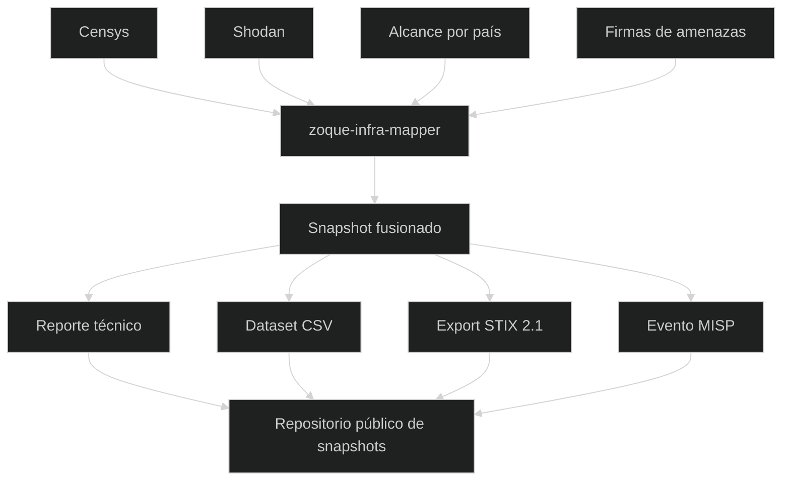

# ZOLIM - Zoque-Observatorio Latinoamericano de Infraestructura Maliciosa
 
[[Ir a ZOLIM](/zolim)]
 

**ZOLIM (Observatorio Latinoamericano de Infraestructura Maliciosa de Zoque)** es una iniciativa de investigación de ZoqueLabs orientada a documentar, analizar y publicar **snapshots periódicos de infraestructura maliciosa en América Latina**, con énfasis en sistemas de comando y control (C2) y tooling asociado.

ZOLIM está diseñado como un sistema **observacional y longitudinal**. No realiza monitoreo en tiempo real ni escaneo activo. Su enfoque se basa en snapshots comparables en el tiempo.

## Cómo funciona ZOLIM

De forma periódica, ZOLIM:

1. Consulta plataformas de inteligencia de internet de terceros (actualmente **Censys** y **Shodan**),
    
2. Aplica filtros por país con un alcance regional definido,
    
3. Hace matching de servicios expuestos contra **firmas** de tooling malicioso,
    
4. Normaliza y fusiona los resultados en un **snapshot con marca temporal**,
    
5. Genera salidas técnicas (reportes y datasets),
    
6. Publica cada snapshot de manera **abierta**.
    

Cada snapshot es un artefacto reproducible y autónomo.

## Para qué sirve ZOLIM

ZOLIM busca apoyar:

- análisis longitudinal de infraestructura maliciosa en la región,
    
- detección de reutilización, churn y drift de infraestructura,
    
- estudios por ASN, ISP y país,
    
- reportes técnicos y trabajo de sociedad civil,
    
- integración con plataformas de threat intelligence.
    

El foco está en el **comportamiento de la infraestructura**, no en la atribución.

## Salidas y transparencia

Todos los snapshots de ZOLIM se publican en un **repositorio público**:

👉 **Repositorio público de snapshots:**  
[https://github.com/ZoqueLabs/olim_datasets](https://github.com/ZoqueLabs/olim_datasets)

Cada snapshot suele incluir:

- un reporte técnico en Markdown,
    
- un dataset normalizado (CSV),
    
- exports en STIX 2.1 y MISP.
    

## Software utilizado

ZOLIM se implementa usando el pipeline abierto **`zoque-infra-mapper`**, encargado de:

- recolección de datos,
    
- matching por firmas,
    
- merge de datasets,
    
- generación de reportes y exports.
    

👉 **Repositorio del software:**  
[https://github.com/ZoqueLabs/zoque-infra-mapper](https://github.com/ZoqueLabs/zoque-infra-mapper)

Para detalles técnicos y de configuración, ver el README del repositorio.

## Advertencias y límites

- ZOLIM es **observacional**, no definitivo.
    
- Los hallazgos se basan en **firmas**, no en atribución.
    
- Puede haber falsos positivos o datos desactualizados.
    
- La presencia de infraestructura no implica control ni intención.
    

Todos los resultados deben leerse con cautela y contexto.

## Vista general del sistema

 
[[Ir a ZOLIM](/zolim)]
