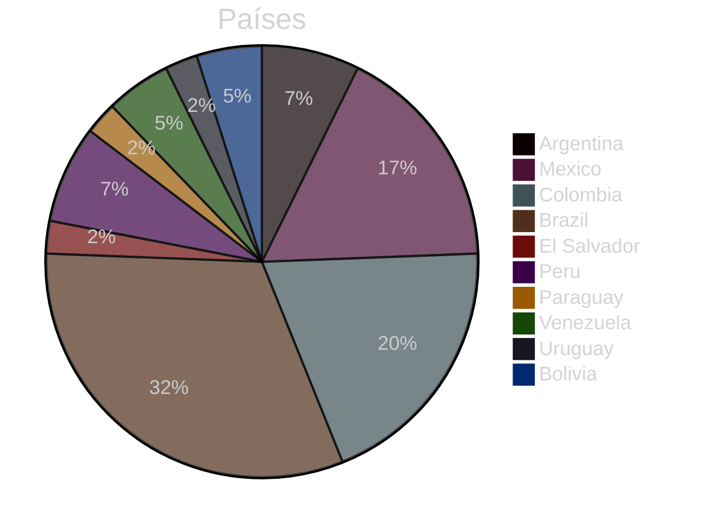
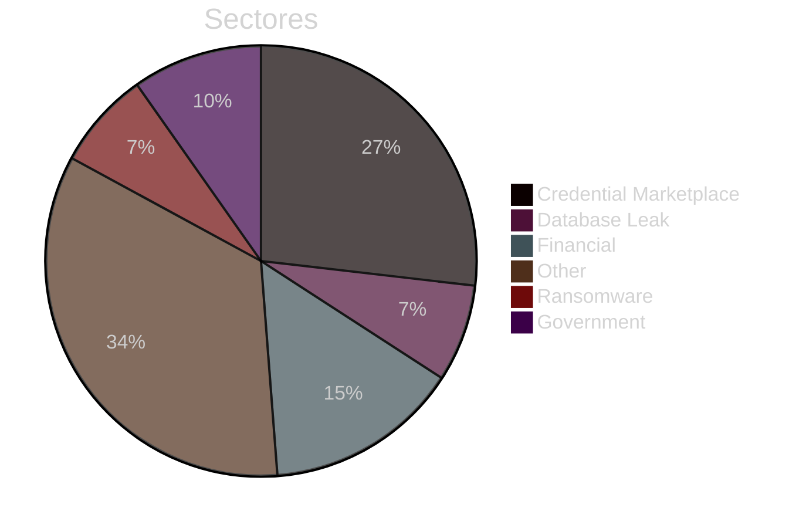
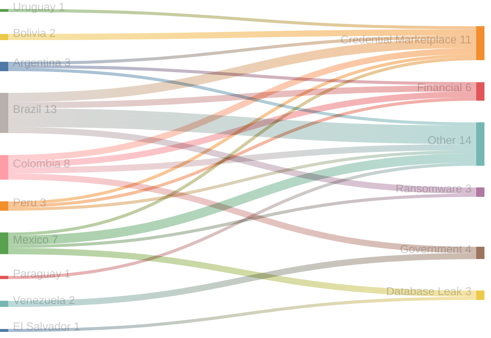
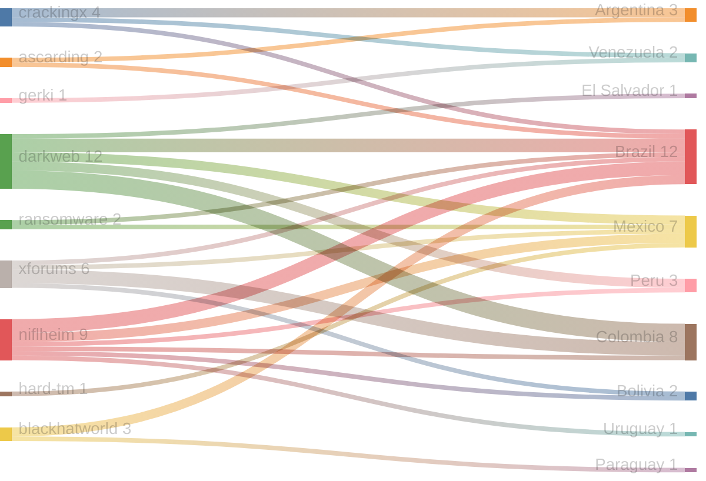
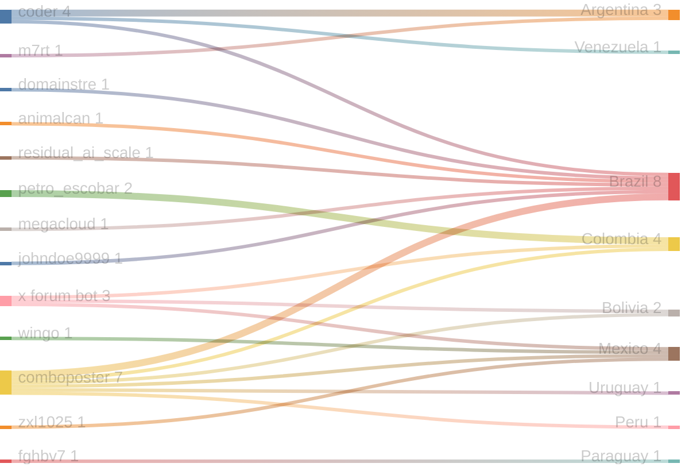

# Exfiltradaz — Monitoreo de filtraciones y exposición de datos en LATAM

> **Exfiltradaz** es una iniciativa de ZoqueLabs para recolectar, estructurar y visibilizar información sobre filtraciones de datos en América Latina a partir de fuentes abiertas.

- Dataset: https://github.com/ZoqueLabs/leaks-data  
- Pipeline: https://github.com/ZoqueLabs/leak-observatory  
- About: [Español](/filtracionesleaks/2026/03/25/acerca-de-exfiltradaz.html) [English](/leaks/2026/03/25/about-exfiltradaz.html)

---
## Reporte de filtraciones

Snapshot actual: https://github.com/ZoqueLabs/leaks-data/blob/main/reports/2026-04-14-filtraciones-latam.md

**Cobertura de datos:** 2026-03-24 → 2026-04-14

Este reporte resume referencias a filtraciones observadas en foros, mercados y feeds de monitoreo del ecosistema de filtraciones.

Durante este periodo se identificaron **41 filtraciones** vinculadas a **10 países**. **Brazil y Colombia** concentran la mayor parte de los registros observados.

Los sectores más frecuentes corresponden a **Other (14), Credential Marketplace (11), Financial (6)**. En esta clasificación, la categoría Other reúne publicaciones que no pudieron asociarse claramente a un sector específico. Estas entradas suelen incluir referencias generales a filtraciones, discusiones en foros o listados de datos cuya naturaleza no es posible identificar con precisión a partir de la información disponible.

Varias de estas publicaciones aparecen en plataformas como **darkweb, niflheim, xforums**, donde suelen circular este tipo de referencias a bases de datos o listados de credenciales.

### Señal destacada

El país con mayor aumento de actividad en este periodo fue **Colombia**, con **2 incidentes adicionales** respecto al snapshot anterior.

## Cambios desde el reporte anterior

**Nuevos autores observados:**
- animalcan
- fghbv7
- johndoe9999
- m7rt
- megacloud
- residual_ai_scale
- wingo
- zxl1025

**Países observados por primera vez:**
- El Salvador
- Uruguay

## Distribución por país

## Distribución por sector

## Sector → País

## Origen → País

## Autor → País mencionado

## Registro de incidentes

 

<table id="incidentTable" class="display compact">
<thead>
<tr>
<th>Fecha</th>
<th>País</th>
<th>Sector</th>
<th>Origen</th>
<th>Autor</th>
<th>Contenido</th>
</tr>
</thead>
<tbody>
<tr><td>2026-04-13</td><td>Argentina</td><td>Credential Marketplace</td><td>crackingx</td><td>coder</td><td>[315.5k]_[argentina]_[SQLICOMBO</td></tr>
<tr><td>2026-04-13</td><td>Mexico</td><td>Database Leak</td><td>darkweb</td><td>None</td><td>DATABASE Mexico Public Water Services - AyD [790+GB of data] for FREE</td></tr>
<tr><td>2026-04-13</td><td>Colombia</td><td>Financial</td><td>xforums</td><td>petro_escobar</td><td>Serfinanza Bank - Emergiacc Conalcréditos Colombia</td></tr>
<tr><td>2026-04-12</td><td>Argentina</td><td>Financial</td><td>ascarding</td><td>m7rt</td><td>M7 $HOP/Ukraine/Nigeria/Argentina/Indoneisa/Egypt/EU, banks and crypto wallets.</td></tr>
<tr><td>2026-04-12</td><td>Mexico</td><td>Other</td><td>xforums</td><td>x forum bot</td><td>Hacking México Libro Certificacion By X FORUMS</td></tr>
<tr><td>2026-04-09</td><td>Brazil</td><td>Credential Marketplace</td><td>niflheim</td><td>domainstre</td><td>MailPass 57K Brazil (br)</td></tr>
<tr><td>2026-04-09</td><td>El Salvador</td><td>Database Leak</td><td>darkweb</td><td>None</td><td>Hello World! El Salvador Police Database! | ⭐ DNA Forums ⭐</td></tr>
<tr><td>2026-04-08</td><td>Brazil</td><td>Ransomware</td><td>ransomware</td><td>None</td><td>🏴‍☠️ Coinbasecartel has just published a new victim : JBS Brazil - Sample uploaded</td></tr>
<tr><td>2026-04-08</td><td>Brazil</td><td>Ransomware</td><td>None</td><td>None</td><td>{
  "Victim": "JBS-Brazil---Sample-uploaded",
  "Source": "ransomfeed[.]it",
  "Content": "Ransomware group called **coinbasecartel** claims attack for **JBS-Brazil---Sample-uploaded**. 
We identify this attack with following **hash code**: __b1505a5cfbe1b5b08bb3485af7367496229ab199e843ef497adb619c275159ec__

Target victim **website**: __jbs.com.br__”,
  "Detection Date": "08 Apr 2026",
  "Type": "Ransom Alert"
}
**🔹 ****t.me/breachdetect**** 🔹**</td></tr>
<tr><td>2026-04-07</td><td>Brazil</td><td>Financial</td><td>darkweb</td><td>None</td><td>Email:Pass - COMBO MAIL PASS CORP USA Israel Egypt Italy Canada Mexico Brazil UK Spain Portugal Netherlands Switzerland Poland ETC 15ML | CrackingX: Free HQ Combos, OpenBullet Configs & Proxies - Cracking Forum</td></tr>
<tr><td>2026-04-07</td><td>Brazil</td><td>Financial</td><td>crackingx</td><td>coder</td><td>COMBO MAIL PASS CORP USA Israel Egypt Italy Canada Mexico Brazil UK Spain Portugal Netherlands Switzerland Poland ETC 15ML</td></tr>
<tr><td>2026-04-07</td><td>Peru</td><td>Other</td><td>darkweb</td><td>None</td><td>Movistar Perú 5M lines | ⭐ DNA Forums ⭐</td></tr>
<tr><td>2026-04-06</td><td>Brazil</td><td>Other</td><td>blackhatworld</td><td>animalcan</td><td>Help, I need Gambling ads advice in LATAM (Brazil)</td></tr>
<tr><td>2026-04-06</td><td>Paraguay</td><td>Other</td><td>blackhatworld</td><td>fghbv7</td><td>UAE/Saudi Arabia/Kuwait/Qatar/Paraguay Numbers needed</td></tr>
<tr><td>2026-04-06</td><td>Mexico</td><td>Other</td><td>niflheim</td><td>wingo</td><td>MEXICO PRIVATE</td></tr>
<tr><td>2026-04-06</td><td>Mexico</td><td>Ransomware</td><td>ransomware</td><td>None</td><td>🏴‍☠️ Nova has just published a new victim : International Business Solution de México</td></tr>
<tr><td>2026-04-06</td><td>Colombia</td><td>Credential Marketplace</td><td>xforums</td><td>x forum bot</td><td>Colombia Logs By X FORUMS</td></tr>
<tr><td>2026-04-05</td><td>Colombia</td><td>Government</td><td>xforums</td><td>petro_escobar</td><td>FNA.GOV.CO COLOMBIA / Fondo Nacional del Ahorro .</td></tr>
<tr><td>2026-04-05</td><td>Colombia</td><td>Other</td><td>darkweb</td><td>None</td><td>Colombia User Data</td></tr>
<tr><td>2026-04-03</td><td>Brazil</td><td>Other</td><td>darkweb</td><td>None</td><td>BRAZIL | DATASUS</td></tr>
<tr><td>2026-04-01</td><td>Venezuela</td><td>Government</td><td>crackingx</td><td>coder</td><td>COMBO 9 ML Venezuela British Virgin Islands United States Virgin Islands Vietnam Vanuatu Wallis and Futuna Samoa Yemen Mayotte South Africa Zambia</td></tr>
<tr><td>2026-04-01</td><td>Venezuela</td><td>Government</td><td>gerki</td><td>None</td><td>Venezuela British Virgin Islands United States Virgin Islands Vietnam Vanuatu Wallis and Futuna Samoa Yemen Mayotte South Africa Zambia Zimbabwe</td></tr>
<tr><td>2026-04-01</td><td>Uruguay</td><td>Credential Marketplace</td><td>niflheim</td><td>comboposter</td><td>✪ [ 15 K++ ] Combo ✪ @Elite_Cloud1 ✪ { Uruguay } ✪ [ 1/APR/2026 ] ✪</td></tr>
<tr><td>2026-04-01</td><td>Brazil</td><td>Other</td><td>niflheim</td><td>comboposter</td><td>✅HQ✅ BRAZIL 2.012.217 LINES GOOD FOR ALL ✅</td></tr>
<tr><td>2026-03-31</td><td>Brazil</td><td>Other</td><td>blackhatworld</td><td>residual_ai_scale</td><td>Hello from Brazil</td></tr>
<tr><td>2026-03-31</td><td>Peru</td><td>Credential Marketplace</td><td>niflheim</td><td>comboposter</td><td>✪ [ 86 K++ ] Combo ✪ @Elite_Cloud1 ✪ { Peru } ✪ [ 31/MAR/2026 ] ✪</td></tr>
<tr><td>2026-03-31</td><td>Mexico</td><td>Other</td><td>niflheim</td><td>comboposter</td><td>MEXICO</td></tr>
<tr><td>2026-03-29</td><td>Brazil</td><td>Credential Marketplace</td><td>xforums</td><td>megacloud</td><td>1.1K Brazil Fresh Valid Mail Access 29.03</td></tr>
<tr><td>2026-03-29</td><td>Brazil</td><td>Credential Marketplace</td><td>niflheim</td><td>comboposter</td><td>✦✦ [ 430 K++ ]✦{ Brazil }✦Email:Pass✦FRESH✦Maxi_Leaks✦[ 29-3-2026 ]✦✦</td></tr>
<tr><td>2026-03-29</td><td>Colombia</td><td>Credential Marketplace</td><td>niflheim</td><td>comboposter</td><td>✦✦ [ 155 K++ ]✦{ Colombia }✦Email:Pass✦FRESH✦Maxi_Leaks✦[ 29-3-2026 ]✦✦</td></tr>
<tr><td>2026-03-29</td><td>Brazil</td><td>Other</td><td>ascarding</td><td>johndoe9999</td><td>Looking for Brazil people $$$$$ BIG OPORTUNITY</td></tr>
<tr><td>2026-03-28</td><td>Mexico</td><td>Database Leak</td><td>darkweb</td><td>None</td><td>DATABASE MÉXICO - INSTITUTO TECNOLÓGICO DEL ISTMO</td></tr>
<tr><td>2026-03-28</td><td>Colombia</td><td>Government</td><td>darkweb</td><td>None</td><td>[FREE 2TB LEAK PART 2] Superintendencia Nacional de Salud de Colombia</td></tr>
<tr><td>2026-03-27</td><td>Colombia</td><td>Other</td><td>darkweb</td><td>None</td><td>SELLING GNP BPO - Call Center - Claro Colombia</td></tr>
<tr><td>2026-03-27</td><td>Mexico</td><td>Credential Marketplace</td><td>hard-tm</td><td>zxl1025</td><td>WTB High quality combo in Mexico, or database containing hash</td></tr>
<tr><td>2026-03-27</td><td>Peru</td><td>Financial</td><td>darkweb</td><td>None</td><td>DATABASE Database of Banco Agropecuario Peru</td></tr>
<tr><td>2026-03-27</td><td>Bolivia</td><td>Credential Marketplace</td><td>xforums</td><td>x forum bot</td><td>Bolivia Logs By X FORUMS</td></tr>
<tr><td>2026-03-27</td><td>Colombia</td><td>Financial</td><td>darkweb</td><td>None</td><td>SELLING Nu BANK -- EmergiaCC Conalcreditos ColombiA</td></tr>
<tr><td>2026-03-26</td><td>Brazil</td><td>Other</td><td>darkweb</td><td>None</td><td>UNLOCKED: Brasil User Data</td></tr>
<tr><td>2026-03-26</td><td>Bolivia</td><td>Credential Marketplace</td><td>niflheim</td><td>comboposter</td><td>✦✦ [ 10 K++ ]✦{ Bolivia }✦Email:Pass✦FRESH✦Maxi_Leaks✦[ 26-3-2026 ]✦✦</td></tr>
<tr><td>2026-03-26</td><td>Argentina</td><td>Other</td><td>crackingx</td><td>coder</td><td>13ML South AfricaNigeria Argentina Chile Colombia Corps Mails</td></tr>
</tbody></table>

