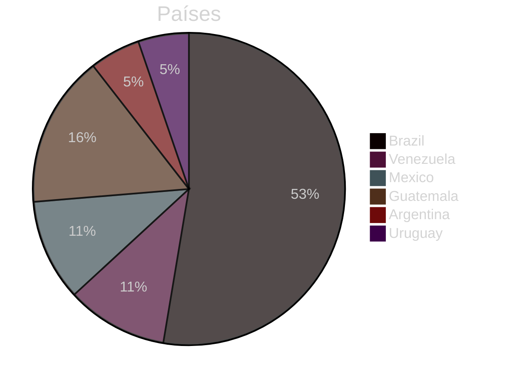
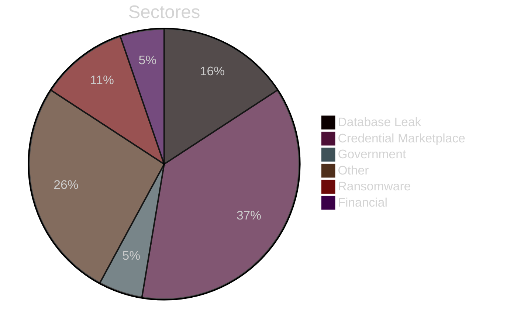
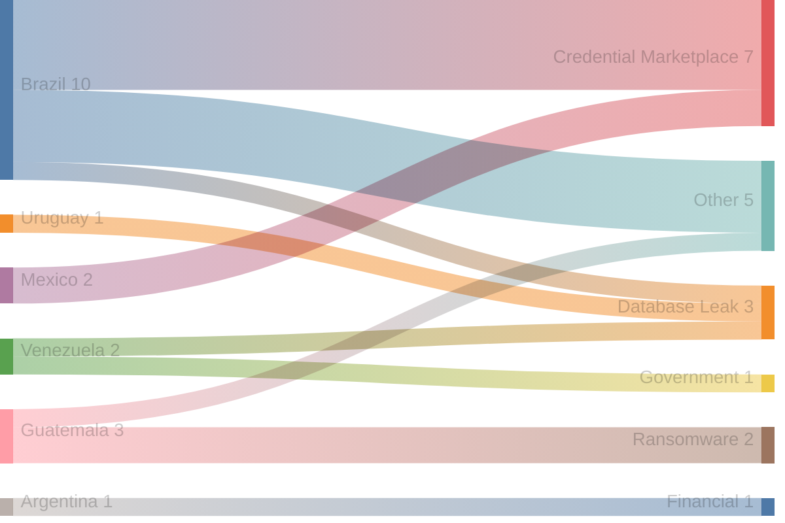
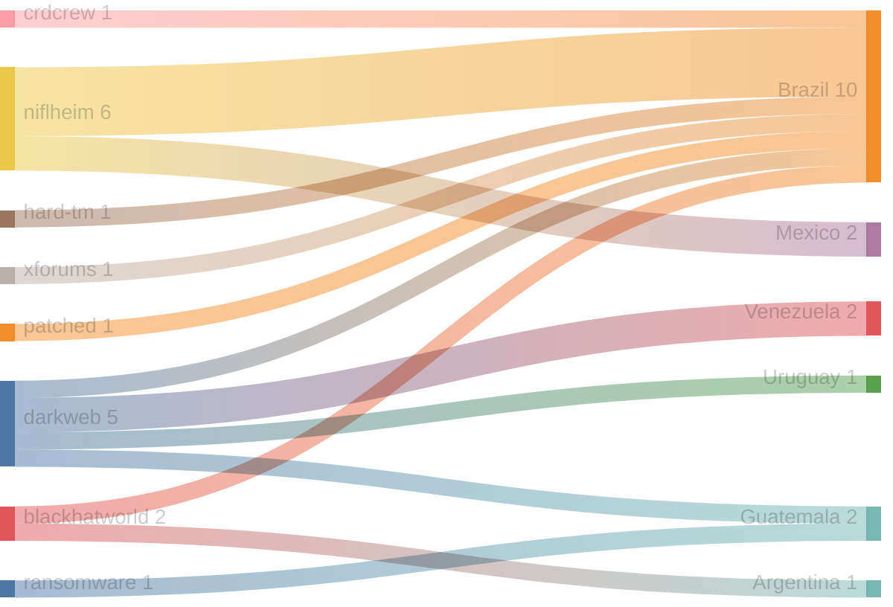
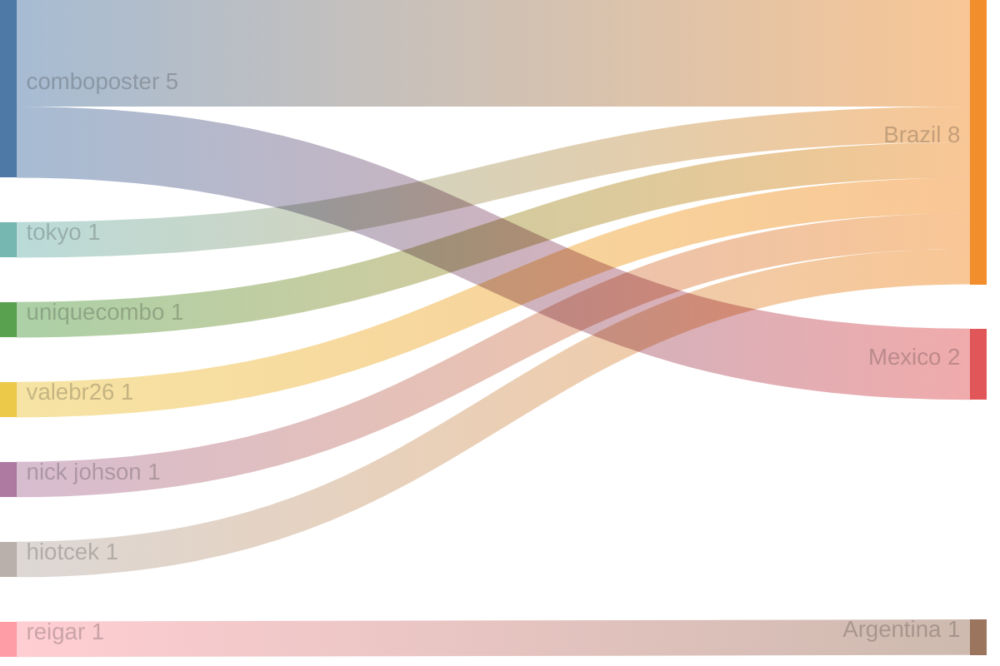

# Exfiltradaz — Monitoreo de filtraciones y exposición de datos en LATAM

> **Exfiltradaz** es una iniciativa de ZoqueLabs para recolectar, estructurar y visibilizar información sobre filtraciones de datos en América Latina a partir de fuentes abiertas.

- Dataset: https://github.com/ZoqueLabs/leaks-data  
- Pipeline: https://github.com/ZoqueLabs/leak-observatory  
- About: [Español](/filtracionesleaks/2026/03/25/acerca-de-exfiltradaz.html) [English](/leaks/2026/03/25/about-exfiltradaz.html)

---
## Reporte de filtraciones

Snapshot actual: [https://github.com/ZoqueLabs/leaks-data/blob/main/reports/2026-06-12-filtraciones-latam.md](https://github.com/ZoqueLabs/leaks-data/blob/main/reports/2026-06-12-filtraciones-latam.md)

**Cobertura de datos:** 2026-05-29 → 2026-06-12

Este reporte resume referencias a filtraciones observadas en foros, mercados y feeds de monitoreo del ecosistema de filtraciones.

Durante este periodo se identificaron **19 filtraciones** vinculadas a **6 países**. **Brazil y Guatemala** concentran la mayor parte de los registros observados.

Los sectores más frecuentes corresponden a **Credential Marketplace (7), Other (5), Database Leak (3)**. En esta clasificación, la categoría Other reúne publicaciones que no pudieron asociarse claramente a un sector específico. Estas entradas suelen incluir referencias generales a filtraciones, discusiones en foros o listados de datos cuya naturaleza no es posible identificar con precisión a partir de la información disponible.

Varias de estas publicaciones aparecen en plataformas como **niflheim, darkweb, blackhatworld**, donde suelen circular este tipo de referencias a bases de datos o listados de credenciales.

### Señal destacada

El país con mayor aumento de actividad en este periodo fue **Guatemala**, con **2 incidentes adicionales** respecto al snapshot anterior.

## Cambios desde el reporte anterior

**Nuevos autores observados:**
- nick johson
- reigar
- tokyo
- uniquecombo
- valebr26

## Distribución por país

## Distribución por sector

## Sector → País

## Origen → País

## Autor → País mencionado

## Registro de incidentes

 

<table id="incidentTable" class="display compact">
<thead>
<tr>
<th>Fecha</th>
<th>País</th>
<th>Sector</th>
<th>Origen</th>
<th>Autor</th>
<th>Contenido</th>
</tr>
</thead>
<tbody>
<tr><td>2026-06-12</td><td>Brazil</td><td>Database Leak</td><td>darkweb</td><td>None</td><td>DATABASE MUNICIPIO DE ITAIPULANDIA BRASIL DataBase</td></tr>
<tr><td>2026-06-12</td><td>Brazil</td><td>Credential Marketplace</td><td>niflheim</td><td>comboposter</td><td>✅COMBOLIST BRAZIL 7K✅ ✨EMAIL:PASS✨</td></tr>
<tr><td>2026-06-12</td><td>Brazil</td><td>Credential Marketplace</td><td>niflheim</td><td>comboposter</td><td>Brazil Mailaccess pvt Data Hits 100x</td></tr>
<tr><td>2026-06-12</td><td>Brazil</td><td>Credential Marketplace</td><td>niflheim</td><td>comboposter</td><td>350x Brazil Mailaccess combo [pvt]</td></tr>
<tr><td>2026-06-11</td><td>Venezuela</td><td>Government</td><td>darkweb</td><td>None</td><td>DATABASE Payrolls of the Ministry of Education, Defense, and Health of Venezuela 2026 (425k)</td></tr>
<tr><td>2026-06-11</td><td>Mexico</td><td>Credential Marketplace</td><td>niflheim</td><td>comboposter</td><td>50K HQ Mexico Combolist Fresh Drop</td></tr>
<tr><td>2026-06-11</td><td>Mexico</td><td>Credential Marketplace</td><td>niflheim</td><td>comboposter</td><td>⚡✨120K MAIL ACCESS MEXICO Accounts ✨⚡</td></tr>
<tr><td>2026-06-11</td><td>Brazil</td><td>Other</td><td>crdcrew</td><td>tokyo</td><td>Live Mastercard Brazil Fresh</td></tr>
<tr><td>2026-06-07</td><td>Brazil</td><td>Credential Marketplace</td><td>hard-tm</td><td>uniquecombo</td><td>253k LINES - 💰 BRAZIL 💰 MAILPASS 2026 💰 UNIQUE-COMBO 💰</td></tr>
<tr><td>2026-06-05</td><td>Brazil</td><td>Other</td><td>xforums</td><td>valebr26</td><td>FULLZ PREMIUM - BRASIL JUNHO26 / FULLZ PREMIUM - БРАЗИЛИЯ, 26 ИЮНЯ</td></tr>
<tr><td>2026-06-04</td><td>Guatemala</td><td>Ransomware</td><td>None</td><td>None</td><td>{
  "Victim": "Liztex-Guatemala",
  "Source": "ransomfeed[.]it",
  "Content": "Ransomware group called **thegentlemen** claims attack for **Liztex-Guatemala**. 
We identify this attack with following **hash code**: __c63bdf53b712d97705e615e3198dde003698f31bf4496619d8fb0d059035720f__

Target victim **website**: __liztex.com__”,
  "Detection Date": "04 Jun 2026",
  "Type": "Ransom Alert"
}
**🔹 ****t.me/breachdetect**** 🔹**</td></tr>
<tr><td>2026-06-04</td><td>Guatemala</td><td>Ransomware</td><td>ransomware</td><td>None</td><td>🏴‍☠️ Thegentlemen has just published a new victim : Liztex Guatemala</td></tr>
<tr><td>2026-06-03</td><td>Brazil</td><td>Credential Marketplace</td><td>patched</td><td>None</td><td>358.6k COMBO MAILS ACCESS GOOD - BRAZIL</td></tr>
<tr><td>2026-06-02</td><td>Guatemala</td><td>Other</td><td>darkweb</td><td>None</td><td>DIGECAM (GUATEMALA) 62K FireArm Serials And Models.</td></tr>
<tr><td>2026-06-01</td><td>Brazil</td><td>Other</td><td>blackhatworld</td><td>nick johson</td><td>HIRING SEO Specialist for Brazil Google Ranking</td></tr>
<tr><td>2026-06-01</td><td>Argentina</td><td>Financial</td><td>blackhatworld</td><td>reigar</td><td>Looking for a Cloaking Specialist for Facebook Ads (Crypto Mixer, Argentina GEO)</td></tr>
<tr><td>2026-06-01</td><td>Uruguay</td><td>Database Leak</td><td>darkweb</td><td>None</td><td>DATABASE [~184k Uruguay] https://www.guiaempresas.com.uy - Comprehensive company registry with</td></tr>
<tr><td>2026-06-01</td><td>Venezuela</td><td>Database Leak</td><td>darkweb</td><td>None</td><td>DATABASE [~768k Venezuela] https://gianbofuegosartificiales.com Distributor contacts with emai</td></tr>
<tr><td>2026-05-30</td><td>Brazil</td><td>Other</td><td>niflheim</td><td>hiotcek</td><td>DB EMAIL SENHA DO BRASIL</td></tr>
</tbody></table>

