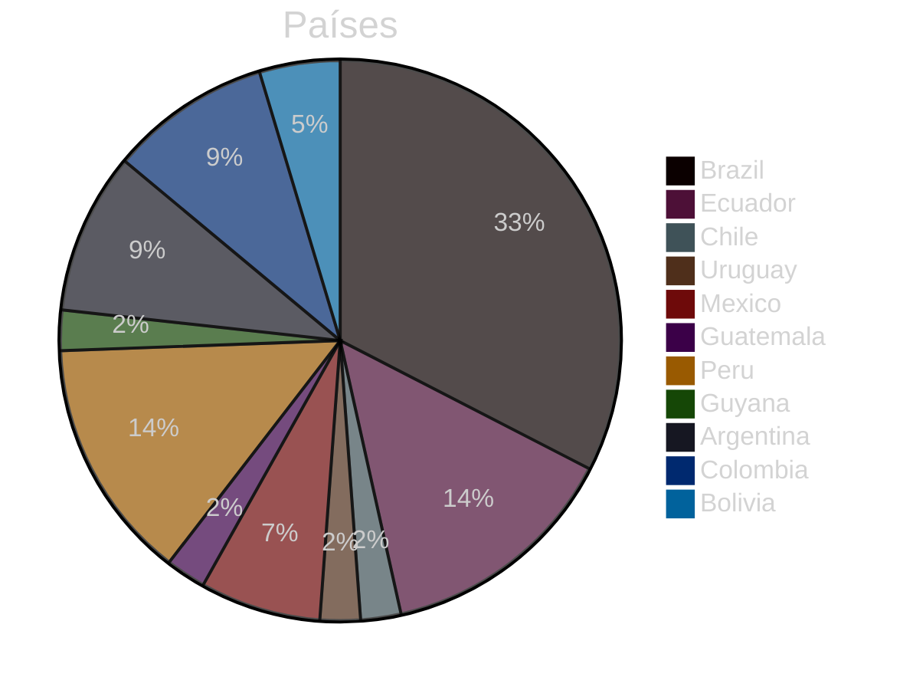
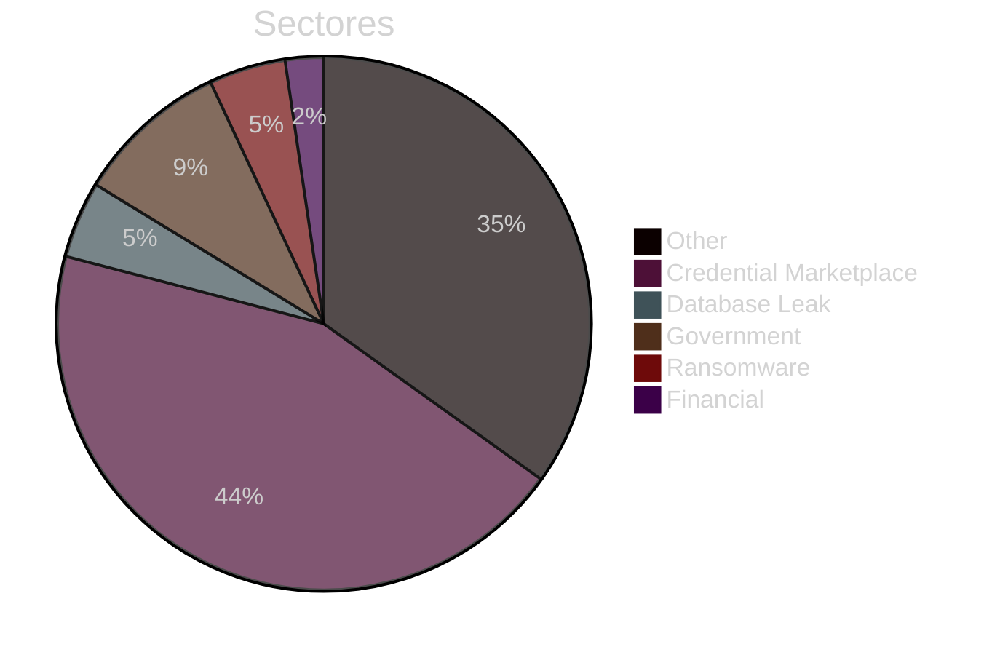
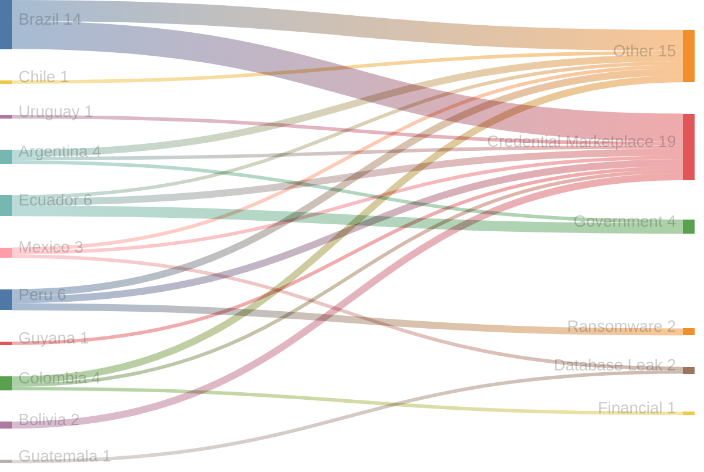
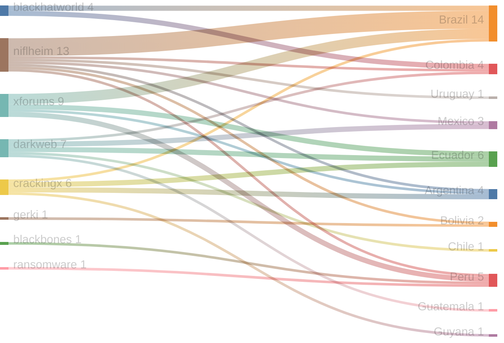
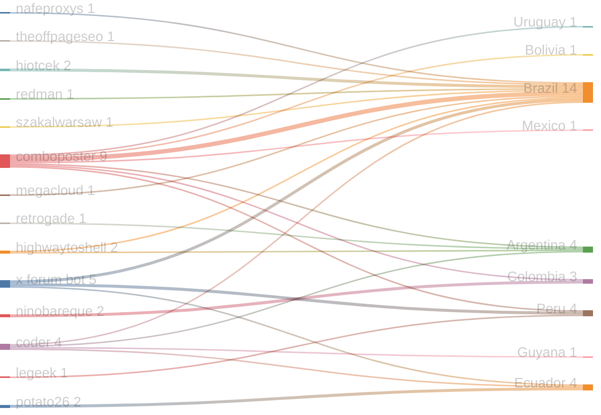

# Exfiltradaz — Monitoreo de filtraciones y exposición de datos en LATAM

> **Exfiltradaz** es una iniciativa de ZoqueLabs para recolectar, estructurar y visibilizar información sobre filtraciones de datos en América Latina a partir de fuentes abiertas.

- Dataset: https://github.com/ZoqueLabs/leaks-data  
- Pipeline: https://github.com/ZoqueLabs/leak-observatory  
- About: [Español](/filtracionesleaks/2026/03/25/acerca-de-exfiltradaz.html) [English](/leaks/2026/03/25/about-exfiltradaz.html)

---
## Reporte de filtraciones

Snapshot actual: https://github.com/ZoqueLabs/leaks-data/blob/main/reports/2026-05-05-filtraciones-latam.md

**Cobertura de datos:** 2026-04-14 → 2026-05-05

Este reporte resume referencias a filtraciones observadas en foros, mercados y feeds de monitoreo del ecosistema de filtraciones.

Durante este periodo se identificaron **43 filtraciones** vinculadas a **11 países**. **Brazil y Ecuador** concentran la mayor parte de los registros observados.

Los sectores más frecuentes corresponden a **Credential Marketplace (19), Other (15), Government (4)**. En esta clasificación, la categoría Other reúne publicaciones que no pudieron asociarse claramente a un sector específico. Estas entradas suelen incluir referencias generales a filtraciones, discusiones en foros o listados de datos cuya naturaleza no es posible identificar con precisión a partir de la información disponible.

Varias de estas publicaciones aparecen en plataformas como **niflheim, xforums, darkweb**, donde suelen circular este tipo de referencias a bases de datos o listados de credenciales.

### Señal destacada

El país con mayor aumento de actividad en este periodo fue **Ecuador**, con **6 incidentes adicionales** respecto al snapshot anterior.

## Cambios desde el reporte anterior

**Nuevos autores observados:**
- highwaytoshell
- legeek
- nafeproxys
- ninobareque
- potato26
- retrogade
- szakalwarsaw
- theoffpageseo

**Países observados por primera vez:**
- Ecuador
- Guatemala
- Guyana

## Distribución por país

## Distribución por sector

## Sector → País

## Origen → País

## Autor → País mencionado

## Registro de incidentes

 

<table id="incidentTable" class="display compact">
<thead>
<tr>
<th>Fecha</th>
<th>País</th>
<th>Sector</th>
<th>Origen</th>
<th>Autor</th>
<th>Contenido</th>
</tr>
</thead>
<tbody>
<tr><td>2026-05-05</td><td>Brazil</td><td>Other</td><td>blackhatworld</td><td>nafeproxys</td><td>⭐ 5G Mobile Proxies ✨ SPAIN & BRAZIL | 60-100 mbs | BHW Discount⚡Rotating & Dedicated | Unlimited & IPV4/IPV6 | SOCKS5 | HTTP | UDP</td></tr>
<tr><td>2026-05-05</td><td>Ecuador</td><td>Other</td><td>darkweb</td><td>None</td><td>DIGERCIC ECUADOR 2026 - 14.8M data, 10.6M images</td></tr>
<tr><td>2026-05-04</td><td>Chile</td><td>Other</td><td>darkweb</td><td>None</td><td>(3) TXT - Chile [CL] 103K (part 2 of Latin America) | XSS (ex DaMaGeLaB)</td></tr>
<tr><td>2026-05-04</td><td>Uruguay</td><td>Credential Marketplace</td><td>niflheim</td><td>comboposter</td><td>✨ 1.2m URUGUAY COMBO ✨ FRESH ✅ UHQ ✅ APRIL 2024</td></tr>
<tr><td>2026-04-29</td><td>Mexico</td><td>Database Leak</td><td>darkweb</td><td>None</td><td>SELLING [FOR SALE] COMPLETE DATABASE OF PUERTO INTELIGENTE SEGURO | MEXICO</td></tr>
<tr><td>2026-04-28</td><td>Guatemala</td><td>Database Leak</td><td>darkweb</td><td>None</td><td>DATABASE Full RENAP DB (18M Records) and SAT (5.6M Vehicles) GUATEMALA 2026</td></tr>
<tr><td>2026-04-28</td><td>Brazil</td><td>Other</td><td>blackhatworld</td><td>theoffpageseo</td><td>Brazil Parasites Gambling</td></tr>
<tr><td>2026-04-28</td><td>Peru</td><td>Credential Marketplace</td><td>xforums</td><td>x forum bot</td><td>Cinemark-peru.com Logs (100 Lines) By X FORUMS</td></tr>
<tr><td>2026-04-28</td><td>Mexico</td><td>Other</td><td>darkweb</td><td>None</td><td>DOCUMENTS Mexico - Instituto Registral y Catastral del Estado de Puebla (IRCEP) [11,269 files]</td></tr>
<tr><td>2026-04-28</td><td>Brazil</td><td>Credential Marketplace</td><td>xforums</td><td>x forum bot</td><td>✦✦ [ 344 K++ ]✦{ Brazil }✦Email:Pass✦FRESH✦[ 21-3-2026 ]✦✦</td></tr>
<tr><td>2026-04-28</td><td>Brazil</td><td>Credential Marketplace</td><td>xforums</td><td>x forum bot</td><td>Brazil Logs By X FORUMS</td></tr>
<tr><td>2026-04-26</td><td>Peru</td><td>Other</td><td>blackbones</td><td>legeek</td><td>Need instant Cashier of Peru VBV + the vbv password</td></tr>
<tr><td>2026-04-26</td><td>Brazil</td><td>Credential Marketplace</td><td>niflheim</td><td>hiotcek</td><td>DATABASE BRAZIL 1.146MILION LIST FRESH EMAIL-PASS BY @SELLERCOMBO2022</td></tr>
<tr><td>2026-04-26</td><td>Brazil</td><td>Other</td><td>niflheim</td><td>redman</td><td>141K .BR (BRAZIL) COUNTRY (EMAIL:PW)</td></tr>
<tr><td>2026-04-25</td><td>Brazil</td><td>Other</td><td>niflheim</td><td>szakalwarsaw</td><td>Brazil Gambling-Casino players leads - 2024 ( Over 1 Million records available)</td></tr>
<tr><td>2026-04-23</td><td>Guyana</td><td>Credential Marketplace</td><td>crackingx</td><td>coder</td><td>7ml combo Greece Grenada Guatemala Guinea Guinea-Bissau Guyana Haiti Honduras Hungary Iceland Iran Iraq Ireland</td></tr>
<tr><td>2026-04-23</td><td>Ecuador</td><td>Credential Marketplace</td><td>crackingx</td><td>coder</td><td>11ml combo mail Cyprus Czech Republic Denmark Djibouti Dominica Dominican Republic Ecuador El Salvador Equatorial Guinea Eswatini (Swazilan</td></tr>
<tr><td>2026-04-23</td><td>Argentina</td><td>Government</td><td>crackingx</td><td>coder</td><td>5ML COMBO MAIL PASS India China Canada United States (USA) Mexico Brazil Argentina United Kingdom (UK Germany France</td></tr>
<tr><td>2026-04-23</td><td>Peru</td><td>Ransomware</td><td>None</td><td>None</td><td>{
  "Victim": "Peru-LNG-Hunt-LNG-Operating-Company",
  "Source": "ransomfeed[.]it",
  "Content": "Ransomware group called **coinbasecartel** claims attack for **Peru-LNG-Hunt-LNG-Operating-Company**. 
We identify this attack with following **hash code**: __58f9f8e1bf89193c4e8b80043087fa7b6fd9e63611d487195db15af697f1c394__

Target victim **website**: __perulng.com__”,
  "Detection Date": "23 Apr 2026",
  "Type": "Ransom Alert"
}
**🔹 ****t.me/breachdetect**** 🔹**</td></tr>
<tr><td>2026-04-23</td><td>Peru</td><td>Ransomware</td><td>ransomware</td><td>None</td><td>🏴‍☠️ Coinbasecartel has just published a new victim : Peru LNG (Hunt LNG Operating Company)</td></tr>
<tr><td>2026-04-22</td><td>Brazil</td><td>Other</td><td>crackingx</td><td>coder</td><td>brazil mail pass</td></tr>
<tr><td>2026-04-22</td><td>Colombia</td><td>Financial</td><td>darkweb</td><td>None</td><td>SELLING Banco Unión (Giros y Finanzas) -- EmergiaCC Conalcreditos Colombia</td></tr>
<tr><td>2026-04-22</td><td>Ecuador</td><td>Credential Marketplace</td><td>xforums</td><td>x forum bot</td><td>✦✦✦ [ 53k++ ] Combo ✦ { Ecuador } ✦ Email:Pass ✦ FRESH ✦ [ 27-9-2025 ] ✦✦✦</td></tr>
<tr><td>2026-04-21</td><td>Brazil</td><td>Credential Marketplace</td><td>niflheim</td><td>hiotcek</td><td>◻️⬜️ 1,000,000+ BRAZIL LINES COMBOLIST .BR - EMAIL:PASSWORD PRIVATE HQ ⬜️◻️</td></tr>
<tr><td>2026-04-20</td><td>Brazil</td><td>Credential Marketplace</td><td>xforums</td><td>megacloud</td><td>1.3K Brazil Valid Mail Access 20.04</td></tr>
<tr><td>2026-04-20</td><td>Brazil</td><td>Credential Marketplace</td><td>niflheim</td><td>comboposter</td><td>「110K」⭐️ BRAZIL UHQ EMAIL:PASS COMBOLIST ⭐️FRESH ✅ 2024</td></tr>
<tr><td>2026-04-18</td><td>Argentina</td><td>Other</td><td>crackingx</td><td>retrogade</td><td>Argentina Chief of Cabinet [DNI & Photos]</td></tr>
<tr><td>2026-04-18</td><td>Ecuador</td><td>Government</td><td>crackingx</td><td>potato26</td><td>Free SQLi + Database 25k records for the Tu Taxi Amigo Ecuador Transportation App</td></tr>
<tr><td>2026-04-18</td><td>Ecuador</td><td>Government</td><td>xforums</td><td>potato26</td><td>Free SQLi + Database for the Tu Taxi Amigo Ecuador Transportation App</td></tr>
<tr><td>2026-04-18</td><td>Ecuador</td><td>Government</td><td>darkweb</td><td>None</td><td>Login:Pass - Free SQLi + Database 25k records for the Tu Taxi Amigo Ecuador Transportation App | CrackingX: Free HQ Combos, OpenBullet Configs & Proxies - Cracking Forum</td></tr>
<tr><td>2026-04-18</td><td>Argentina</td><td>Credential Marketplace</td><td>niflheim</td><td>comboposter</td><td>✪ [ 70 K++ ] Combo ✪ @Elite_Cloud1 ✪ { Argentina } ✪ [ 18/APR/2026 ] ✪</td></tr>
<tr><td>2026-04-18</td><td>Bolivia</td><td>Credential Marketplace</td><td>niflheim</td><td>comboposter</td><td>✪ [ 11 K++ ] Combo ✪ @Elite_Cloud1 ✪ { Bolivia } ✪ [ 18/APR/2026 ] ✪</td></tr>
<tr><td>2026-04-18</td><td>Brazil</td><td>Other</td><td>xforums</td><td>highwaytoshell</td><td>[Webshell (ASPX)] Construction - Brazil ($50M - $100M revenue)</td></tr>
<tr><td>2026-04-17</td><td>Colombia</td><td>Credential Marketplace</td><td>niflheim</td><td>comboposter</td><td>COLOMBIA COMBOS | GOOD FOR ALL {HITS GUARANTEED}</td></tr>
<tr><td>2026-04-17</td><td>Brazil</td><td>Credential Marketplace</td><td>niflheim</td><td>comboposter</td><td>BRAZIL COMBOS | GOOD FOR ALL {HITS GUARANTEED}</td></tr>
<tr><td>2026-04-17</td><td>Mexico</td><td>Credential Marketplace</td><td>niflheim</td><td>comboposter</td><td>Mexico MX combo UHQ privet ⭐TEST COMBO⭐</td></tr>
<tr><td>2026-04-17</td><td>Argentina</td><td>Other</td><td>xforums</td><td>highwaytoshell</td><td>[VPN (Fortinet)] Retail / E-Commerce - Argentina ($100M - $250M revenue)</td></tr>
<tr><td>2026-04-16</td><td>Peru</td><td>Credential Marketplace</td><td>niflheim</td><td>comboposter</td><td>✪ [ 93 K++ ] Combo ✪ @Elite_Cloud1 ✪ { Peru } ✪ [ 16/APR/2026 ] ✪</td></tr>
<tr><td>2026-04-16</td><td>Brazil</td><td>Credential Marketplace</td><td>niflheim</td><td>comboposter</td><td>181K Brazil Combolist</td></tr>
<tr><td>2026-04-16</td><td>Colombia</td><td>Other</td><td>blackhatworld</td><td>ninobareque</td><td>[Case Study] $0 Hosting / 100 Lighthouse / Fresh Domain. Scaling a SUS-304 Brand in Colombia. Engineering vs. The Sandbox.</td></tr>
<tr><td>2026-04-16</td><td>Colombia</td><td>Other</td><td>blackhatworld</td><td>ninobareque</td><td>[Journey] $0 Infra (Cloudflare Edge) + Claude Code + Programmatic SEO → Local SERP Domination in Colombia (Launch Phase)</td></tr>
<tr><td>2026-04-15</td><td>Peru</td><td>Other</td><td>xforums</td><td>x forum bot</td><td>1x COINTEL-PERU SMTP 📧 📬</td></tr>
<tr><td>2026-04-14</td><td>Bolivia</td><td>Credential Marketplace</td><td>gerki</td><td>None</td><td>9ML COMBOLIST Bangladesh Barbados Belarus Belgium Belize Benin Bhutan Bolivia Bosnia and Herzegovina Botswana Brazil Brunei Bulgaria</td></tr>
</tbody></table>

