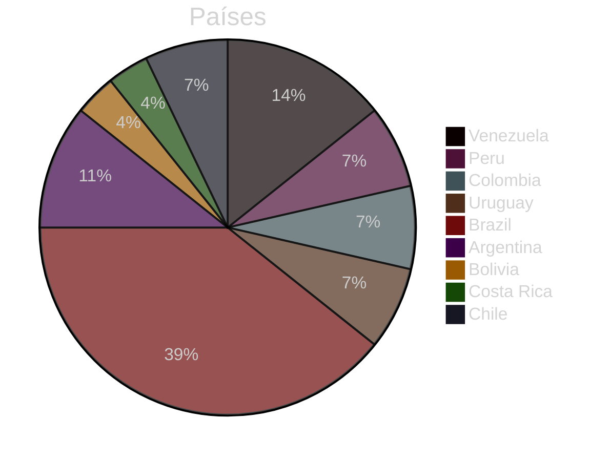
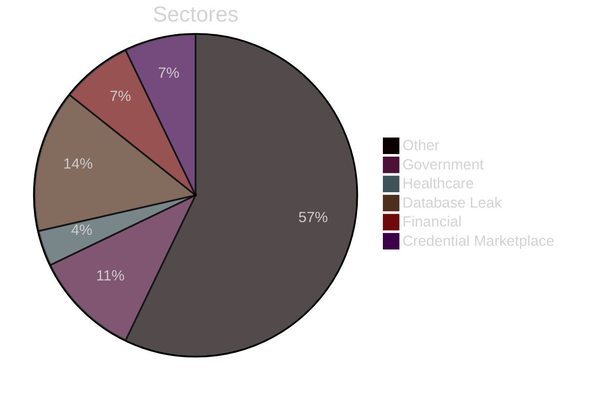
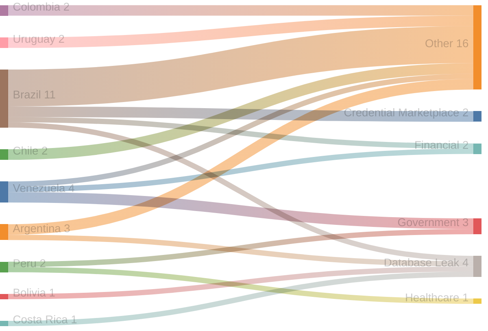
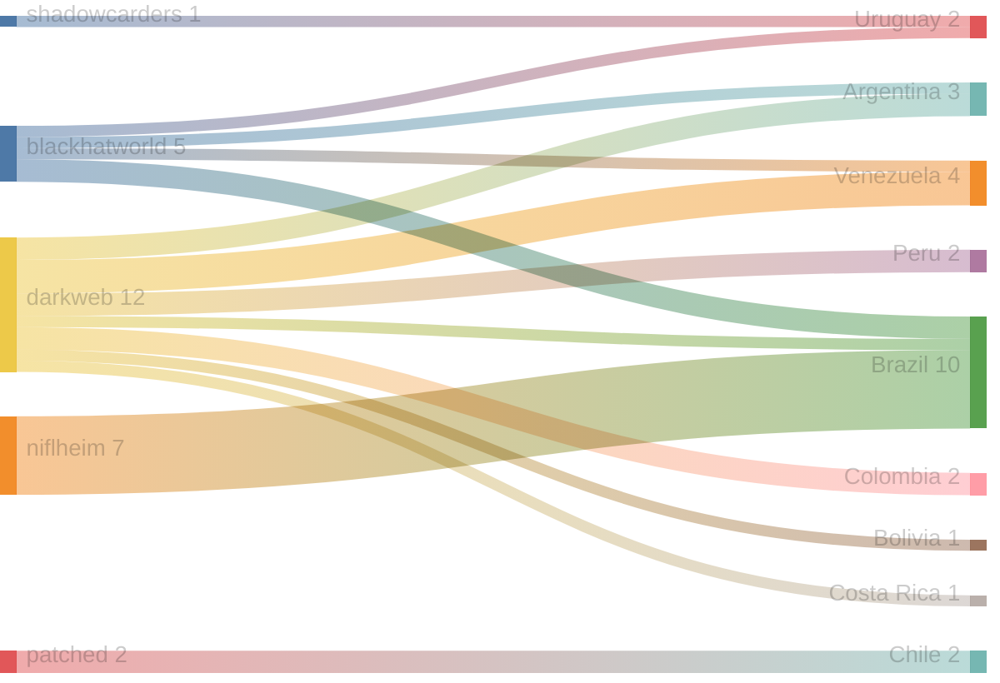
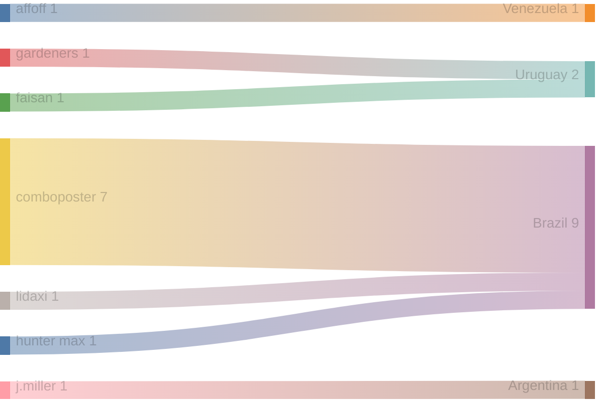

# Exfiltradaz — Monitoreo de filtraciones y exposición de datos en LATAM

> **Exfiltradaz** es una iniciativa de ZoqueLabs para recolectar, estructurar y visibilizar información sobre filtraciones de datos en América Latina a partir de fuentes abiertas.

- Dataset: https://github.com/ZoqueLabs/leaks-data  
- Pipeline: https://github.com/ZoqueLabs/leak-observatory  
- About: [Español](/filtracionesleaks/2026/03/25/acerca-de-exfiltradaz.html) [English](/leaks/2026/03/25/about-exfiltradaz.html)

---
## Reporte de filtraciones

Snapshot actual: [https://github.com/ZoqueLabs/leaks-data/blob/main/reports/2026-06-25-filtraciones-latam.md](https://github.com/ZoqueLabs/leaks-data/blob/main/reports/2026-06-25-filtraciones-latam.md)

**Cobertura de datos:** 2026-06-12 → 2026-06-25

Este reporte resume referencias a filtraciones observadas en foros, mercados y feeds de monitoreo del ecosistema de filtraciones.

Durante este periodo se identificaron **28 filtraciones** vinculadas a **9 países**. **Brazil y Venezuela** concentran la mayor parte de los registros observados.

Los sectores más frecuentes corresponden a **Other (16), Database Leak (4), Government (3)**. En esta clasificación, la categoría Other reúne publicaciones que no pudieron asociarse claramente a un sector específico. Estas entradas suelen incluir referencias generales a filtraciones, discusiones en foros o listados de datos cuya naturaleza no es posible identificar con precisión a partir de la información disponible.

Varias de estas publicaciones aparecen en plataformas como **darkweb, niflheim, blackhatworld**, donde suelen circular este tipo de referencias a bases de datos o listados de credenciales.

### Señal destacada

El país con mayor aumento de actividad en este periodo fue **Costa Rica**, con **1 incidentes adicionales** respecto al snapshot anterior.

## Cambios desde el reporte anterior

**Nuevos autores observados:**
- affoff
- faisan
- gardeners
- hunter max
- j.miller
- lidaxi

**Países observados por primera vez:**
- Costa Rica

## Distribución por país

## Distribución por sector

## Sector → País

## Origen → País

## Autor → País mencionado

## Registro de incidentes

 

<table id="incidentTable" class="display compact">
<thead>
<tr>
<th>Fecha</th>
<th>País</th>
<th>Sector</th>
<th>Origen</th>
<th>Autor</th>
<th>Contenido</th>
</tr>
</thead>
<tbody>
<tr><td>2026-06-25</td><td>Venezuela</td><td>Other</td><td>blackhatworld</td><td>affoff</td><td>Twin earthquakes level apartment towers in Venezuela</td></tr>
<tr><td>2026-06-24</td><td>Peru</td><td>Government</td><td>darkweb</td><td>None</td><td>DATABASE [ L4TAMFUCK3RS ] DIRANDRO Policía Nacional del Peru</td></tr>
<tr><td>2026-06-24</td><td>Colombia</td><td>Other</td><td>darkweb</td><td>None</td><td>[REPOST] 20K University of Magdalena in Colombia - PwnForums</td></tr>
<tr><td>2026-06-24</td><td>Peru</td><td>Healthcare</td><td>darkweb</td><td>None</td><td>SELLING Peru - Centro Médico Especializado OSI: Healthcare Solutions Breach</td></tr>
<tr><td>2026-06-23</td><td>Uruguay</td><td>Other</td><td>blackhatworld</td><td>gardeners</td><td>Today: Portugal vs Uruguay Prediction</td></tr>
<tr><td>2026-06-22</td><td>Venezuela</td><td>Government</td><td>darkweb</td><td>None</td><td>[L4TAMFUCK3R$] Ministry of Penitentiary Services of Venezuela | 22.9K Images + Data</td></tr>
<tr><td>2026-06-21</td><td>Brazil</td><td>Other</td><td>None</td><td>None</td><td>{
  "Source": "https://nulledbb.com/",
  "Content": "UK,MEXICO,TEXAS,BRAZIL,ROMANIA PASSPORT/ID/DRIVER LICENSE[CLEARED *IMAGES*].", 
  "author": "<a href="https://nulledbb.com/member.php?action=profile&uid=769184">Janovic</a>",
  "Detection Date": "21 Jun 2026",
  "Type": "Data leak"
}
**🔹 ****t.me/breachdetect****  🔹**</td></tr>
<tr><td>2026-06-21</td><td>Venezuela</td><td>Government</td><td>darkweb</td><td>None</td><td>DATABASE [L4TAMFUCK3R$] Full DB Ministry of Mining Venezuela (CVG, CVM, SENAFIM, MINERVEN)</td></tr>
<tr><td>2026-06-20</td><td>Argentina</td><td>Database Leak</td><td>darkweb</td><td>None</td><td>DATABASE ARGENTINA BCRA - GDEBA IOMA ALL LEAK (8.62GB)</td></tr>
<tr><td>2026-06-20</td><td>Bolivia</td><td>Database Leak</td><td>darkweb</td><td>None</td><td>DATABASE SEDEM Bolivia Subsidy Database - Leak 526K+ Records</td></tr>
<tr><td>2026-06-20</td><td>Uruguay</td><td>Other</td><td>shadowcarders</td><td>faisan</td><td>uruguay noma</td></tr>
<tr><td>2026-06-18</td><td>Brazil</td><td>Other</td><td>niflheim</td><td>comboposter</td><td>⚜️HQ⚜️BRAZIL 1.237.436 LINES GOOD FOR ALL⚜️</td></tr>
<tr><td>2026-06-18</td><td>Brazil</td><td>Other</td><td>niflheim</td><td>comboposter</td><td>PRIVATE BRAZIL ?? MAIL BY @antalya_H</td></tr>
<tr><td>2026-06-18</td><td>Brazil</td><td>Database Leak</td><td>niflheim</td><td>comboposter</td><td>[REPOST] Brazil Database - 780K records (Latin America series, Part 1) - Original by</td></tr>
<tr><td>2026-06-18</td><td>Venezuela</td><td>Financial</td><td>darkweb</td><td>None</td><td>[L4TAMFUCK3R$] Sovereign Gold Platform - Central Bank of Venezuela - 186.5k records</td></tr>
<tr><td>2026-06-17</td><td>Brazil</td><td>Other</td><td>niflheim</td><td>comboposter</td><td>⚜️HQ⚜️BRAZIL 1.315.520 LINES GOOD FOR ALL</td></tr>
<tr><td>2026-06-17</td><td>Brazil</td><td>Credential Marketplace</td><td>niflheim</td><td>comboposter</td><td>250k HQ Brazil Combolist Fresh Drop</td></tr>
<tr><td>2026-06-17</td><td>Argentina</td><td>Other</td><td>darkweb</td><td>None</td><td>SELLING [SALE] Argentina Police Internal Directory 2026</td></tr>
<tr><td>2026-06-17</td><td>Brazil</td><td>Credential Marketplace</td><td>niflheim</td><td>comboposter</td><td>✅COMBOLIST BRAZIL 120K✅ ✨EMAIL:PASS✨</td></tr>
<tr><td>2026-06-17</td><td>Brazil</td><td>Financial</td><td>darkweb</td><td>None</td><td>Private - [BRAZIL] Sicoob Bank Database 10GB | Craxpro</td></tr>
<tr><td>2026-06-17</td><td>Colombia</td><td>Other</td><td>darkweb</td><td>None</td><td>[BREAKING] LockBit hits Casa Andina (Colombia)</td></tr>
<tr><td>2026-06-16</td><td>Argentina</td><td>Other</td><td>blackhatworld</td><td>j.miller</td><td>Who Would Win In Their Prime Portugal Or Argentina?</td></tr>
<tr><td>2026-06-15</td><td>Costa Rica</td><td>Database Leak</td><td>darkweb</td><td>None</td><td>DATABASE [Costa Rica][2026] mariainmaculada.ed.cr Database</td></tr>
<tr><td>2026-06-14</td><td>Chile</td><td>Other</td><td>patched</td><td>None</td><td>UPL Chile</td></tr>
<tr><td>2026-06-14</td><td>Chile</td><td>Other</td><td>patched</td><td>None</td><td>[Chile] 135K AssetPlan leak full names, rut, addresses</td></tr>
<tr><td>2026-06-14</td><td>Brazil</td><td>Other</td><td>blackhatworld</td><td>lidaxi</td><td>Why do I keep getting flagged for multi-account abuse when running Google Ads for slots in Brazil? Any advice, guys?</td></tr>
<tr><td>2026-06-13</td><td>Brazil</td><td>Other</td><td>blackhatworld</td><td>hunter max</td><td>Require DR 90+ Edu Guest Post Backlinks For Brazil Betting Website</td></tr>
<tr><td>2026-06-12</td><td>Brazil</td><td>Other</td><td>niflheim</td><td>comboposter</td><td>⚡✨2.1k Brazil Accounts✨⚡</td></tr>
</tbody></table>

