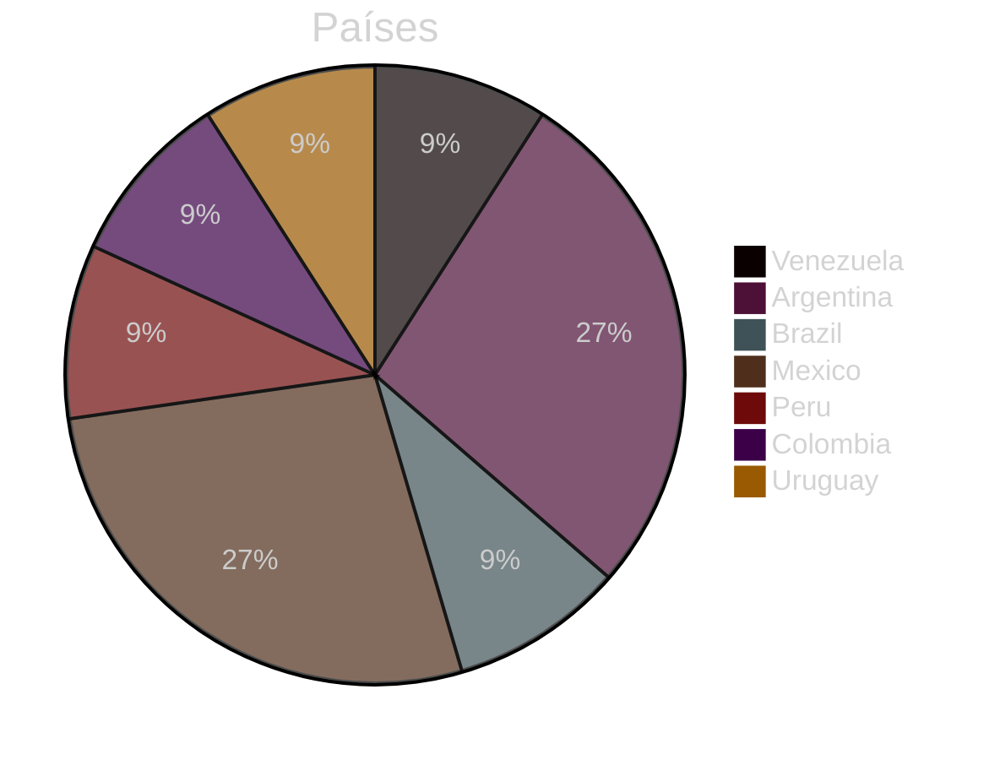
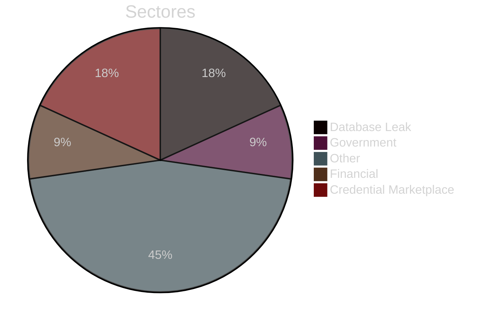
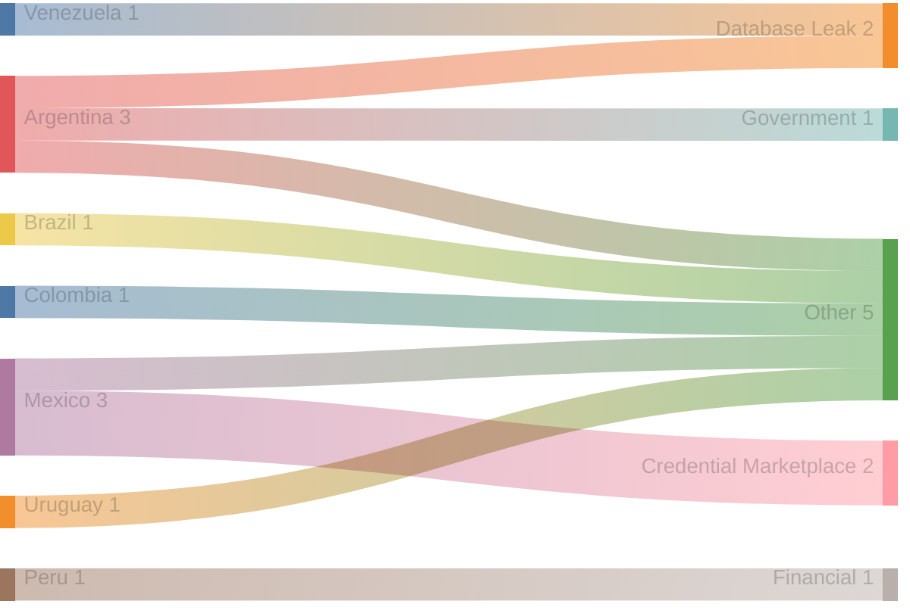
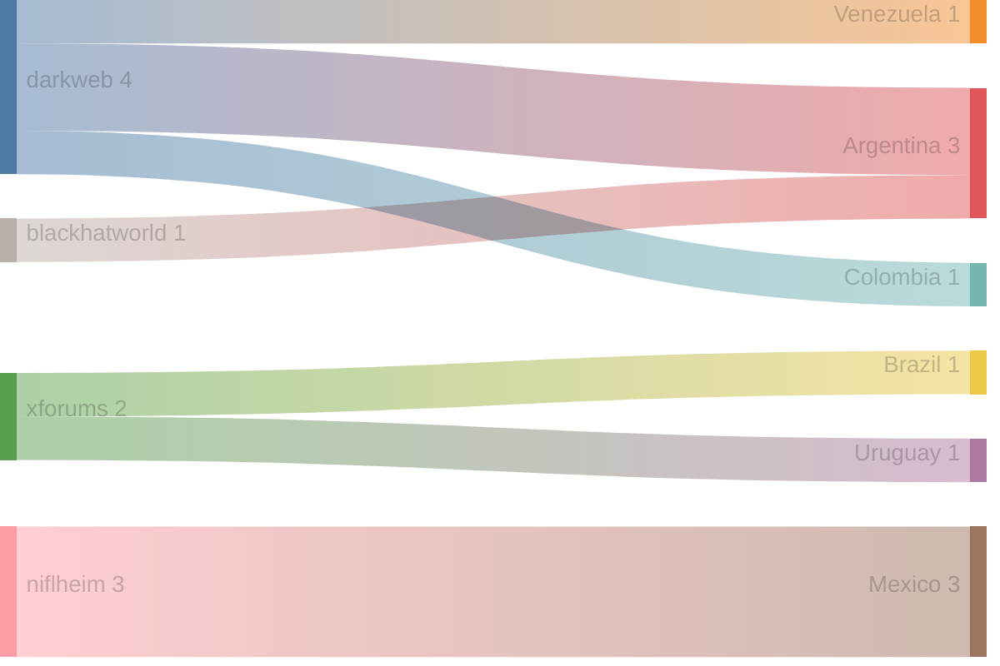
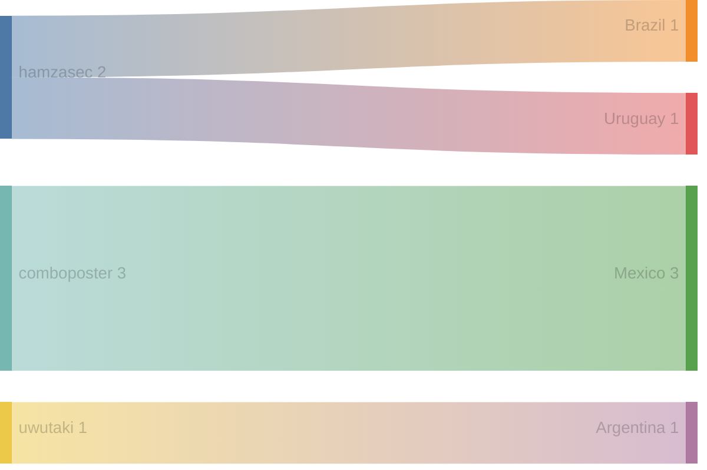

# Exfiltradaz — Monitoreo de filtraciones y exposición de datos en LATAM

> **Exfiltradaz** es una iniciativa de ZoqueLabs para recolectar, estructurar y visibilizar información sobre filtraciones de datos en América Latina a partir de fuentes abiertas.

- Dataset: https://github.com/ZoqueLabs/leaks-data  
- Pipeline: https://github.com/ZoqueLabs/leak-observatory  
- About: [Español](/filtracionesleaks/2026/03/25/acerca-de-exfiltradaz.html) [English](/leaks/2026/03/25/about-exfiltradaz.html)

---
## Reporte de filtraciones

Snapshot actual: [https://github.com/ZoqueLabs/leaks-data/blob/main/reports/2026-05-15-filtraciones-latam.md](https://github.com/ZoqueLabs/leaks-data/blob/main/reports/2026-05-15-filtraciones-latam.md)

**Cobertura de datos:** 2026-05-05 → 2026-05-15

Este reporte resume referencias a filtraciones observadas en foros, mercados y feeds de monitoreo del ecosistema de filtraciones.

Durante este periodo se identificaron **11 filtraciones** vinculadas a **7 países**. **Argentina y Mexico** concentran la mayor parte de los registros observados.

Los sectores más frecuentes corresponden a **Other (5), Database Leak (2), Credential Marketplace (2)**. En esta clasificación, la categoría Other reúne publicaciones que no pudieron asociarse claramente a un sector específico. Estas entradas suelen incluir referencias generales a filtraciones, discusiones en foros o listados de datos cuya naturaleza no es posible identificar con precisión a partir de la información disponible.

Varias de estas publicaciones aparecen en plataformas como **darkweb, niflheim, xforums**, donde suelen circular este tipo de referencias a bases de datos o listados de credenciales.

## Cambios desde el reporte anterior

**Nuevos autores observados:**
- uwutaki

## Distribución por país

## Distribución por sector

## Sector → País

## Origen → País

## Autor → País mencionado

## Registro de incidentes

 

<table id="incidentTable" class="display compact">
<thead>
<tr>
<th>Fecha</th>
<th>País</th>
<th>Sector</th>
<th>Origen</th>
<th>Autor</th>
<th>Contenido</th>
</tr>
</thead>
<tbody>
<tr><td>2026-05-15</td><td>Venezuela</td><td>Database Leak</td><td>darkweb</td><td>None</td><td>DATABASE CANTV ABA ULTRA Venezuela 2026 - 7.5K Personal Data 4K Data OLT GPON Fiber Optic</td></tr>
<tr><td>2026-05-15</td><td>Argentina</td><td>Government</td><td>darkweb</td><td>None</td><td>DATABASE MINISTERIO DE SALUD ARGENTINA | 52M LINES | 700GB LEAK</td></tr>
<tr><td>2026-05-13</td><td>Brazil</td><td>Other</td><td>xforums</td><td>hamzasec</td><td>Db Brazil 85M Leaked</td></tr>
<tr><td>2026-05-13</td><td>Mexico</td><td>Other</td><td>niflheim</td><td>comboposter</td><td>⭐️HQ⭐️ MEXICO 344.946 LINES GOOD FOR ALL⭐️</td></tr>
<tr><td>2026-05-13</td><td>Peru</td><td>Financial</td><td>None</td><td>None</td><td>{
  "Source": "https://cardforum.cc/",
  "Content": "fulllz.asia [+] ATM Cloned Cards CCV USA JAPAN PERU CANADA FRANCE ITALY EURO Cheap Pr", 
  "author": "<a href="https://cardforum.cc/member.php?action=profile&uid=142087">dumpstop10</a>",
  "Detection Date": "13 May 2026",
  "Type": "Data leak"
}
**🔹 ****t.me/breachdetect****  🔹**</td></tr>
<tr><td>2026-05-12</td><td>Mexico</td><td>Credential Marketplace</td><td>niflheim</td><td>comboposter</td><td>✪ [ 112 K++ ] Combo ✪ @Elite_Cloud1 ✪ { Mexico } ✪ [ 31/MAR/2026 ] ✪</td></tr>
<tr><td>2026-05-11</td><td>Mexico</td><td>Credential Marketplace</td><td>niflheim</td><td>comboposter</td><td>MEXICO BELGUIM SPAIN CHINA KOREA POLAND AUSTRALIA FRESH COMBOLISTS</td></tr>
<tr><td>2026-05-09</td><td>Argentina</td><td>Database Leak</td><td>darkweb</td><td>None</td><td>ARGENTINA CAR OWNERS DATABASE - PwnForums</td></tr>
<tr><td>2026-05-07</td><td>Colombia</td><td>Other</td><td>darkweb</td><td>None</td><td>(3) TXT - Colombia [CO] 219K (part 3 of Latin America) | XSS (ex DaMaGeLaB)</td></tr>
<tr><td>2026-05-06</td><td>Argentina</td><td>Other</td><td>blackhatworld</td><td>uwutaki</td><td>India, Pakistan, Brazil, and Argentina payment gateway</td></tr>
<tr><td>2026-05-06</td><td>Uruguay</td><td>Other</td><td>xforums</td><td>hamzasec</td><td>Db Expoınclusion Uruguay</td></tr>
</tbody></table>

