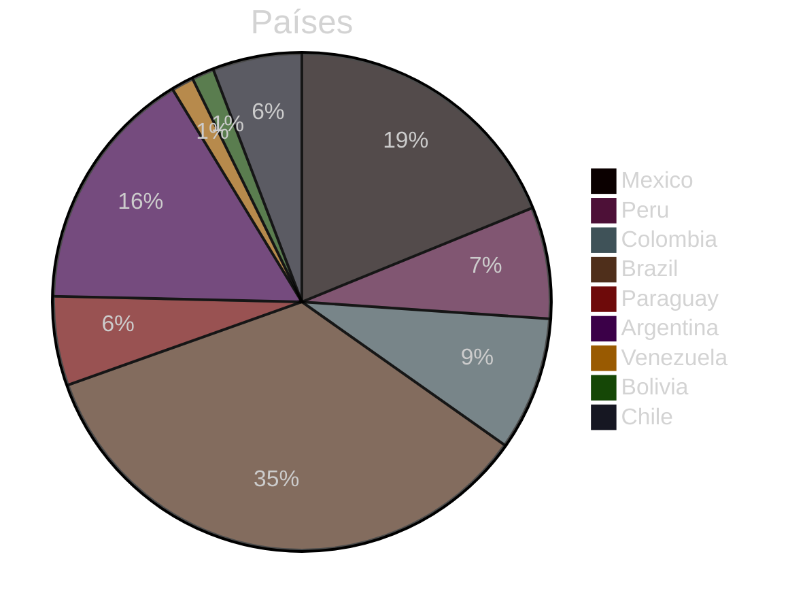
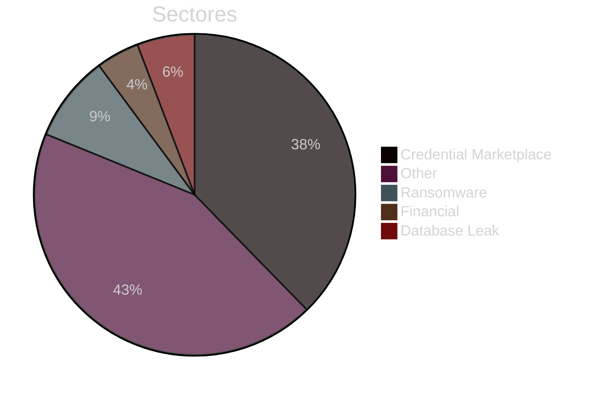
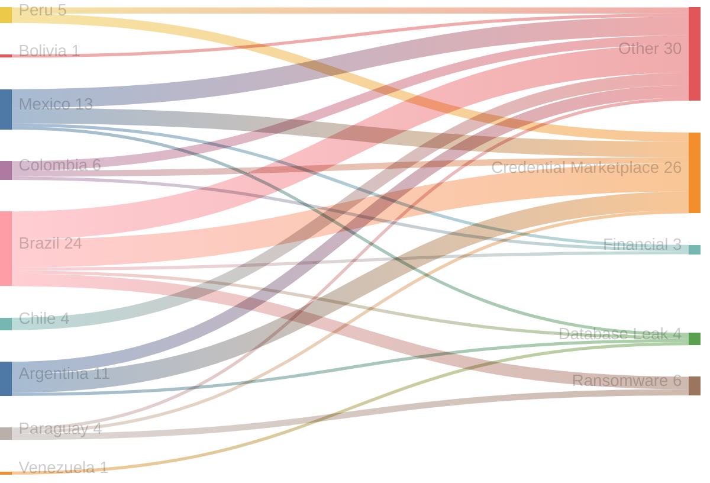
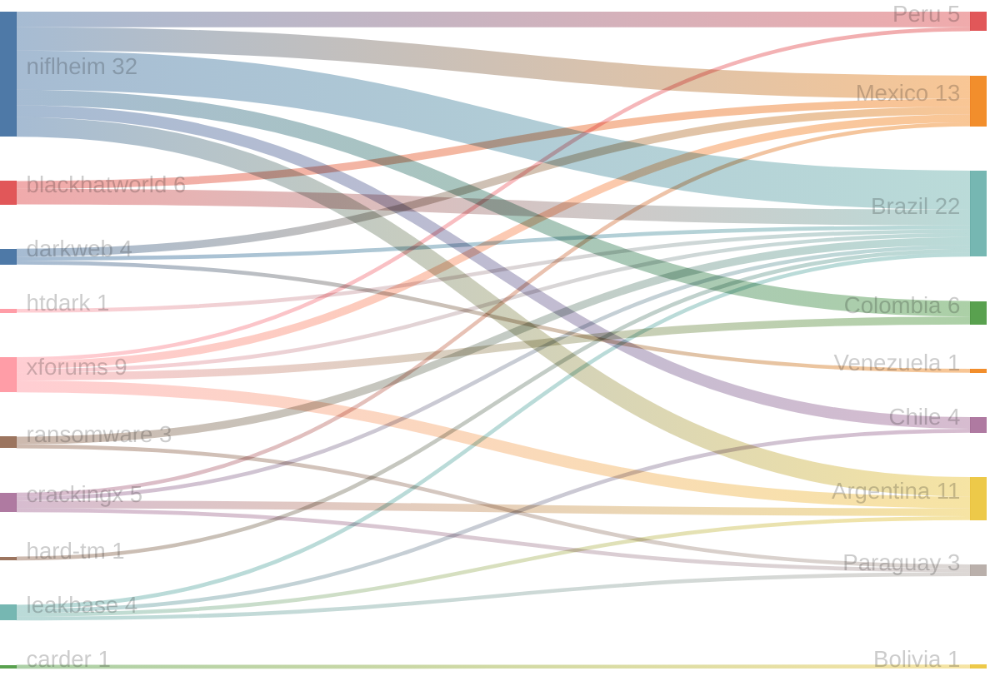
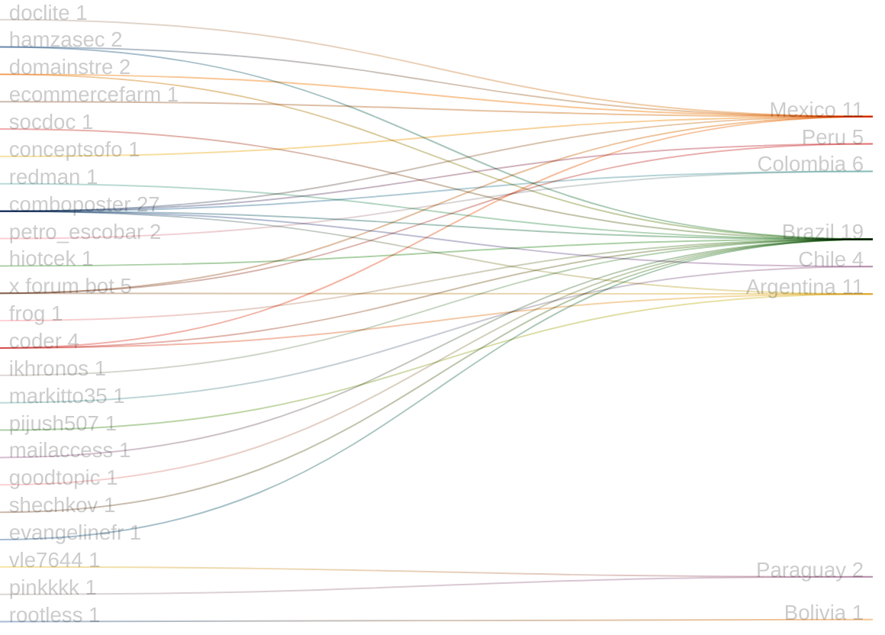

# Exfiltradaz — Monitoreo de filtraciones y exposición de datos en LATAM

> **Exfiltradaz** es una iniciativa de ZoqueLabs para recolectar, estructurar y visibilizar información sobre filtraciones de datos en América Latina a partir de fuentes abiertas.

- Dataset: https://github.com/ZoqueLabs/leaks-data  
- Pipeline: https://github.com/ZoqueLabs/leak-observatory  
- About: [Español](/filtracionesleaks/2026/03/25/acerca-de-exfiltradaz.html) [English](/leaks/2026/03/25/about-exfiltradaz.html)

---
## Reporte de filtraciones

Snapshot actual: https://github.com/ZoqueLabs/leaks-data/blob/main/reports/2026-03-25-filtraciones-latam.md

**Cobertura de datos:** 2026-03-12 → 2026-03-25

Este reporte resume referencias a filtraciones observadas en foros, mercados y feeds de monitoreo del ecosistema de filtraciones.

Durante este periodo se identificaron **69 filtraciones** vinculadas a **9 países**. **Brazil y Mexico** concentran la mayor parte de los registros observados.

Los sectores más frecuentes corresponden a **Other (30), Credential Marketplace (26), Ransomware (6)**. En esta clasificación, la categoría Other reúne publicaciones que no pudieron asociarse claramente a un sector específico. Estas entradas suelen incluir referencias generales a filtraciones, discusiones en foros o listados de datos cuya naturaleza no es posible identificar con precisión a partir de la información disponible.

Varias de estas publicaciones aparecen en plataformas como **niflheim, xforums, blackhatworld**, donde suelen circular este tipo de referencias a bases de datos o listados de credenciales.

### Señal destacada

El país con mayor aumento de actividad en este periodo fue **Brazil**, con **12 incidentes adicionales** respecto al snapshot anterior.

## Cambios desde el reporte anterior

**Nuevos autores observados:**
- conceptsofo
- evangelinefr
- goodtopic
- mailaccess
- pinkkkk
- shechkov

## Distribución por país

## Distribución por sector

## Sector → País

## Origen → País

## Autor → País mencionado

## Registro de incidentes

 

<table id="incidentTable" class="display compact">
<thead>
<tr>
<th>Fecha</th>
<th>País</th>
<th>Sector</th>
<th>Origen</th>
<th>Autor</th>
<th>Contenido</th>
</tr>
</thead>
<tbody>
<tr><td>2026-03-12</td><td>Mexico</td><td>Credential Marketplace</td><td>niflheim</td><td>comboposter</td><td>✪ [ 96 K++ ] Combo ✪ @Elite_Cloud1 ✪ { Mexico } ✪ [ 11/MAR/2026 ] ✪</td></tr>
<tr><td>2026-03-12</td><td>Peru</td><td>Credential Marketplace</td><td>niflheim</td><td>comboposter</td><td>✪ [ 73 K++ ] Combo ✪ @Elite_Cloud1 ✪ { Peru } ✪ [ 11/MAR/2026 ] ✪</td></tr>
<tr><td>2026-03-11</td><td>Colombia</td><td>Other</td><td>xforums</td><td>petro_escobar</td><td>GNP BPO - Call Center -- SFTP Claro Colombia - gas natural - WHHumanizatech- ServHumanizaTech</td></tr>
<tr><td>2026-03-11</td><td>Brazil</td><td>Ransomware</td><td>None</td><td>None</td><td>{</td></tr>
<tr><td>2026-03-11</td><td>Brazil</td><td>Ransomware</td><td>ransomware</td><td>None</td><td>🏴‍☠️ Coinbasecartel has just published a new victim : JBS Brazil - We have 3TB of your data - Pics added</td></tr>
<tr><td>2026-03-10</td><td>Paraguay</td><td>Ransomware</td><td>ransomware</td><td>None</td><td>🏴‍☠️ Kairos has just published a new victim : Institute of Social Security - Paraguay</td></tr>
<tr><td>2026-03-10</td><td>Paraguay</td><td>Ransomware</td><td>None</td><td>None</td><td>{</td></tr>
<tr><td>2026-03-10</td><td>Argentina</td><td>Other</td><td>xforums</td><td>x forum bot</td><td>Argentina By X FORUMS</td></tr>
<tr><td>2026-03-10</td><td>Argentina</td><td>Other</td><td>xforums</td><td>x forum bot</td><td>[1.410 lines] argentina.com 15-03-25 By X FORUMS</td></tr>
<tr><td>2026-03-10</td><td>Mexico</td><td>Other</td><td>niflheim</td><td>doclite</td><td>Mexico passport +selfie+video 40x free</td></tr>
<tr><td>2026-03-10</td><td>Colombia</td><td>Financial</td><td>xforums</td><td>petro_escobar</td><td>Claro Colombia GNP-BPO Call Center ** SQL Dump Dump</td></tr>
<tr><td>2026-03-09</td><td>Brazil</td><td>Financial</td><td>xforums</td><td>hamzasec</td><td>Brazil Kyc</td></tr>
<tr><td>2026-03-09</td><td>Mexico</td><td>Credential Marketplace</td><td>niflheim</td><td>domainstre</td><td>MailPass Mexico (mx) 51.1k</td></tr>
<tr><td>2026-03-09</td><td>Venezuela</td><td>Database Leak</td><td>darkweb</td><td>None</td><td>DATABASE FREE DB YUMMY RIDES Venezuela, 30k Images With Full Names Of The Drivers.</td></tr>
<tr><td>2026-03-08</td><td>Brazil</td><td>Other</td><td>blackhatworld</td><td>socdoc</td><td>UAE company - Need to receive BRL from Brazil and convert to USD payout</td></tr>
<tr><td>2026-03-08</td><td>Mexico</td><td>Financial</td><td>xforums</td><td>hamzasec</td><td>Bbva Mexico Bank</td></tr>
<tr><td>2026-03-06</td><td>Brazil</td><td>Credential Marketplace</td><td>niflheim</td><td>redman</td><td>⭐ [DATABASE] BRASIL STREAMING COMBO ⭐ FRESH CRACKED ⭐</td></tr>
<tr><td>2026-03-06</td><td>Brazil</td><td>Other</td><td>niflheim</td><td>hiotcek</td><td>DB BRASIL</td></tr>
<tr><td>2026-03-05</td><td>Brazil</td><td>Ransomware</td><td>None</td><td>None</td><td>{</td></tr>
<tr><td>2026-03-05</td><td>Brazil</td><td>Ransomware</td><td>ransomware</td><td>None</td><td>🏴‍☠️ Coinbasecartel has just published a new victim : JBS Brazil - We have 3TB of your data</td></tr>
<tr><td>2026-03-05</td><td>Brazil</td><td>Other</td><td>darkweb</td><td>None</td><td>JBS Brazil - We have 3TB of your data • Coinbasecartel</td></tr>
<tr><td>2026-03-04</td><td>Peru</td><td>Credential Marketplace</td><td>niflheim</td><td>comboposter</td><td>✦✦ [ 73 K++ ] Combo✦{ Peru }✦ Email:Pass ✦FRESH✦ [ 18-2-2026 ] ✦✦</td></tr>
<tr><td>2026-03-04</td><td>Mexico</td><td>Database Leak</td><td>darkweb</td><td>None</td><td>DATABASE Mexico Public Water Services - AyD [790+GB of data] for FREE</td></tr>
<tr><td>2026-03-03</td><td>Mexico</td><td>Credential Marketplace</td><td>niflheim</td><td>comboposter</td><td>✦✦ [ 91 K++ ] Combo✦{ Mexico }✦ Email:Pass ✦FRESH✦ [ 15-2-2026 ] ✦✦</td></tr>
<tr><td>2026-03-03</td><td>Paraguay</td><td>Other</td><td>leakbase</td><td>vle7644</td><td>Paraguay full DB</td></tr>
<tr><td>2026-03-01</td><td>Mexico</td><td>Other</td><td>darkweb</td><td>None</td><td>🇲🇽 MEXICO VOTERS CARD FRONT BACK | ⭐ DNA Forums ⭐</td></tr>
<tr><td>2026-03-01</td><td>Brazil</td><td>Database Leak</td><td>leakbase</td><td>frog</td><td>Linkedin USA Austria Brazil Bangladesh Cand France India Iran Iraq Luxembourg UK databases</td></tr>
<tr><td>2026-03-01</td><td>Mexico</td><td>Other</td><td>blackhatworld</td><td>ecommercefarm</td><td>Hello from Mexico! Building a US/MX Cloud Phone Automation Setup</td></tr>
<tr><td>2026-02-28</td><td>Brazil</td><td>Other</td><td>blackhatworld</td><td>ikhronos</td><td>New member from Brazil – Looking for insights on profitable niches</td></tr>
<tr><td>2026-02-28</td><td>Bolivia</td><td>Other</td><td>carder</td><td>rootless</td><td>I need drops in brazil, panama, peru, bolivia.</td></tr>
<tr><td>2026-02-27</td><td>Mexico</td><td>Credential Marketplace</td><td>crackingx</td><td>coder</td><td>Mexico combo 17 ml</td></tr>
<tr><td>2026-02-27</td><td>Chile</td><td>Other</td><td>leakbase</td><td>markitto35</td><td>Mgmotor.pe - Live Mysql Db + 250K Contacts (Peru - Chile)</td></tr>
<tr><td>2026-02-26</td><td>Colombia</td><td>Credential Marketplace</td><td>niflheim</td><td>comboposter</td><td>✪ [ 189 K++ ] Combo ✪ @Elite_Cloud1 ✪ { Colombia } ✪ [ 19/FEB/2026 ] ✪</td></tr>
<tr><td>2026-02-26</td><td>Peru</td><td>Other</td><td>xforums</td><td>x forum bot</td><td>1x ADARVE-PERU SMTP 📧 📬</td></tr>
<tr><td>2026-02-26</td><td>Brazil</td><td>Credential Marketplace</td><td>niflheim</td><td>comboposter</td><td>148K BRAZIL COMBO MAIL ACCESS</td></tr>
<tr><td>2026-02-25</td><td>Argentina</td><td>Database Leak</td><td>leakbase</td><td>pijush507</td><td>275K Argentina Consumer B2C Email Database</td></tr>
<tr><td>2026-03-24</td><td>Brazil</td><td>Credential Marketplace</td><td>niflheim</td><td>comboposter</td><td>✦✦ [ 324 K++ ]✦{ Brazil }✦Email:Pass✦FRESH✦Maxi_Leaks✦[ 24-3-2026 ]✦✦</td></tr>
<tr><td>2026-03-24</td><td>Colombia</td><td>Credential Marketplace</td><td>niflheim</td><td>comboposter</td><td>✦✦ [ 127 K++ ]✦{ Colombia }✦Email:Pass✦FRESH✦Maxi_Leaks✦[ 24-3-2026 ]✦✦</td></tr>
<tr><td>2026-03-24</td><td>Mexico</td><td>Credential Marketplace</td><td>xforums</td><td>x forum bot</td><td>✦✦✦ [133k++ ] Combo ✦ { Mexico } ✦ Email:Pass ✦ FRESH ✦ [ 25-9-2025 ] ✦✦✦</td></tr>
<tr><td>2026-03-24</td><td>Mexico</td><td>Other</td><td>blackhatworld</td><td>conceptsofo</td><td>This is how you limit your videos from going viral in India, Mexico, Turkey, etc.</td></tr>
<tr><td>2026-03-24</td><td>Brazil</td><td>Credential Marketplace</td><td>htdark</td><td>mailaccess</td><td>1K Brazil Fresh Valid Mail Access 24.03</td></tr>
<tr><td>2026-03-22</td><td>Argentina</td><td>Credential Marketplace</td><td>crackingx</td><td>coder</td><td>[31KKk]_[argentina]_[SQLICOMBO</td></tr>
<tr><td>2026-03-21</td><td>Argentina</td><td>Credential Marketplace</td><td>xforums</td><td>x forum bot</td><td>Argentina Logs By X FORUMS</td></tr>
<tr><td>2026-03-21</td><td>Argentina</td><td>Credential Marketplace</td><td>crackingx</td><td>coder</td><td>ARGENTINA COMBO LIST _</td></tr>
<tr><td>2026-03-19</td><td>Argentina</td><td>Credential Marketplace</td><td>niflheim</td><td>comboposter</td><td>HOTMAILS ACCESS .AR ARGENTINA TARGETED COUNTRY TRY</td></tr>
<tr><td>2026-03-19</td><td>Argentina</td><td>Credential Marketplace</td><td>niflheim</td><td>comboposter</td><td>EMAIL:PASS | ⭐ 4combo4 Database ⭐ | ARGENTINA COMBO LIST | PRIVATE SOURCE ⚙️</td></tr>
<tr><td>2026-03-19</td><td>Argentina</td><td>Credential Marketplace</td><td>niflheim</td><td>comboposter</td><td>✦✦ [ 35 K++ ] Combo✦{ Argentina }✦ Email:Pass ✦FRESH✦ [ 28-1-2026 ] ✦✦</td></tr>
<tr><td>2026-03-16</td><td>Brazil</td><td>Credential Marketplace</td><td>niflheim</td><td>domainstre</td><td>MailPass 100K Brazil (br)</td></tr>
<tr><td>2026-03-15</td><td>Brazil</td><td>Credential Marketplace</td><td>hard-tm</td><td>goodtopic</td><td>800X BRAZIL Full Mail Access 15.03</td></tr>
<tr><td>2026-03-15</td><td>Chile</td><td>Other</td><td>niflheim</td><td>comboposter</td><td>⚜️HQ CHILE 166.289 LINES GOOD FOR ALL⚜️</td></tr>
<tr><td>2026-03-15</td><td>Peru</td><td>Credential Marketplace</td><td>niflheim</td><td>comboposter</td><td>✪ [ 66 K++ ] Combo ✪ @Elite_Cloud1 ✪ { Peru } ✪ [ 14/MAR/2026 ] ✪</td></tr>
<tr><td>2026-03-14</td><td>Brazil</td><td>Other</td><td>niflheim</td><td>comboposter</td><td>⭐️✨Brazil 142K✨⭐️</td></tr>
<tr><td>2026-03-14</td><td>Argentina</td><td>Other</td><td>niflheim</td><td>comboposter</td><td>⚜️ARGENTINA 264.723 LINES HQ GOOD FOR ALL⚜️</td></tr>
<tr><td>2026-03-14</td><td>Brazil</td><td>Other</td><td>niflheim</td><td>comboposter</td><td>⚜️BRAZIL 1.574.679 HQ FRESH LINES BY EXL⚜️</td></tr>
<tr><td>2026-03-14</td><td>Colombia</td><td>Other</td><td>niflheim</td><td>comboposter</td><td>⚜️COLOMBIA 5.29mb HQ GOOD FOR ALL⚜️</td></tr>
<tr><td>2026-03-14</td><td>Chile</td><td>Other</td><td>niflheim</td><td>comboposter</td><td>⚜️CHILE 6.92mb HQ GOOD FOR ALL⚜️</td></tr>
<tr><td>2026-03-14</td><td>Argentina</td><td>Other</td><td>niflheim</td><td>comboposter</td><td>⚜️ARGENTINA 9.9mb HQ GOOD FOR ALL⚜️</td></tr>
<tr><td>2026-03-14</td><td>Peru</td><td>Other</td><td>niflheim</td><td>comboposter</td><td>⚜️PERU 3.11mb HQ GOOD FOR ALL⚜️</td></tr>
<tr><td>2026-03-13</td><td>Mexico</td><td>Other</td><td>niflheim</td><td>comboposter</td><td>⚜️MEXICO 5.73mb NEW HQ LINES BY EXL⚜️</td></tr>
<tr><td>2026-03-13</td><td>Brazil</td><td>Other</td><td>niflheim</td><td>comboposter</td><td>⚜️ BRAZIL 50mb NEW HQ LINES BY EXL⚜️</td></tr>
<tr><td>2026-03-13</td><td>Brazil</td><td>Credential Marketplace</td><td>niflheim</td><td>comboposter</td><td>✦✦ [ 339 K++ ]✦{ Brazil }✦Email:Pass✦FRESH✦Maxi_Leaks✦[ 13-3-2026 ]✦✦</td></tr>
<tr><td>2026-03-13</td><td>Brazil</td><td>Credential Marketplace</td><td>niflheim</td><td>comboposter</td><td>X3600 HOTMAILS ACCESS .BR BRAZIL COUNTRY TARGET MAIL ACCESS</td></tr>
<tr><td>2026-03-13</td><td>Mexico</td><td>Other</td><td>niflheim</td><td>comboposter</td><td>⚜️MEXICO 10.4mb NEW HQ LINES BY EXL⚜️</td></tr>
<tr><td>2026-03-13</td><td>Colombia</td><td>Other</td><td>niflheim</td><td>comboposter</td><td>⚜️COLOMBIA 5.2mb NEW HQ LINES BY EXL⚜️</td></tr>
<tr><td>2026-03-13</td><td>Chile</td><td>Other</td><td>niflheim</td><td>comboposter</td><td>⚜️CHILE 6.2mb NEW HQ LINES BY EXL⚜️</td></tr>
<tr><td>2026-03-13</td><td>Brazil</td><td>Other</td><td>blackhatworld</td><td>shechkov</td><td>Google Ads Brazil</td></tr>
<tr><td>2026-03-12</td><td>Paraguay</td><td>Credential Marketplace</td><td>crackingx</td><td>pinkkkk</td><td>Selling a Hotmail checkout process in Paraguay that runs on Android. I'll record a video proving it and everything.</td></tr>
<tr><td>2026-03-12</td><td>Brazil</td><td>Other</td><td>blackhatworld</td><td>evangelinefr</td><td>Looking for SEO Packages & Expert for Brazil & Ukraine Sites</td></tr>
<tr><td>2026-03-12</td><td>Brazil</td><td>Credential Marketplace</td><td>crackingx</td><td>coder</td><td>Brazil COMBO</td></tr>
</tbody></table>

