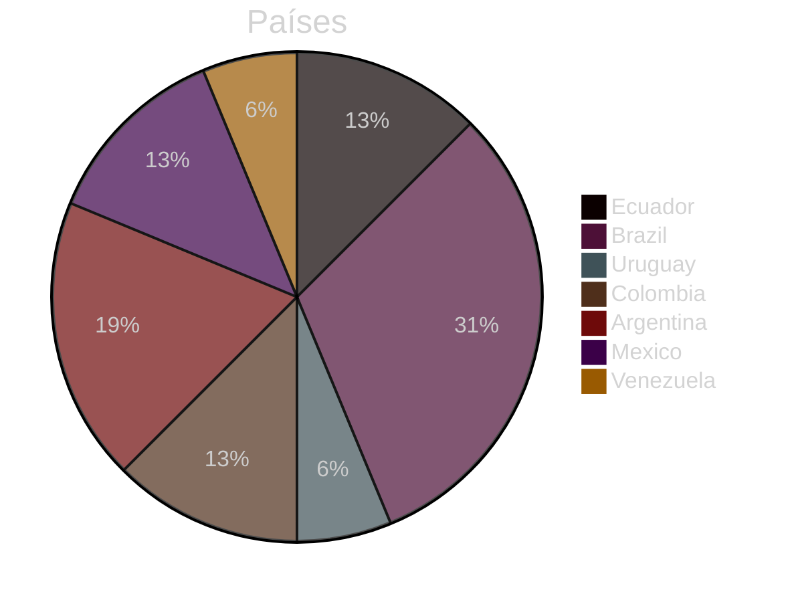
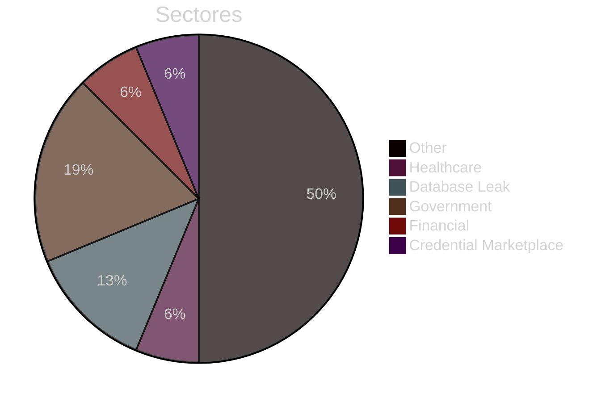
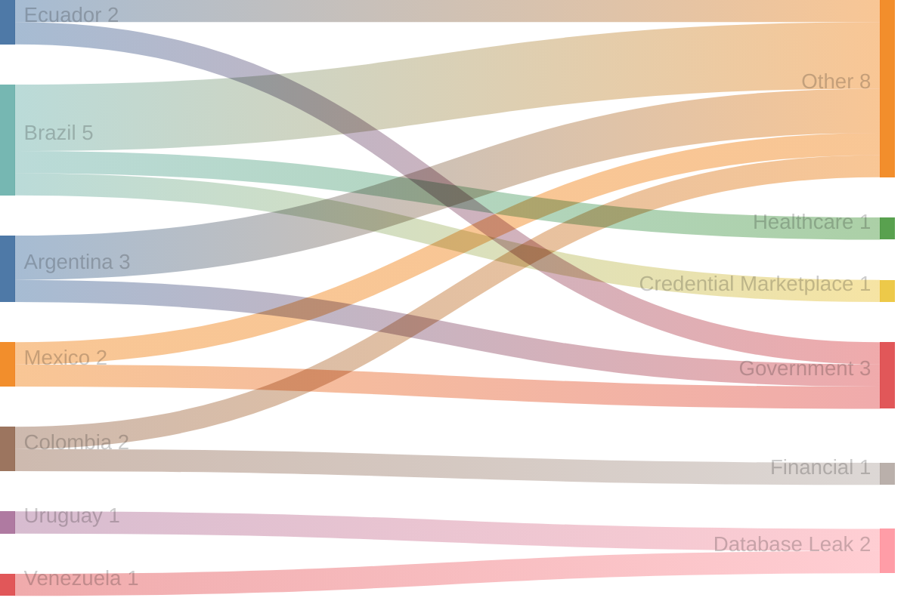
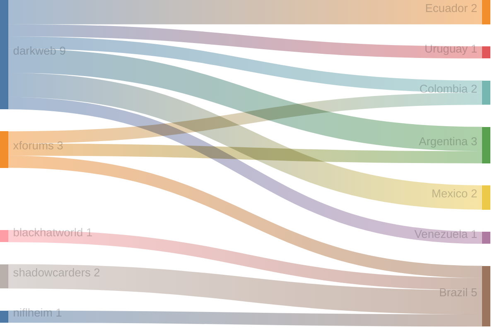
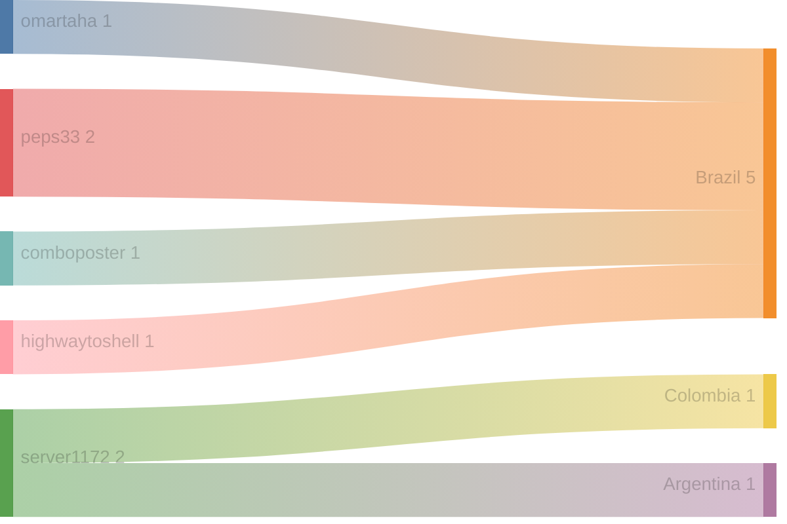

# Exfiltradaz — Monitoreo de filtraciones y exposición de datos en LATAM

> **Exfiltradaz** es una iniciativa de ZoqueLabs para recolectar, estructurar y visibilizar información sobre filtraciones de datos en América Latina a partir de fuentes abiertas.

- Dataset: https://github.com/ZoqueLabs/leaks-data  
- Pipeline: https://github.com/ZoqueLabs/leak-observatory  
- About: [Español](/filtracionesleaks/2026/03/25/acerca-de-exfiltradaz.html) [English](/leaks/2026/03/25/about-exfiltradaz.html)

---
## Reporte de filtraciones

Snapshot actual: [https://github.com/ZoqueLabs/leaks-data/blob/main/reports/2026-05-29-filtraciones-latam.md](https://github.com/ZoqueLabs/leaks-data/blob/main/reports/2026-05-29-filtraciones-latam.md)

**Cobertura de datos:** 2026-05-15 → 2026-05-29

Este reporte resume referencias a filtraciones observadas en foros, mercados y feeds de monitoreo del ecosistema de filtraciones.

Durante este periodo se identificaron **16 filtraciones** vinculadas a **7 países**. **Brazil y Argentina** concentran la mayor parte de los registros observados.

Los sectores más frecuentes corresponden a **Other (8), Government (3), Database Leak (2)**. En esta clasificación, la categoría Other reúne publicaciones que no pudieron asociarse claramente a un sector específico. Estas entradas suelen incluir referencias generales a filtraciones, discusiones en foros o listados de datos cuya naturaleza no es posible identificar con precisión a partir de la información disponible.

Varias de estas publicaciones aparecen en plataformas como **darkweb, xforums, shadowcarders**, donde suelen circular este tipo de referencias a bases de datos o listados de credenciales.

## Cambios desde el reporte anterior

**Nuevos autores observados:**
- omartaha
- peps33
- server1172

## Distribución por país

## Distribución por sector

## Sector → País

## Origen → País

## Autor → País mencionado

## Registro de incidentes

 

<table id="incidentTable" class="display compact">
<thead>
<tr>
<th>Fecha</th>
<th>País</th>
<th>Sector</th>
<th>Origen</th>
<th>Autor</th>
<th>Contenido</th>
</tr>
</thead>
<tbody>
<tr><td>2026-05-28</td><td>Ecuador</td><td>Other</td><td>darkweb</td><td>None</td><td>DOCUMENTS Polizas de las Fuerzas Armadas del Ecuador</td></tr>
<tr><td>2026-05-25</td><td>Brazil</td><td>Healthcare</td><td>blackhatworld</td><td>omartaha</td><td>Expanding Partnerships in Key GEOs: Canada, Mexico, Brazil, Turkey, India</td></tr>
<tr><td>2026-05-23</td><td>Brazil</td><td>Other</td><td>shadowcarders</td><td>peps33</td><td>({+447426976269})<buy certified weight lost peptides online in brazil, puerto rico, philippines, usa</td></tr>
<tr><td>2026-05-23</td><td>Brazil</td><td>Other</td><td>shadowcarders</td><td>peps33</td><td>{+447426976269})][Peptides vs steroids Available in Brazil, Puerto Rico, Philippines, USA, Australia</td></tr>
<tr><td>2026-05-22</td><td>Uruguay</td><td>Database Leak</td><td>darkweb</td><td>None</td><td>SELLING uruguay: MEC BUTIA [Databases] [Becas] [10k Sample] [Citizens]</td></tr>
<tr><td>2026-05-22</td><td>Ecuador</td><td>Government</td><td>darkweb</td><td>None</td><td>DATABASE Ministry of Environment and Energy of Ecuador DATABASE JSON</td></tr>
<tr><td>2026-05-21</td><td>Colombia</td><td>Financial</td><td>darkweb</td><td>None</td><td>DATABASE Banco Agrario -- EmergiaCC Conalcreditos ColombiA</td></tr>
<tr><td>2026-05-21</td><td>Brazil</td><td>Credential Marketplace</td><td>niflheim</td><td>comboposter</td><td>⭐[400k]⭐ MAILPASS ⚡UHQ DATABASE BRAZIL TARGETED⚡ - FRESH DATA- 2026 ⭐</td></tr>
<tr><td>2026-05-20</td><td>Colombia</td><td>Other</td><td>xforums</td><td>server1172</td><td>Quindio University Colombia - 3.26 GB FREE</td></tr>
<tr><td>2026-05-19</td><td>Argentina</td><td>Government</td><td>darkweb</td><td>None</td><td>[~478k] Argentina https://intranet.jus.mendoza.gov.ar - Legal personnel records including contacts, IDs, emails, job titles</td></tr>
<tr><td>2026-05-19</td><td>Mexico</td><td>Other</td><td>darkweb</td><td>None</td><td>high-level education for entrepreneurs / Mexico / 315K+ Leads</td></tr>
<tr><td>2026-05-19</td><td>Brazil</td><td>Other</td><td>xforums</td><td>highwaytoshell</td><td>[RDWeb] Government (Municipal) - Brazil ($250M - $500M revenue)</td></tr>
<tr><td>2026-05-17</td><td>Argentina</td><td>Other</td><td>darkweb</td><td>None</td><td>ARGENTINA IOMA - GDEBA - BCRA ALL LEAK FREE PART2 (corrected link)</td></tr>
<tr><td>2026-05-16</td><td>Mexico</td><td>Government</td><td>darkweb</td><td>None</td><td>[MEXICO] SYSTEM TO DOX ANY LAWYER IN THE STATE OF BAJA CALIFORNIA [MEXICO]</td></tr>
<tr><td>2026-05-16</td><td>Venezuela</td><td>Database Leak</td><td>darkweb</td><td>None</td><td>DATABASE MOVISTAR VENEZUELA 2026 DB 4.15 Million Customer Numbers.</td></tr>
<tr><td>2026-05-16</td><td>Argentina</td><td>Other</td><td>xforums</td><td>server1172</td><td>ARGENTINA BCRA - GDEBA IOMA ALL LEAK FREE</td></tr>
</tbody></table>

