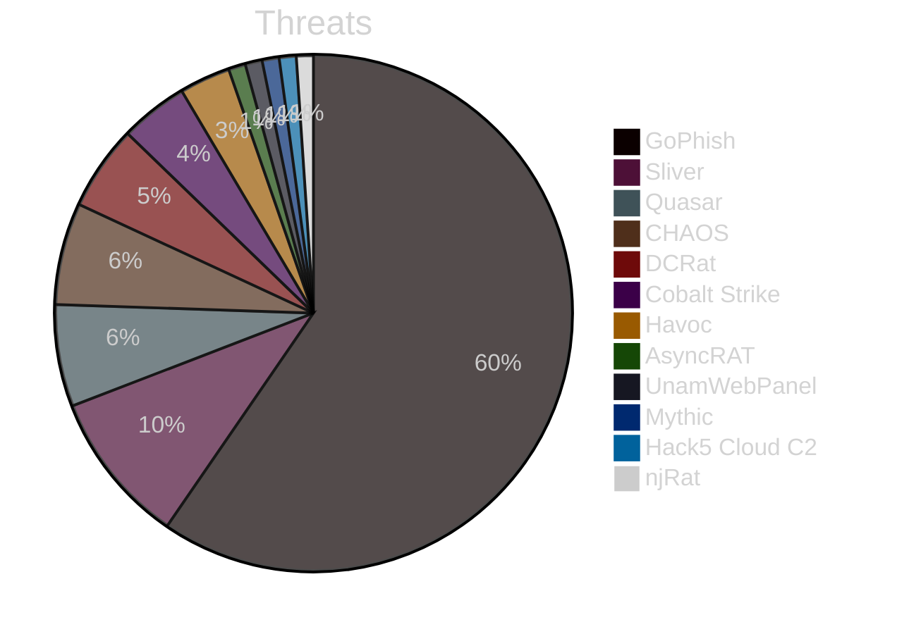
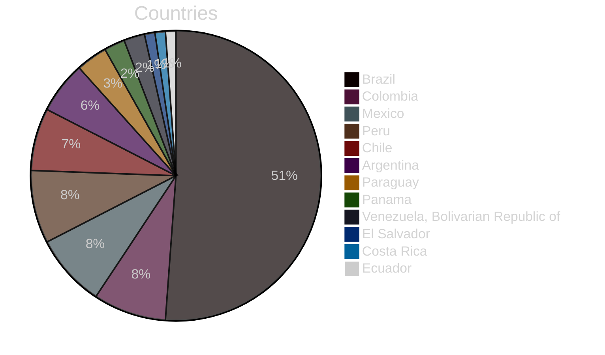
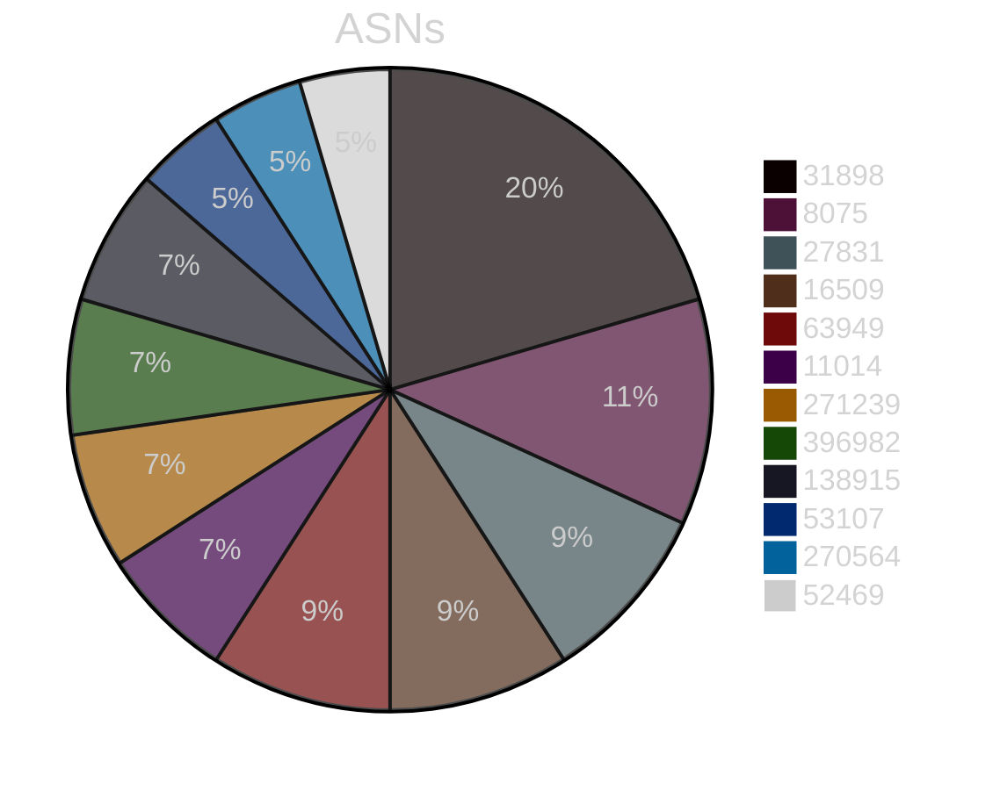
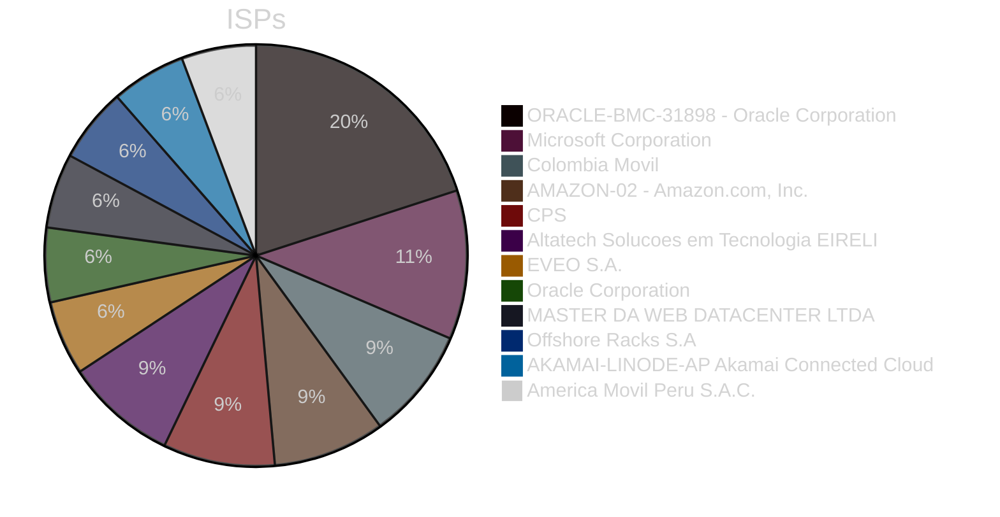
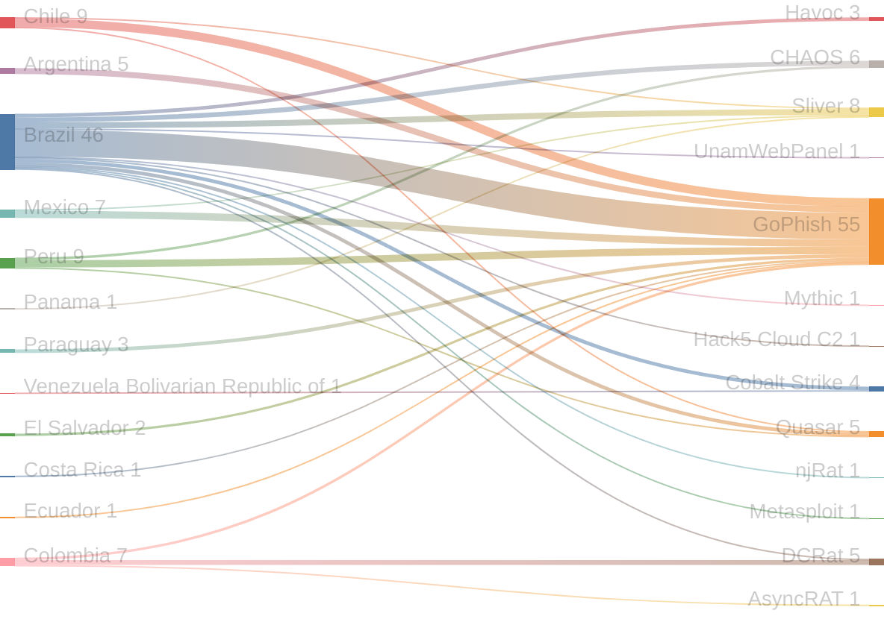
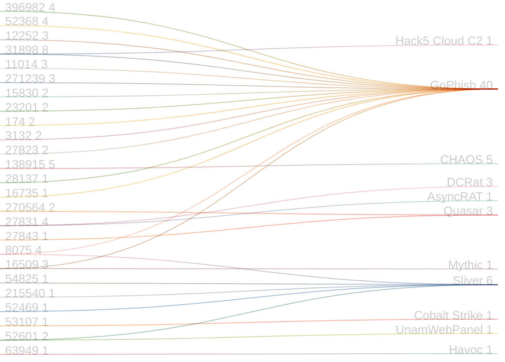
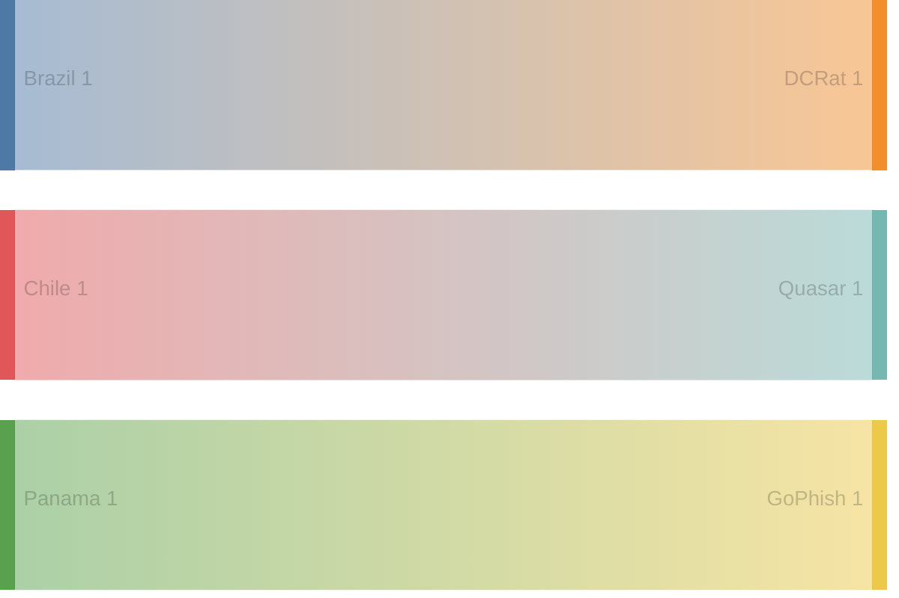
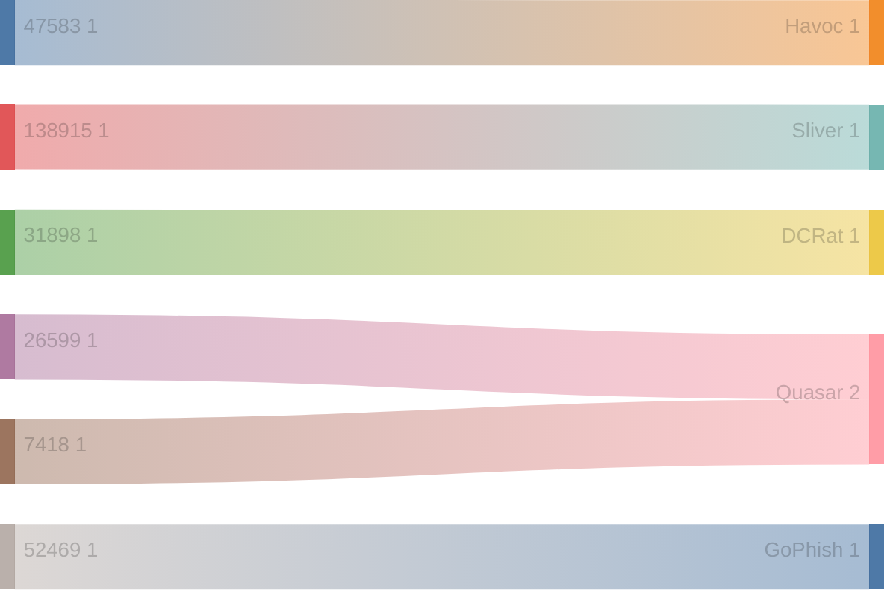

# ZOLIM - Zoque-Observatorio Latinoamericano de Infraestructura Maliciosa

> **ZOLIM (Observatorio Latinoamericano de Infraestructura Maliciosa de Zoque)** es una iniciativa de investigación de ZoqueLabs orientada a documentar, analizar y publicar **snapshots periódicos de infraestructura maliciosa en América Latina**, con énfasis en sistemas de comando y control (C2) y tooling asociado.

- Generated: `2026-02-17T17:58:40Z`
- About ZOLIM: [Español](/zolim/2026/02/05/acerca-de-zolim.html) - [English](/zolim/2026/02/05/about-zolim.html)
- Current snapshot: [https://github.com/ZoqueLabs/olim_datasets/tree/main/reports/2026-02-17_12-58-39](https://github.com/ZoqueLabs/olim_datasets/tree/main/reports/2026-02-17_12-58-39)

## Metrics (current)

> **IPs:** `87` | **Unique ports:** `31` | **Threat frameworks:** `14` | **Countries:** `13` | **Cities:** `36` | **ASNs:** `47`

## Tops (current)

- Threats: `GoPhish(56)` `Sliver(9)` `Quasar(6)` `CHAOS(6)` `DCRat(5)` `Cobalt Strike(4)` `Havoc(3)` `AsyncRAT(1)` `UnamWebPanel(1)` `Mythic(1)` `Hack5 Cloud C2(1)` `njRat(1)`
- Countries: `Brazil(44)` `Colombia(7)` `Mexico(7)` `Peru(7)` `Chile(6)` `Argentina(5)` `Paraguay(3)` `Panama(2)` `Venezuela, Bolivarian Republic of(2)` `El Salvador(1)` `Costa Rica(1)` `Ecuador(1)`
- Cities: `São Paulo(30)` `Lima(7)` `Barranquilla(4)` `Santiago(4)` `Belo Horizonte(3)` `Buenos Aires(3)` `Panamá(2)` `Asunción(2)` `Rolândia(2)` `Mexico City(2)` `Santiago de Querétaro(2)` `Rosario(2)`
- ASNs: `31898(9)` `8075(5)` `27831(4)` `16509(4)` `63949(4)` `11014(3)` `271239(3)` `396982(3)` `138915(3)` `53107(2)` `270564(2)` `52469(2)`
- ISPs: `ORACLE-BMC-31898 - Oracle Corporation(7)` `Microsoft Corporation(4)` `Colombia Movil(3)` `AMAZON-02 - Amazon.com, Inc.(3)` `CPS(3)` `Altatech Solucoes em Tecnologia EIRELI(3)` `EVEO S.A.(2)` `Oracle Corporation(2)` `MASTER DA WEB DATACENTER LTDA(2)` `Offshore Racks S.A(2)` `AKAMAI-LINODE-AP Akamai Connected Cloud(2)` `America Movil Peru S.A.C.(2)`
- Orgs: `unknown(54)` `Microsoft Corporation(4)` `Offshore Racks S.A(2)` `Linode(2)` `ZAM LTDA.(2)` `Colombia Móvil(1)` `FAXT TELECOMUNICACOES LTDA(1)` `Oracle Public Cloud(1)` `Equinix Services, Inc.(1)` `GLOBAL CONNECTIVITY SOLUTIONS LLP(1)` `Univ. Catolica Nuestra Senora de la Asuncion(1)` `DIGICEL S.A. DE C.V.(1)`
- Ports (frequency across IPs): `3333(29)` `443(14)` `31337(9)` `8080(7)` `80(4)` `8443(3)` `43333(3)` `8848(2)` `1080(2)` `8081(2)` `1000(1)` `10035(1)`

## Graphs (current)

### Country → Threat (top)

### ASN → Threat (top)

## Delta vs previous snapshot

- IPs: **+10** / **-0** (persistent: `77`)
- Threat frameworks: **+0** / **-0**
- Countries: **+0** / **-0**
- ASNs: **+3** / **-0**
- ISPs: **+5** / **-2**
- Orgs: **+4** / **-1**
- Ports: **+7** / **-0**
- Cities: **+4** / **-0**

### Delta lists (compact)

- New IPs: `136.248.245.36`, `146.235.38.234`, `147.93.9.173`, `149.50.137.180`, `18.231.69.245`, `181.162.184.56`, `181.174.165.128`, `191.8.232.11`, `38.60.209.110`, `38.60.242.200`
- Removed IPs: _none_
- New threats: _none_
- Removed threats: _none_
- New countries: _none_
- New ASNs: `26599`, `47583`, `7418`
- New ISPs: `AS-HOSTINGER`, `Colombia Móvil`, `KAOPU-HK Kaopu Cloud HK Limited`, `Level 3 Parent, LLC`, `TELEFONICA CHILE S.A.`
- New ports: `18010`, `2087`, `4700`, `50050`, `5038`, `6653`, `853`

### IP reuse / threat drift

- IPs with threat changes: `1`
  - `191.93.118.254`: ['AsyncRAT', 'DCRat'] → ['AsyncRAT'] (+[], -['DCRat'])

### Delta graph: NEW Country → Threat edges

### Delta graph: NEW ASN → Threat edges

## All IPs (current snapshot)
 

| IP | Threats | Ports | Country | City | ASN | ISP | Org | Source | Last scan |
|---|---|---|---|---|---|---|---|---|---|
| 136.248.245.36 | GoPhish | 3333 | Chile | Colina | AS31898 | ORACLE-BMC-31898 - Oracle Corporation | unknown | censys | 2026-02-17_07-20-04 |
| 144.22.192.165 | GoPhish | 8443 | Brazil | São Paulo | AS31898 | ORACLE-BMC-31898 - Oracle Corporation | unknown | censys | 2026-02-17_11-11-07 |
| 144.22.207.61 | GoPhish | 8443 | Brazil | São Paulo | AS31898 | ORACLE-BMC-31898 - Oracle Corporation | unknown | censys | 2026-02-17_09-23-44 |
| 146.235.38.234 | DCRat | 5038 | Brazil | São Paulo | AS31898 | ORACLE-BMC-31898 - Oracle Corporation | unknown | censys | 2026-02-17_07-21-28 |
| 147.28.223.190 | Sliver | 31337 | Mexico | La Cañada | AS54825 | Packet Host, Inc. | Equinix Services, Inc. | shodan | 2026-01-04_18-32-22 |
| 147.45.116.18 | Sliver | 31337 | Brazil | São Paulo | AS215540 | GLOBAL CONNECTIVITY SOLUTIONS LLP | GLOBAL CONNECTIVITY SOLUTIONS LLP | shodan | 2026-01-22_09-40-58 |
| 147.93.9.173 | Havoc | 443 | Brazil | São Paulo | AS47583 | AS-HOSTINGER | unknown | censys | 2026-02-17_13-12-24 |
| 148.230.153.56 | GoPhish | 3333 | Mexico | Torreón | AS22884 | TOTAL PLAY TELECOMUNICACIONES SA DE CV | unknown | censys | 2026-02-04_23-22-09 |
| 149.50.137.180 | GoPhish | 2087 | Argentina | Rosario | AS27823 | Dattatec.com | unknown | censys | 2026-02-17_06-11-20 |
| 15.228.3.86 | Cobalt Strike | 80 | Brazil | São Paulo | AS16509 | Amazon.com, Inc. | Amazon Data Services Brazil | shodan | 2026-01-06_03-05-38 |
| 150.187.25.242 | Cobalt Strike | 9999 | Venezuela, Bolivarian Republic of | Barquisimeto | AS20312 | Fundación Centro Nacional de Innovación Tecnológica (CENIT) | Fundación Centro Nacional de Innovación Tecnológica (CENIT) | shodan | 2026-02-16_10-51-14 |
| 152.203.25.225 | GoPhish | 8080 | Colombia | Bucaramanga | AS3816 | COLOMBIA TELECOMUNICACIONES S.A. ESP BIC | unknown | censys | 2026-01-27_11-49-19 |
| 152.67.58.223 | Hack5 Cloud C2 | 8080 | Brazil | São Paulo | AS31898 | Oracle Corporation | Oracle Public Cloud | shodan | 2026-02-17_15-11-21 |
| 156.244.39.44 | CHAOS;CHAOS | 1604;11434 | Peru | Lima | AS138915 | Kaopu Cloud HK Limited | Lightnode Limited | shodan | 2026-01-09_17-34-42 |
| 157.151.4.17 | GoPhish | 3333 | Brazil | Vinhedo | AS31898 | ORACLE-BMC-31898 - Oracle Corporation | unknown | censys | 2026-02-17_07-48-44 |
| 161.132.220.65 | Quasar | 8080 | Peru | Lima | AS27843 | WIN EMPRESAS S.A.C. | unknown | censys | 2026-02-17_06-10-27 |
| 161.132.51.222 | GoPhish | 3333 | Peru | Lima | AS3132 | Red Cientifica Peruana | unknown | censys | 2026-02-17_15-10-27 |
| 161.132.54.23 | GoPhish | 8081 | Peru | Lima | AS3132 | Red Cientifica Peruana | unknown | censys | 2026-01-07_01-42-12 |
| 167.234.226.89 | GoPhish | 443 | Brazil | São Paulo | AS31898 | Oracle Corporation | Oracle Corporation | shodan | 2026-02-17_17-08-29 |
| 168.138.128.79 | GoPhish | 3333 | Brazil | São Paulo | AS31898 | ORACLE-BMC-31898 - Oracle Corporation | unknown | censys | 2026-02-17_15-10-19 |
| 170.231.155.101 | Metasploit | 3790 | Brazil | Varginha | AS263424 | Fonelight Telecomunicações S/A | Fonelight Telecomunicações S/A | shodan | 2025-12-26_00-53-40 |
| 170.239.86.183 | GoPhish;GoPhish | 3333;3333 | Chile | Santiago | AS52368 | ZAM LTDA. | ZAM LTDA. | shodan | 2025-12-15_03-08-50 |
| 170.239.86.232 | GoPhish;GoPhish | 3333;3333 | Chile | Santiago | AS52368 | ZAM LTDA. | ZAM LTDA. | shodan | 2025-12-30_12-46-13 |
| 172.233.1.83 | Havoc | 443 | Brazil | São Paulo | AS63949 | AKAMAI-LINODE-AP Akamai Connected Cloud | unknown | censys | 2026-01-09_16-14-23 |
| 172.233.15.195 | Supershell | 8888 | Brazil | São Paulo | AS63949 | Akamai Connected Cloud | Linode | shodan | 2026-02-03_23-45-25 |
| 172.233.25.95 | GoPhish | 3333 | Brazil | São Paulo | AS63949 | AKAMAI-LINODE-AP Akamai Connected Cloud | unknown | censys | 2026-02-17_06-10-52 |
| 172.233.27.101 | CHAOS | 953 | Brazil | São Paulo | AS63949 | Akamai Connected Cloud | Linode | shodan | 2026-01-29_14-45-19 |
| 177.104.176.211 | GoPhish | 8080 | Brazil | São Paulo | AS53107 | EVEO S.A. | unknown | censys | 2026-02-17_09-10-59 |
| 177.124.72.24 | Sliver;UnamWebPanel | 31337;11180 | Brazil | Belo Horizonte | AS52601 | FAXT TELECOMUNICACOES LTDA | FAXT TELECOMUNICACOES LTDA | shodan | 2026-02-17_11-20-09 |
| 177.126.168.209 | GoPhish | 3333 | Brazil | São Paulo | AS15830 | EQUINIX | unknown | censys | 2026-02-17_08-18-07 |
| 177.136.225.181 | Cobalt Strike | 10035 | Brazil | São Paulo | AS53107 | EVEO S.A. | unknown | censys | 2026-02-17_08-02-58 |
| 177.89.234.43 | njRat | 1177 | Brazil | Natal | AS28220 | Alares Cabo Servicos de Telecomunicacoes S.A. | CABO SERVICOS DE TELECOMUNICACOES LTDA | shodan | 2026-01-31_13-46-48 |
| 179.0.178.198 | Quasar | 1080 | Brazil | Belo Horizonte | AS270564 | MASTER DA WEB DATACENTER LTDA | unknown | censys | 2026-01-13_03-18-32 |
| 179.0.178.79 | Quasar | 1080 | Brazil | Belo Horizonte | AS270564 | MASTER DA WEB DATACENTER LTDA | unknown | censys | 2026-01-02_19-13-48 |
| 18.231.69.245 | GoPhish | 8080 | Brazil | São Paulo | AS16509 | AMAZON-02 - Amazon.com, Inc. | unknown | censys | 2026-02-09_12-59-27 |
| 181.162.184.56 | Quasar | 8080 | Chile | Rancagua | AS7418 | TELEFONICA CHILE S.A. | unknown | censys | 2026-02-17_01-35-32 |
| 181.174.164.116 | Sliver | 31337 | Panama | Panamá | AS52469 | Offshore Racks S.A | Offshore Racks S.A | shodan | 2026-01-20_20-44-09 |
| 181.174.165.128 | GoPhish | 3333 | Panama | Panamá | AS52469 | Offshore Racks S.A | Offshore Racks S.A | shodan | 2026-02-17_11-37-09 |
| 181.176.215.140 | GoPhish | 80 | Peru | Lima | AS262210 | VIETTEL PERU S.A.C. | unknown | censys | 2026-01-27_18-23-44 |
| 181.206.158.190 | DCRat | 1000 | Colombia | Barranquilla | AS27831 | Colombia Movil | unknown | censys | 2026-02-17_09-10-33 |
| 186.169.55.212 | DCRat | 9002 | Colombia | Valledupar | AS3816 | COLOMBIA TELECOMUNICACIONES S.A. ESP BIC | COLOMBIA TELECOMUNICACIONES S.A. ESP | shodan | 2026-02-09_05-37-35 |
| 186.177.71.142 | GoPhish | 443 | Costa Rica | San José | AS262197 | MILLICOM CABLE COSTA RICA S.A. | unknown | censys | 2026-02-11_10-12-51 |
| 187.168.236.220 | GoPhish | 3334 | Mexico | Mexico City | AS8151 | UNINET | unknown | censys | 2026-01-22_23-11-26 |
| 187.45.170.66 | GoPhish | 3333 | Brazil | Rio de Janeiro | AS28137 | Vialink Solucoes de Tecnologia Ltda | unknown | censys | 2026-02-17_08-33-01 |
| 187.45.79.131 | GoPhish | 3333 | Brazil | Triunfo | AS28343 | UNIFIQUE TELECOMUNICACOES SA | unknown | censys | 2026-02-04_19-06-08 |
| 190.104.242.91 | GoPhish | 43333 | Argentina | Buenos Aires | AS11014 | CPS | unknown | censys | 2026-02-17_08-19-55 |
| 190.104.242.92 | GoPhish | 43333 | Argentina | Buenos Aires | AS11014 | CPS | unknown | censys | 2026-02-17_08-29-51 |
| 190.110.41.114 | GoPhish | 3333 | Ecuador | Quito | AS22724 | PUNTONET S.A. | unknown | censys | 2026-01-23_14-11-46 |
| 190.111.234.234 | GoPhish | 43333 | Argentina | Buenos Aires | AS11014 | CPS | unknown | censys | 2026-02-17_08-37-33 |
| 190.119.16.140 | GoPhish | 443 | Peru | Lima | AS12252 | America Movil Peru S.A.C. | unknown | censys | 2026-02-17_12-10-27 |
| 190.119.63.144 | GoPhish;GoPhish | 443;443 | Peru | Lima | AS12252 | America Movil Peru S.A.C. | America Movil Peru S.A.C. | shodan | 2025-12-30_07-56-58 |
| 191.209.58.15 | GoPhish | 3333 | Brazil | São José dos Campos | AS27699 | TELEFONICA BRASIL S.A | unknown | censys | 2026-02-14_14-10-47 |
| 191.8.232.11 | Quasar | 6653 | Brazil | São Paulo | AS26599 | TELEFONICA BRASIL S.A | unknown | censys | 2026-02-17_09-08-19 |
| 191.93.113.160 | DCRat | 8848 | Colombia | Barranquilla | AS27831 | Colombia Movil | unknown | censys | 2026-01-05_18-30-31 |
| 191.93.117.34 | DCRat | 8848 | Colombia | Barranquilla | AS27831 | Colombia Movil | unknown | censys | 2026-02-17_09-10-22 |
| 191.93.118.254 | AsyncRAT | 9000 | Colombia | Barranquilla | AS27831 | Colombia Móvil | Colombia Móvil | shodan | 2026-02-17_12-17-34 |
| 200.10.229.166 | GoPhish | 3333 | Paraguay | San Lorenzo | AS27733 | Centro Nacional de Computacion | unknown | censys | 2026-02-17_09-23-08 |
| 200.109.21.86 | Quasar | 443 | Venezuela, Bolivarian Republic of | Valencia | AS8048 | CANTV Servicios, Venezuela | CANTV Servicios, Venezuela | shodan | 2026-01-27_16-50-57 |
| 200.219.214.190 | GoPhish | 3333 | Brazil | São Paulo | AS15830 | EQUINIX | unknown | censys | 2026-02-17_09-07-41 |
| 200.38.160.49 | GoPhish | 3333 | Mexico | Mexico City | AS13579 | INFOTEC CENTRO DE INVESTIGACION E INNOVACION EN TECNOLOGIAS DE LA INFORMACION Y COMUNICACION | unknown | censys | 2026-02-11_14-14-29 |
| 200.40.131.89 | Sliver | 31337 | Uruguay | Montevideo | AS6057 | Administracion Nacional de Telecomunicaciones | Administracion Nacional de Telecomunicaciones | shodan | 2026-01-21_19-23-04 |
| 200.58.100.246 | GoPhish | 3333 | Argentina | Rosario | AS27823 | Dattatec.com | unknown | censys | 2026-02-11_08-11-32 |
| 200.85.49.125 | GoPhish | 3333 | Paraguay | Asunción | AS23201 | Telecel S.A. | unknown | censys | 2026-01-02_00-18-19 |
| 200.9.4.41 | GoPhish | 443 | Paraguay | Asunción | AS23201 | Telecel S.A. | Univ. Catolica Nuestra Senora de la Asuncion | shodan | 2026-01-26_05-31-56 |
| 201.16.156.113 | GoPhish | 3333 | Brazil | São Paulo | AS16735 | ALGAR TELECOM SA | unknown | censys | 2026-01-26_08-39-48 |
| 201.92.133.149 | Havoc | 8081 | Brazil | São Paulo | AS27699 | TELEFÔNICA BRASIL S.A | TELEFÔNICA BRASIL S.A | shodan | 2025-12-22_01-54-38 |
| 34.176.142.248 | GoPhish;GoPhish | 443;80 | Chile | Santiago | AS396982 | Google LLC | Google LLC | shodan | 2026-02-17_17-00-52 |
| 34.51.42.9 | GoPhish | 443 | Mexico | Santiago de Querétaro | AS396982 | GOOGLE-CLOUD-PLATFORM - Google LLC | unknown | censys | 2026-02-09_17-10-57 |
| 34.51.56.27 | GoPhish | 80 | Mexico | Santiago de Querétaro | AS396982 | GOOGLE-CLOUD-PLATFORM - Google LLC | unknown | censys | 2026-02-02_04-30-21 |
| 38.56.209.142 | GoPhish;GoPhish | 7443;8443 | El Salvador | Antiguo Cuscatlán | AS174 | Cogent Communications | DIGICEL S.A. DE C.V. | shodan | 2026-02-09_15-12-47 |
| 38.60.209.110 | CHAOS;CHAOS;CHAOS | 18010;4700;853 | Brazil | São Paulo | AS138915 | Kaopu Cloud HK Limited | Kaopu Cloud HK Limited | shodan | 2026-02-17_17-02-05 |
| 38.60.242.200 | Sliver | 31337 | Brazil | São Paulo | AS138915 | KAOPU-HK Kaopu Cloud HK Limited | unknown | censys | 2026-02-17_10-26-10 |
| 4.201.122.3 | GoPhish | 443 | Brazil | São Paulo | AS8075 | Microsoft Corporation | Microsoft Corporation | shodan | 2026-02-17_17-21-26 |
| 4.201.140.200 | GoPhish | 3333 | Brazil | Campinas | AS8075 | MICROSOFT-CORP-MSN-AS-BLOCK - Microsoft Corporation | unknown | censys | 2026-02-09_22-01-37 |
| 4.201.155.137 | Sliver | 31337 | Brazil | São Paulo | AS8075 | Microsoft Corporation | Microsoft Corporation | shodan | 2026-01-12_10-42-51 |
| 4.201.185.160 | Sliver | 31337 | Brazil | São Paulo | AS8075 | Microsoft Corporation | Microsoft Corporation | shodan | 2025-12-16_11-49-04 |
| 4.201.220.7 | Cobalt Strike | 50050 | Brazil | São Paulo | AS8075 | Microsoft Corporation | Microsoft Corporation | shodan | 2026-02-17_16-15-57 |
| 40.233.26.200 | GoPhish | 3333 | Mexico | Triana | AS31898 | ORACLE-BMC-31898 - Oracle Corporation | unknown | censys | 2026-02-17_11-22-52 |
| 45.225.129.11 | GoPhish | 3333 | Brazil | Rolândia | AS271239 | Altatech Solucoes em Tecnologia EIRELI | unknown | censys | 2026-01-13_08-12-57 |
| 45.225.129.210 | GoPhish | 3333 | Brazil | Apucarana | AS271239 | Altatech Solucoes em Tecnologia EIRELI | unknown | censys | 2026-02-17_03-10-36 |
| 45.225.129.50 | GoPhish | 3333 | Brazil | Rolândia | AS271239 | Altatech Solucoes em Tecnologia EIRELI | unknown | censys | 2026-01-06_12-42-16 |
| 45.226.189.70 | GoPhish | 3333 | Brazil | Curitiba | AS266997 | MPTEC INFORMATICA LTDA - ME | MPTEC INFORMATICA LTDA - ME | shodan | 2026-02-17_11-35-30 |
| 45.227.61.113 | GoPhish | 3333 | Brazil | São Paulo | AS271366 | ALTVIA TECNOLOGIA E SERVICOS DIGITAIS LTDA | unknown | censys | 2026-02-17_11-21-09 |
| 45.236.130.44 | Sliver | 31337 | Chile | Santiago | AS64111 | INFORMATICA BLUEHOSTING LIMITADA | INFORMATICA BLUEHOSTING LIMITADA | shodan | 2025-12-15_14-32-17 |
| 54.232.144.183 | Mythic | 443 | Brazil | São Paulo | AS16509 | AMAZON-02 - Amazon.com, Inc. | unknown | censys | 2026-02-17_13-10-46 |
| 54.233.43.28 | GoPhish | 8080 | Brazil | São Paulo | AS16509 | AMAZON-02 - Amazon.com, Inc. | unknown | censys | 2026-02-08_22-22-03 |
| 64.76.214.54 | GoPhish | 443 | Colombia | Barrio San Luis | AS3549 | Level 3 Parent, LLC | CTL Colombia | shodan | 2026-02-17_12-07-05 |

---

**Current snapshot link:** https://github.com/ZoqueLabs/olim_datasets/tree/main/reports/2026-02-17_12-58-39
