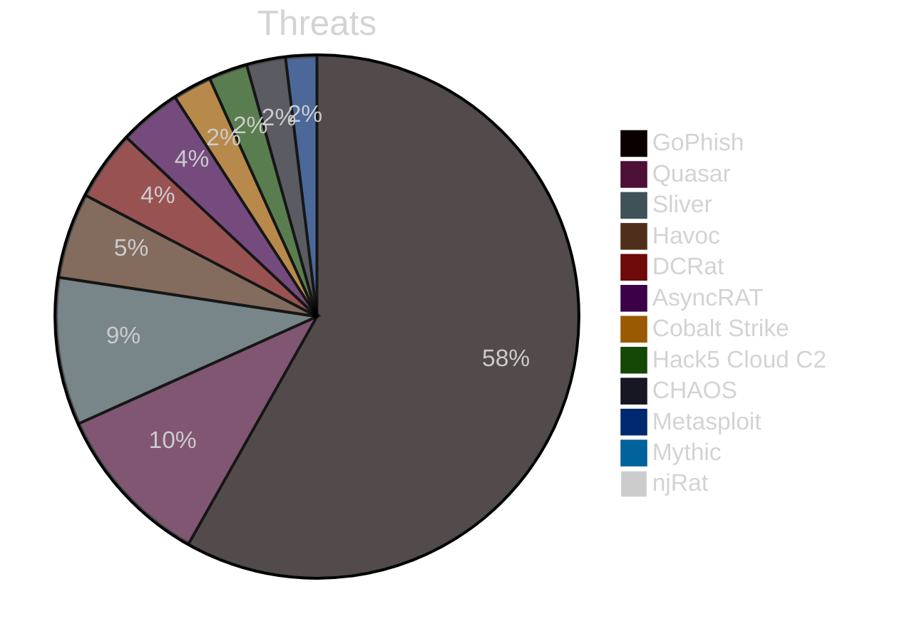
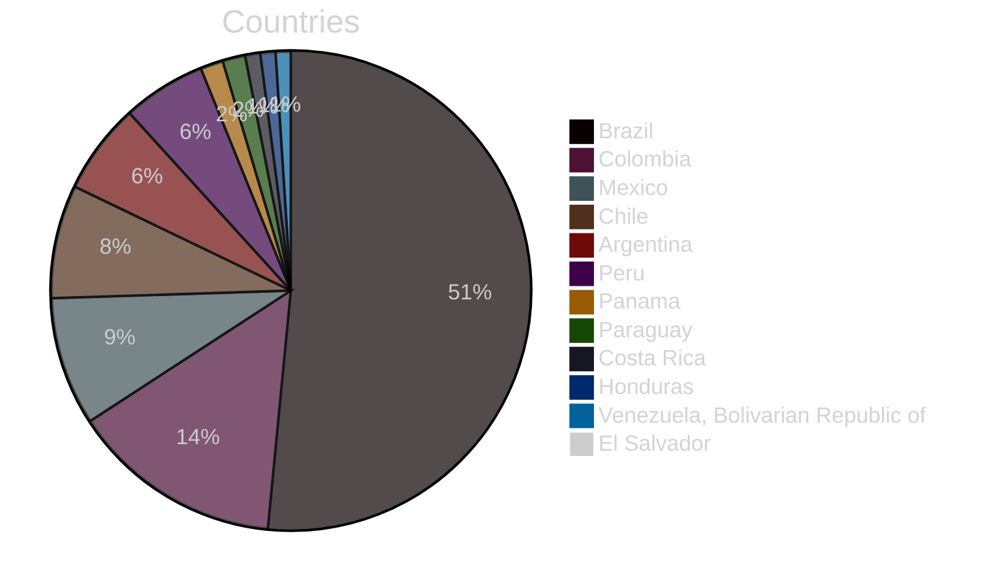
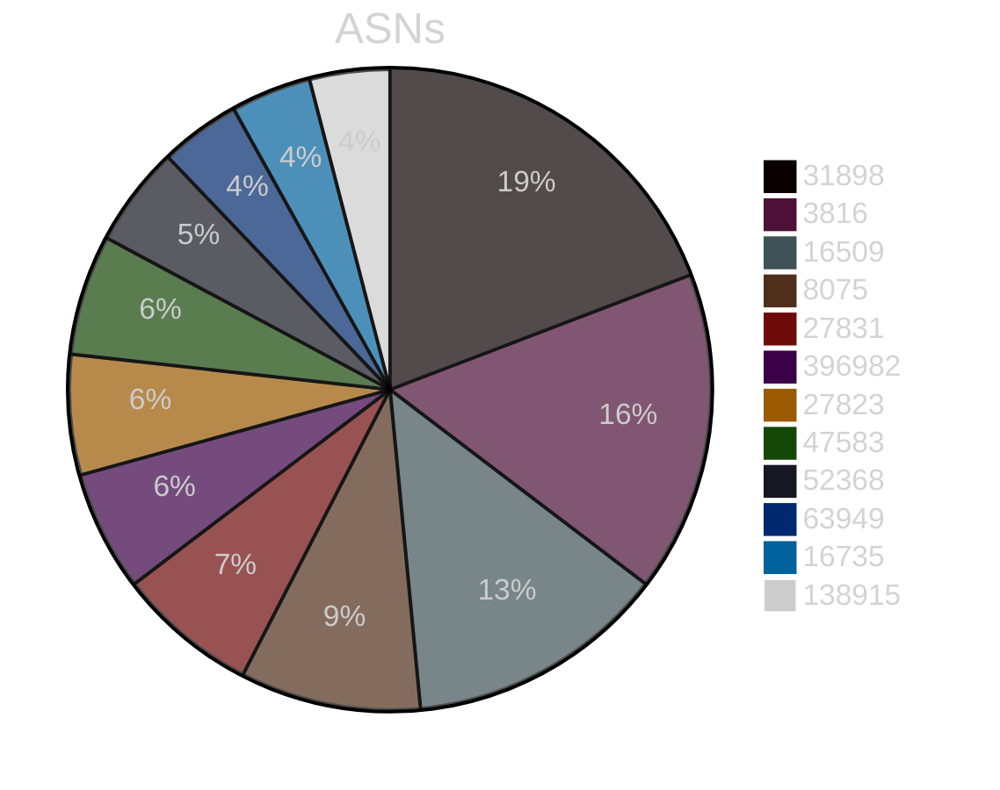
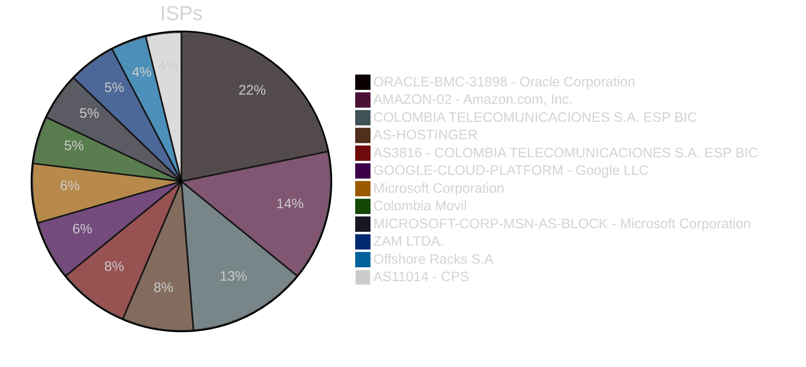
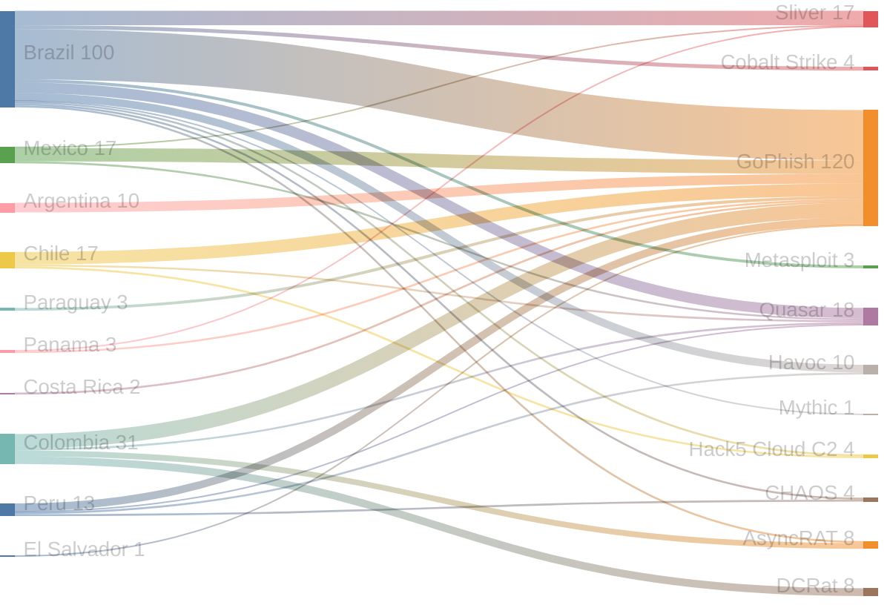
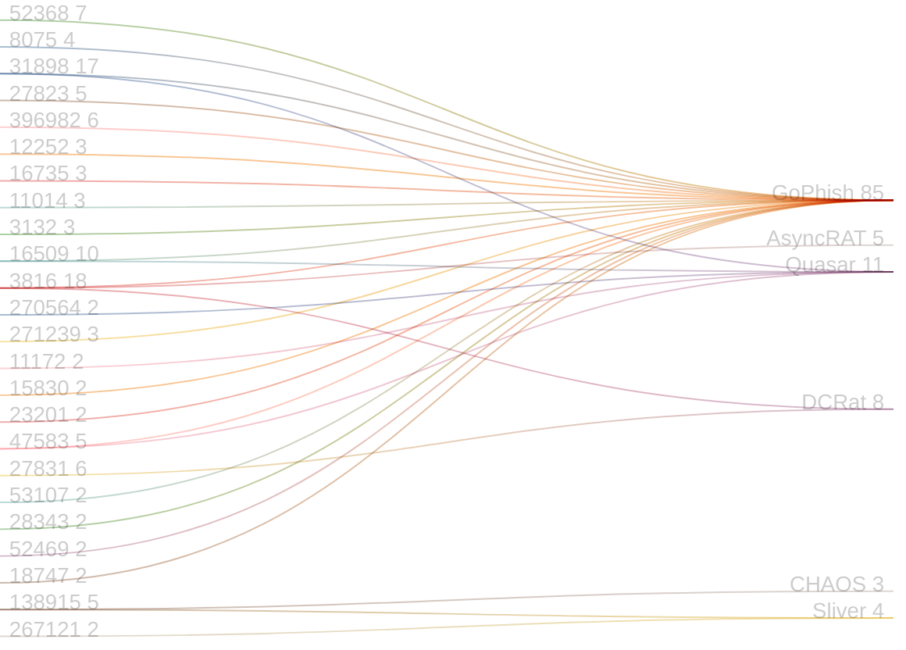
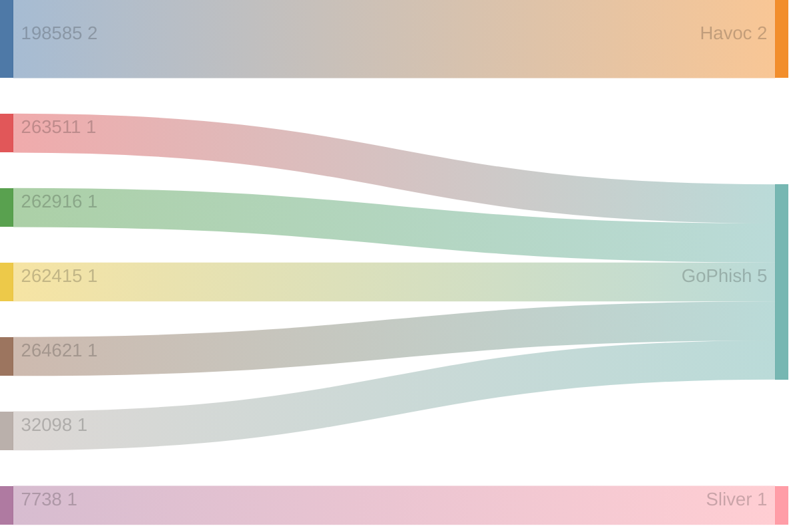

# ZOLIM - Zoque-Observatorio Latinoamericano de Infraestructura Maliciosa

> **ZOLIM (Observatorio Latinoamericano de Infraestructura Maliciosa de Zoque)** es una iniciativa de investigación de ZoqueLabs orientada a documentar, analizar y publicar **snapshots periódicos de infraestructura maliciosa en América Latina**, con énfasis en sistemas de comando y control (C2) y tooling asociado.

- Generated: `2026-06-26T17:41:47Z`
- About ZOLIM: [Español](/zolim/2026/02/05/acerca-de-zolim.html) - [English](/zolim/2026/02/05/about-zolim.html)
- Current snapshot: [En Github](https://github.com/ZoqueLabs/olim_datasets/tree/main/reports/2026-06-26_12-41-47)

## Metrics (current)

> **IPs:** `199` | **Unique ports:** `40` | **Threat frameworks:** `13` | **Countries:** `14` | **Cities:** `59` | **ASNs:** `85`

## Tops (current)

- Threats: `GoPhish(121)` `Quasar(21)` `Sliver(19)` `Havoc(11)` `DCRat(9)` `AsyncRAT(8)` `Cobalt Strike(5)` `Hack5 Cloud C2(5)` `CHAOS(5)` `Metasploit(4)` `Mythic(1)` `njRat(1)`
- Countries: `Brazil(101)` `Colombia(28)` `Mexico(17)` `Chile(15)` `Argentina(12)` `Peru(11)` `Panama(3)` `Paraguay(3)` `Costa Rica(2)` `Honduras(2)` `Venezuela, Bolivarian Republic of(2)` `El Salvador(1)`
- Cities: `São Paulo(68)` `Lima(11)` `Santiago(10)` `Valledupar(8)` `Barranquilla(7)` `Campinas(6)` `Rosario(6)` `Buenos Aires(5)` `Radica(4)` `Mexico City(4)` `Bucaramanga(4)` `Girón(4)`
- ASNs: `31898(19)` `3816(16)` `16509(13)` `8075(9)` `27831(7)` `396982(6)` `27823(6)` `47583(6)` `52368(5)` `63949(4)` `16735(4)` `138915(4)`
- ISPs: `ORACLE-BMC-31898 - Oracle Corporation(17)` `AMAZON-02 - Amazon.com, Inc.(11)` `COLOMBIA TELECOMUNICACIONES S.A. ESP BIC(10)` `AS-HOSTINGER(6)` `AS3816 - COLOMBIA TELECOMUNICACIONES S.A. ESP BIC(6)` `GOOGLE-CLOUD-PLATFORM - Google LLC(5)` `Microsoft Corporation(5)` `Colombia Movil(4)` `MICROSOFT-CORP-MSN-AS-BLOCK - Microsoft Corporation(4)` `ZAM LTDA.(4)` `Offshore Racks S.A(3)` `AS11014 - CPS(3)`
- Orgs: `unknown(145)` `Microsoft Corporation(5)` `TELEFÔNICA BRASIL S.A(3)` `ZAM LTDA.(3)` `Offshore Racks S.A(2)` `Oracle Corporation(2)` `ATPlus Telecom(2)` `Amazon Data Services Brazil(2)` `Linode(2)` `Kaopu Cloud HK Limited(2)` `Nw3 telecomunicações Ltda(2)` `Colombia Móvil(1)`
- Ports (frequency across IPs): `3333(62)` `443(32)` `31337(18)` `8080(17)` `80(13)` `8443(8)` `9090(8)` `8848(5)` `8081(4)` `6000(4)` `3790(4)` `9000(3)`

## Graphs (current)

```mermaid
---
config:
  theme: dark
---
pie title Threats
  "GoPhish" : 121
  "Quasar" : 21
  "Sliver" : 19
  "Havoc" : 11
  "DCRat" : 9
  "AsyncRAT" : 8
  "Cobalt Strike" : 5
  "Hack5 Cloud C2" : 5
  "CHAOS" : 5
  "Metasploit" : 4
  "Mythic" : 1
  "njRat" : 1
```

```mermaid
---
config:
  theme: dark
---
pie title Countries
  "Brazil" : 101
  "Colombia" : 28
  "Mexico" : 17
  "Chile" : 15
  "Argentina" : 12
  "Peru" : 11
  "Panama" : 3
  "Paraguay" : 3
  "Costa Rica" : 2
  "Honduras" : 2
  "Venezuela, Bolivarian Republic of" : 2
  "El Salvador" : 1
```

```mermaid
---
config:
  theme: dark
---
pie title ASNs
  "31898" : 19
  "3816" : 16
  "16509" : 13
  "8075" : 9
  "27831" : 7
  "396982" : 6
  "27823" : 6
  "47583" : 6
  "52368" : 5
  "63949" : 4
  "16735" : 4
  "138915" : 4
```

```mermaid
---
config:
  theme: dark
---
pie title ISPs
  "ORACLE-BMC-31898 - Oracle Corporation" : 17
  "AMAZON-02 - Amazon.com, Inc." : 11
  "COLOMBIA TELECOMUNICACIONES S.A. ESP BIC" : 10
  "AS-HOSTINGER" : 6
  "AS3816 - COLOMBIA TELECOMUNICACIONES S.A. ESP BIC" : 6
  "GOOGLE-CLOUD-PLATFORM - Google LLC" : 5
  "Microsoft Corporation" : 5
  "Colombia Movil" : 4
  "MICROSOFT-CORP-MSN-AS-BLOCK - Microsoft Corporation" : 4
  "ZAM LTDA." : 4
  "Offshore Racks S.A" : 3
  "AS11014 - CPS" : 3
```

### Country → Threat (top)

```mermaid
---
config:
  theme: dark
---
%% Country → Threat (top)
sankey-beta
  Brazil,GoPhish,52
  Brazil,Sliver,15
  Colombia,GoPhish,15
  Mexico,GoPhish,14
  Chile,GoPhish,13
  Brazil,Quasar,11
  Argentina,GoPhish,10
  Colombia,DCRat,8
  Brazil,Havoc,8
  Peru,GoPhish,8
  Colombia,AsyncRAT,6
  Brazil,Cobalt Strike,4
  Paraguay,GoPhish,3
  Brazil,Metasploit,3
  Brazil,Hack5 Cloud C2,2
  Costa Rica,GoPhish,2
  Chile,Quasar,2
  Panama,GoPhish,2
  Mexico,Quasar,2
  Colombia,Quasar,2
  Peru,Havoc,2
  Brazil,AsyncRAT,2
  Chile,Hack5 Cloud C2,2
  Peru,CHAOS,2
  Brazil,CHAOS,2
  Brazil,Mythic,1
  Mexico,Sliver,1
  Panama,Sliver,1
  Peru,Quasar,1
  El Salvador,GoPhish,1
```

### ASN → Threat (top)

```mermaid
---
config:
  theme: dark
---
%% ASN → Threat (top)
sankey-beta
  31898,GoPhish,15
  3816,GoPhish,11
  16509,GoPhish,7
  52368,GoPhish,7
  27831,DCRat,6
  396982,GoPhish,6
  27823,GoPhish,5
  3816,AsyncRAT,5
  8075,GoPhish,4
  12252,GoPhish,3
  16735,GoPhish,3
  11014,GoPhish,3
  3132,GoPhish,3
  271239,GoPhish,3
  16509,Quasar,3
  47583,GoPhish,3
  138915,CHAOS,3
  270564,Quasar,2
  15830,GoPhish,2
  23201,GoPhish,2
  53107,GoPhish,2
  28343,GoPhish,2
  138915,Sliver,2
  52469,GoPhish,2
  47583,Quasar,2
  11172,Quasar,2
  31898,Quasar,2
  3816,DCRat,2
  18747,GoPhish,2
  267121,Sliver,2
```

## Delta vs previous snapshot

- IPs: **+12** / **-0** (persistent: `187`)
- Threat frameworks: **+0** / **-0**
- Countries: **+0** / **-0**
- ASNs: **+7** / **-0**
- ISPs: **+11** / **-6**
- Orgs: **+3** / **-3**
- Ports: **+1** / **-0**
- Cities: **+4** / **-1**

### Delta lists (compact)

- New IPs: `143.0.160.56`, `15.228.253.87`, `170.239.85.250`, `177.39.19.95`, `185.115.161.32`, `186.244.227.160`, `200.150.197.106`, `200.170.159.131`, `200.28.129.239`, `200.58.109.89`, `200.92.152.190`, `201.161.34.130`
- Removed IPs: _none_
- New threats: _none_
- Removed threats: _none_
- New countries: _none_
- New ASNs: `198585`, `262415`, `262916`, `263511`, `264621`, `32098`, `7738`
- New ISPs: `AS21756 - SIDERCA S.A.I.C.`, `AS262415 - OPEN PROCESSAMENTO DE DADOS LTDA`, `AS262916 - Mega Cable, S.A. de C.V.`, `AS263511 - Saveincloud Hospedagem na Internet Ltda`, `AS272336 - Secretaria de Relaciones Exteriores`, `AS27747 - Telecentro S.A.`, `BLUE SAT SERVICIOS ADMINISTRADOS DE TELECOMUNICACIONES SA`, `LVLT-3549 - Level 3 Parent, LLC`, `LuraHosting - LuraHosting Datacenter LTDA`, `Transtelco Inc`, `V tal`
- New ports: `6943`

### IP reuse / threat drift

- No IP reuse / drift detected (between these two snapshots).

### Delta graph: NEW ASN → Threat edges

```mermaid
---
config:
  theme: dark
---
%% Δ ASN → Threat (new edges)
sankey-beta
  198585,Havoc,2
  263511,GoPhish,1
  262916,GoPhish,1
  262415,GoPhish,1
  7738,Sliver,1
  264621,GoPhish,1
  32098,GoPhish,1
```

## All IPs (current snapshot)

 

| IP | Threats | Ports | Country | City | ASN | ISP | Org | Source | Last scan |
|---|---|---|---|---|---|---|---|---|---|
| 136.248.245.167 | GoPhish | 3333 | Chile | Colina | AS31898 | ORACLE-BMC-31898 - Oracle Corporation | unknown | censys | 2026-06-03_18-11-13 |
| 136.248.245.36 | GoPhish | 3333 | Chile | Colina | AS31898 | ORACLE-BMC-31898 - Oracle Corporation | unknown | censys | 2026-06-26_05-24-04 |
| 137.131.157.110 | GoPhish | 3333 | Brazil | São Paulo | AS31898 | ORACLE-BMC-31898 - Oracle Corporation | unknown | censys | 2026-06-26_05-32-19 |
| 138.185.109.230 | GoPhish | 9443 | Brazil | Araguaína | AS52721 | AS52721 - TOLEDO FIBRA TELECOMUNICACAO LTDA | unknown | censys | 2026-05-16_10-10-28 |
| 138.36.238.226 | GoPhish | 3333 | Argentina | Rosario | AS27823 | AS27823 - Dattatec.com | unknown | censys | 2026-06-26_10-11-11 |
| 143.0.160.56 | GoPhish | 3333 | Costa Rica | San José | AS264621 | BLUE SAT SERVICIOS ADMINISTRADOS DE TELECOMUNICACIONES SA | BLUE SAT SERVICIOS ADMINISTRADOS DE TELECOMUNICACIONES SA | shodan | 2026-06-26_14-41-42 |
| 144.22.192.165 | GoPhish | 8443 | Brazil | São Paulo | AS31898 | ORACLE-BMC-31898 - Oracle Corporation | unknown | censys | 2026-06-26_16-00-15 |
| 144.22.207.61 | GoPhish | 8443 | Brazil | São Paulo | AS31898 | Oracle Corporation | Oracle Corporation | shodan | 2026-02-18_07-41-20 |
| 146.235.38.234 | DCRat | 5038 | Brazil | São Paulo | AS31898 | ORACLE-BMC-31898 - Oracle Corporation | unknown | censys | 2026-03-05_11-10-21 |
| 147.15.78.253 | Sliver;GoPhish | 31337;3333 | Brazil | São Paulo | AS31898 | ORACLE-BMC-31898 - Oracle Corporation | unknown | censys | 2026-06-26_16-43-48 |
| 147.28.223.190 | Sliver | 31337 | Mexico | La Cañada | AS54825 | Packet Host, Inc. | Equinix Services, Inc. | shodan | 2026-01-04_18-32-22 |
| 147.45.116.18 | Sliver | 31337 | Brazil | São Paulo | AS215540 | GLOBAL CONNECTIVITY SOLUTIONS LLP | GLOBAL CONNECTIVITY SOLUTIONS LLP | shodan | 2026-01-22_09-40-58 |
| 147.93.9.173 | Havoc | 443 | Brazil | São Paulo | AS47583 | AS-HOSTINGER | unknown | censys | 2026-03-05_08-16-01 |
| 148.230.153.56 | GoPhish | 3333 | Mexico | Torreón | AS22884 | TOTAL PLAY TELECOMUNICACIONES SA DE CV | unknown | censys | 2026-02-04_23-22-09 |
| 149.130.165.200 | Quasar | 9000 | Colombia | Cota | AS31898 | ORACLE-BMC-31898 - Oracle Corporation | unknown | censys | 2026-03-04_18-58-45 |
| 149.50.137.180 | GoPhish | 2087 | Argentina | Rosario | AS27823 | Dattatec.com | DATTATEC.COM S.R.L. | shodan | 2026-02-19_17-24-34 |
| 15.228.253.87 | GoPhish | 8080 | Brazil | São Paulo | AS16509 | AMAZON-02 - Amazon.com, Inc. | unknown | censys | 2026-06-26_13-11-20 |
| 15.228.3.86 | Cobalt Strike | 80 | Brazil | São Paulo | AS16509 | Amazon.com, Inc. | Amazon Data Services Brazil | shodan | 2026-06-26_08-43-58 |
| 150.187.25.242 | Cobalt Strike | 9999 | Venezuela, Bolivarian Republic of | Barquisimeto | AS20312 | Fundación Centro Nacional de Innovación Tecnológica (CENIT) | Fundación Centro Nacional de Innovación Tecnológica (CENIT) | shodan | 2026-06-26_14-52-12 |
| 150.230.93.32 | GoPhish | 3333 | Brazil | São Paulo | AS31898 | ORACLE-BMC-31898 - Oracle Corporation | unknown | censys | 2026-06-26_05-59-45 |
| 152.203.25.225 | GoPhish | 8080 | Colombia | Bucaramanga | AS3816 | COLOMBIA TELECOMUNICACIONES S.A. ESP BIC | unknown | censys | 2026-01-27_11-49-19 |
| 152.203.31.60 | GoPhish;GoPhish | 8080;9090 | Colombia | Girón | AS3816 | AS3816 - COLOMBIA TELECOMUNICACIONES S.A. ESP BIC | unknown | censys | 2026-05-20_15-45-42 |
| 152.254.155.35 | Hack5 Cloud C2 | 8080 | Brazil | São Paulo | AS27699 | TELEFÔNICA BRASIL S.A | TELEFÔNICA BRASIL S.A | shodan | 2026-06-15_15-22-28 |
| 152.67.58.223 | Hack5 Cloud C2 | 8080 | Brazil | São Paulo | AS31898 | ORACLE-BMC-31898 - Oracle Corporation | unknown | censys | 2026-06-26_10-10-29 |
| 156.244.39.44 | CHAOS;CHAOS | 1604;11434 | Peru | Lima | AS138915 | Kaopu Cloud HK Limited | Lightnode Limited | shodan | 2026-01-09_17-34-42 |
| 157.151.4.17 | GoPhish | 3333 | Brazil | Vinhedo | AS31898 | ORACLE-BMC-31898 - Oracle Corporation | unknown | censys | 2026-05-01_13-19-36 |
| 161.132.220.65 | Quasar | 8080 | Peru | Lima | AS27843 | WIN EMPRESAS S.A.C. | unknown | censys | 2026-04-17_13-11-01 |
| 161.132.37.115 | GoPhish | 3333 | Peru | Lima | AS3132 | AS3132 - Red Cientifica Peruana | unknown | censys | 2026-06-14_08-57-54 |
| 161.132.51.222 | GoPhish | 3333 | Peru | Lima | AS3132 | AS3132 - Red Cientifica Peruana | unknown | censys | 2026-06-26_12-11-39 |
| 161.132.54.23 | GoPhish | 8081 | Peru | Lima | AS3132 | Red Cientifica Peruana | unknown | censys | 2026-01-07_01-42-12 |
| 163.176.38.132 | GoPhish | 3333 | Brazil | São Paulo | AS31898 | ORACLE-BMC-31898 - Oracle Corporation | unknown | censys | 2026-05-28_05-45-18 |
| 167.234.226.89 | GoPhish | 443 | Brazil | São Paulo | AS31898 | Oracle Corporation | Oracle Corporation | shodan | 2026-04-20_08-48-39 |
| 168.138.128.79 | GoPhish | 3333 | Brazil | São Paulo | AS31898 | ORACLE-BMC-31898 - Oracle Corporation | unknown | censys | 2026-06-26_11-11-01 |
| 168.138.131.15 | Quasar | 80 | Brazil | São Paulo | AS31898 | ORACLE-BMC-31898 - Oracle Corporation | unknown | censys | 2026-03-05_04-55-17 |
| 168.196.106.7 | GoPhish | 443 | Brazil | Aquiraz | AS265451 | AS265451 - INFOLINK TELECOM | unknown | censys | 2026-06-26_16-26-23 |
| 170.231.155.101 | Metasploit | 3790 | Brazil | Varginha | AS263424 | Fonelight Telecomunicações S/A | Fonelight Telecomunicações S/A | shodan | 2025-12-26_00-53-40 |
| 170.239.85.250 | GoPhish | 3333 | Chile | Santiago | AS52368 | ZAM LTDA. | ZAM LTDA. | shodan | 2026-06-23_23-56-17 |
| 170.239.86.183 | GoPhish;GoPhish | 3333;3333 | Chile | Santiago | AS52368 | ZAM LTDA. | ZAM LTDA. | shodan | 2025-12-15_03-08-50 |
| 170.239.86.232 | GoPhish;GoPhish | 3333;3333 | Chile | Santiago | AS52368 | ZAM LTDA. | ZAM LTDA. | shodan | 2025-12-30_12-46-13 |
| 172.233.1.83 | Havoc | 443 | Brazil | São Paulo | AS63949 | AKAMAI-LINODE-AP Akamai Connected Cloud | unknown | censys | 2026-01-09_16-14-23 |
| 172.233.15.195 | Supershell | 8888 | Brazil | São Paulo | AS63949 | Akamai Connected Cloud | Linode | shodan | 2026-02-03_23-45-25 |
| 172.233.25.95 | GoPhish | 3333 | Brazil | São Paulo | AS63949 | AKAMAI-LINODE-AP - Akamai Connected Cloud | unknown | censys | 2026-05-16_11-10-42 |
| 172.233.27.101 | CHAOS | 12136 | Brazil | São Paulo | AS63949 | Akamai Connected Cloud | Linode | shodan | 2026-03-18_16-24-00 |
| 177.104.176.211 | GoPhish | 8080 | Brazil | São Paulo | AS53107 | EVEO S.A. | unknown | censys | 2026-02-27_18-10-23 |
| 177.104.188.108 | GoPhish | 3333 | Brazil | São Paulo | AS53107 | EVEO S.A. | unknown | censys | 2026-02-23_08-09-19 |
| 177.124.72.24 | Sliver | 31337 | Brazil | Diamantina | AS52601 | AS52601 - BIZZ INTERNET LTDA | unknown | censys | 2026-06-26_06-20-20 |
| 177.126.168.209 | GoPhish | 3333 | Brazil | São Paulo | AS15830 | EQUINIX | unknown | censys | 2026-05-01_02-10-47 |
| 177.136.225.181 | Cobalt Strike | 10035 | Brazil | São Paulo | AS53107 | AS53107 - EVEO S.A. | unknown | censys | 2026-06-26_06-44-54 |
| 177.39.19.95 | GoPhish | 3333 | Brazil | São Paulo | AS262415 | AS262415 - OPEN PROCESSAMENTO DE DADOS LTDA | unknown | censys | 2026-06-26_05-10-52 |
| 177.54.147.216 | Sliver | 31337 | Brazil | São Paulo | AS262287 | Latitude.sh LTDA | Latitude.sh LTDA | shodan | 2026-04-21_02-03-25 |
| 177.67.105.14 | Quasar | 8090 | Brazil | Campinorte | AS262517 | NIQTURBO PIMENTEL E MOREIRA LTDA | unknown | censys | 2026-05-01_12-47-58 |
| 177.74.252.105 | GoPhish | 3333 | Brazil | Itajaí | AS28343 | AS28343 - UNIFIQUE TELECOMUNICACOES S/A | unknown | censys | 2026-05-21_02-11-09 |
| 177.84.111.122 | GoPhish | 9443 | Brazil | Araguaína | AS52721 | AS52721 - TOLEDO FIBRA TELECOMUNICACAO LTDA | unknown | censys | 2026-05-16_07-11-14 |
| 177.89.234.43 | njRat | 1177 | Brazil | Natal | AS28220 | Alares Cabo Servicos de Telecomunicacoes S.A. | CABO SERVICOS DE TELECOMUNICACOES LTDA | shodan | 2026-01-31_13-46-48 |
| 179.0.178.198 | Quasar | 1080 | Brazil | Belo Horizonte | AS270564 | MASTER DA WEB DATACENTER LTDA | unknown | censys | 2026-01-13_03-18-32 |
| 179.0.178.79 | Quasar | 1080 | Brazil | Belo Horizonte | AS270564 | MASTER DA WEB DATACENTER LTDA | unknown | censys | 2026-01-02_19-13-48 |
| 179.151.242.232 | GoPhish | 9090 | Brazil | São Paulo | AS26599 | TELEFONICA BRASIL S.A | unknown | censys | 2026-02-25_07-59-13 |
| 18.230.61.7 | GoPhish | 8080 | Brazil | São Paulo | AS16509 | AMAZON-02 - Amazon.com, Inc. | unknown | censys | 2026-03-31_13-54-40 |
| 18.231.69.245 | GoPhish | 8080 | Brazil | São Paulo | AS16509 | AMAZON-02 - Amazon.com, Inc. | unknown | censys | 2026-02-09_12-59-27 |
| 18.231.78.171 | Quasar | 443 | Brazil | São Paulo | AS16509 | AMAZON-02 - Amazon.com, Inc. | unknown | censys | 2026-03-05_05-59-35 |
| 181.162.184.56 | Quasar | 8080 | Chile | Rancagua | AS7418 | TELEFONICA CHILE S.A. | unknown | censys | 2026-02-17_01-35-32 |
| 181.174.164.116 | Sliver | 31337 | Panama | Panamá | AS52469 | Offshore Racks S.A | Offshore Racks S.A | shodan | 2026-01-20_20-44-09 |
| 181.174.165.127 | GoPhish | 3333 | Panama | Panamá | AS52469 | Offshore Racks S.A | unknown | censys | 2026-03-09_06-59-37 |
| 181.174.165.128 | GoPhish | 3333 | Panama | Panamá | AS52469 | Offshore Racks S.A | Offshore Racks S.A | shodan | 2026-03-05_12-01-02 |
| 181.176.215.140 | GoPhish | 80 | Peru | Lima | AS262210 | VIETTEL PERU S.A.C. | unknown | censys | 2026-01-27_18-23-44 |
| 181.206.158.190 | DCRat | 1000 | Colombia | Barranquilla | AS27831 | AS27831 - Colombia Movil | unknown | censys | 2026-06-26_13-13-49 |
| 181.235.1.253 | AsyncRAT | 6000 | Colombia | Valledupar | AS3816 | COLOMBIA TELECOMUNICACIONES S.A. ESP BIC | unknown | censys | 2026-04-17_13-11-53 |
| 181.236.210.75 | GoPhish | 9090 | Colombia | Girón | AS3816 | AS3816 - COLOMBIA TELECOMUNICACIONES S.A. ESP BIC | unknown | censys | 2026-06-03_09-25-49 |
| 181.32.33.172 | GoPhish;GoPhish | 8080;9090 | Colombia | Bucaramanga | AS3816 | COLOMBIA TELECOMUNICACIONES S.A. ESP BIC | unknown | censys | 2026-05-06_06-11-41 |
| 181.32.35.253 | GoPhish | 9090 | Colombia | Girón | AS3816 | AS3816 - COLOMBIA TELECOMUNICACIONES S.A. ESP BIC | unknown | censys | 2026-05-25_02-10-53 |
| 181.79.36.228 | GoPhish;GoPhish | 3333;80 | Colombia | Bogotá | AS18747 | IFX18747 - IFX Corporation | unknown | censys | 2026-03-18_08-11-03 |
| 185.115.161.32 | Havoc;Havoc | 6943;8443 | Brazil | São Paulo | AS198585 | LuraHosting - LuraHosting Datacenter LTDA | unknown | censys | 2026-06-26_13-10-37 |
| 186.155.213.134 | Metasploit | 3790 | Colombia | Bogotá | AS19429 | ETB - Colombia | ETB - Colombia | shodan | 2026-05-05_09-28-34 |
| 186.168.6.214 | GoPhish;GoPhish | 9090;8080 | Colombia | Bucaramanga | AS3816 | COLOMBIA TELECOMUNICACIONES S.A. ESP BIC | unknown | censys | 2026-05-12_18-11-11 |
| 186.169.36.103 | AsyncRAT | 6000 | Colombia | Valledupar | AS3816 | COLOMBIA TELECOMUNICACIONES S.A. ESP BIC | unknown | censys | 2026-04-02_06-11-10 |
| 186.169.55.212 | DCRat | 9002 | Colombia | Valledupar | AS3816 | COLOMBIA TELECOMUNICACIONES S.A. ESP BIC | COLOMBIA TELECOMUNICACIONES S.A. ESP | shodan | 2026-02-09_05-37-35 |
| 186.169.63.171 | DCRat | 9090 | Colombia | Valledupar | AS3816 | COLOMBIA TELECOMUNICACIONES S.A. ESP BIC | unknown | censys | 2026-03-17_20-04-31 |
| 186.169.71.201 | AsyncRAT | 6000 | Colombia | Valledupar | AS3816 | AS3816 - COLOMBIA TELECOMUNICACIONES S.A. ESP BIC | unknown | censys | 2026-06-10_13-11-49 |
| 186.169.76.228 | AsyncRAT | 5010 | Colombia | Valledupar | AS3816 | COLOMBIA TELECOMUNICACIONES S.A. ESP BIC | unknown | censys | 2026-05-15_07-28-00 |
| 186.169.83.89 | Quasar | 2096 | Colombia | Valledupar | AS3816 | COLOMBIA TELECOMUNICACIONES S.A. ESP BIC | unknown | censys | 2026-04-17_12-37-48 |
| 186.177.71.142 | GoPhish | 443 | Costa Rica | San José | AS262197 | MILLICOM CABLE COSTA RICA S.A. | unknown | censys | 2026-02-11_10-12-51 |
| 186.212.30.231 | Havoc | 8081 | Brazil | São Paulo | AS18881 | TELEFÔNICA BRASIL S.A | TELEFÔNICA BRASIL S.A | shodan | 2026-05-07_01-29-04 |
| 186.244.227.160 | Sliver | 31337 | Brazil | Juiz de Fora | AS7738 | V tal | Globenet Cabos Submarinos America Inc. | shodan | 2026-06-24_15-37-24 |
| 186.64.122.196 | GoPhish | 8443 | Chile | Curicó | AS52368 | ZAM LTDA. | unknown | censys | 2026-03-22_09-27-01 |
| 187.127.4.73 | GoPhish | 443 | Brazil | Campinas | AS47583 | AS-HOSTINGER | unknown | censys | 2026-04-20_03-11-35 |
| 187.168.236.220 | GoPhish | 3334 | Mexico | Mexico City | AS8151 | UNINET | unknown | censys | 2026-01-22_23-11-26 |
| 187.45.170.66 | GoPhish | 3333 | Brazil | Rio de Janeiro | AS28137 | AS28137 - Vialink Solucoes de Tecnologia Ltda | unknown | censys | 2026-06-26_07-51-53 |
| 187.45.79.131 | GoPhish | 3333 | Brazil | Triunfo | AS28343 | UNIFIQUE TELECOMUNICACOES SA | unknown | censys | 2026-02-04_19-06-08 |
| 187.49.187.224 | Metasploit | 3790 | Brazil | São Paulo | AS270512 | Nw3 telecomunicações Ltda | Nw3 telecomunicações Ltda | shodan | 2026-05-22_09-48-16 |
| 187.49.187.233 | Metasploit | 3790 | Brazil | São Paulo | AS270512 | Nw3 telecomunicações Ltda | Nw3 telecomunicações Ltda | shodan | 2026-04-15_00-57-22 |
| 187.84.150.111 | Sliver | 31337 | Brazil | Blumenau | AS267121 | ATPlus Telecom | ATPlus Telecom | shodan | 2026-03-31_08-19-55 |
| 187.84.150.127 | Sliver | 31337 | Brazil | Blumenau | AS267121 | ATPlus Telecom | ATPlus Telecom | shodan | 2026-04-19_02-00-47 |
| 189.45.141.173 | GoPhish | 443 | Brazil | Rio de Janeiro | AS17222 | MUNDIVOX DO BRASIL LTDA | MUNDIVOX DO BRASIL LTDA | shodan | 2026-06-03_03-54-04 |
| 190.104.242.91 | GoPhish | 43333 | Argentina | Buenos Aires | AS11014 | AS11014 - CPS | unknown | censys | 2026-06-26_07-38-31 |
| 190.104.242.92 | GoPhish | 43333 | Argentina | Buenos Aires | AS11014 | AS11014 - CPS | unknown | censys | 2026-06-26_07-46-20 |
| 190.110.41.114 | GoPhish | 3333 | Ecuador | Quito | AS22724 | PUNTONET S.A. | unknown | censys | 2026-01-23_14-11-46 |
| 190.111.234.234 | GoPhish | 43333 | Argentina | Buenos Aires | AS11014 | AS11014 - CPS | unknown | censys | 2026-06-26_09-11-08 |
| 190.114.254.211 | GoPhish | 3333 | Chile | Curicó | AS52368 | AS52368 - ZAM LTDA. | unknown | censys | 2026-05-29_06-11-44 |
| 190.119.16.140 | GoPhish | 443 | Peru | Lima | AS12252 | AS12252 - America Movil Peru S.A.C. | unknown | censys | 2026-06-26_12-11-34 |
| 190.119.63.144 | GoPhish;GoPhish | 443;443 | Peru | Lima | AS12252 | America Movil Peru S.A.C. | America Movil Peru S.A.C. | shodan | 2025-12-30_07-56-58 |
| 190.14.57.229 | Quasar | 443 | Chile | Santiago | AS27659 | Ingenieria e Informatica Asociada Ltda IIA Ltda | unknown | censys | 2026-03-04_22-14-38 |
| 190.20.96.35 | GoPhish | 3333 | Chile | Santiago | AS7418 | AS7418 - TELEFONICA CHILE S.A. | unknown | censys | 2026-06-12_17-53-41 |
| 190.232.52.100 | Havoc | 80 | Peru | Lima | AS6147 | INTEGRATEL PERU S.A.A. | unknown | censys | 2026-04-17_12-04-38 |
| 190.232.52.93 | Havoc | 80 | Peru | Lima | AS6147 | INTEGRATEL PERU S.A.A. | unknown | censys | 2026-05-01_11-43-13 |
| 190.255.90.152 | AsyncRAT | 6000 | Colombia | Valledupar | AS3816 | AS3816 - COLOMBIA TELECOMUNICACIONES S.A. ESP BIC | unknown | censys | 2026-05-27_13-12-40 |
| 190.55.127.139 | Quasar | 4782 | Argentina | Buenos Aires | AS27747 | AS27747 - Telecentro S.A. | unknown | censys | 2026-06-26_15-10-25 |
| 190.66.83.233 | GoPhish | 8080 | Colombia | Bucaramanga | AS3816 | COLOMBIA TELECOMUNICACIONES S.A. ESP BIC | unknown | censys | 2026-03-18_07-10-49 |
| 190.66.88.195 | GoPhish | 9090 | Colombia | Girón | AS3816 | AS3816 - COLOMBIA TELECOMUNICACIONES S.A. ESP BIC | unknown | censys | 2026-06-10_09-12-27 |
| 190.84.81.7 | GoPhish | 3333 | Colombia | Colombia | Not Found | unknown | Telmex Colombia S.A. | shodan | 2026-05-28_08-07-07 |
| 191.101.131.244 | Sliver | 31337 | Brazil | Muriaé | AS270353 | Tyna Host - Datacenter no Brasil | unknown | censys | 2026-05-15_05-18-41 |
| 191.209.58.15 | GoPhish | 3333 | Brazil | São Paulo | AS27699 | TELEFONICA BRASIL S.A | unknown | censys | 2026-03-20_06-09-33 |
| 191.252.60.140 | Havoc | 80 | Brazil | São Paulo | AS27715 | Locaweb Servicos de Internet SA | unknown | censys | 2026-04-02_01-11-24 |
| 191.8.232.11 | Quasar | 6653 | Brazil | São Paulo | AS26599 | TELEFONICA BRASIL S.A | unknown | censys | 2026-02-17_09-08-19 |
| 191.93.113.160 | DCRat | 8848 | Colombia | Barranquilla | AS27831 | Colombia Movil | unknown | censys | 2026-01-05_18-30-31 |
| 191.93.113.86 | DCRat | 8848 | Colombia | Barranquilla | AS27831 | Colombia Movil | unknown | censys | 2026-03-18_07-06-32 |
| 191.93.116.106 | DCRat | 8848 | Colombia | Barranquilla | AS27831 | AS27831 - Colombia Movil | unknown | censys | 2026-06-26_07-34-39 |
| 191.93.117.34 | DCRat | 8848 | Colombia | Barranquilla | AS27831 | Colombia Movil | unknown | censys | 2026-02-17_09-10-22 |
| 191.93.118.190 | DCRat | 8848 | Colombia | Barranquilla | AS27831 | Colombia Movil | unknown | censys | 2026-03-05_07-58-20 |
| 191.93.118.254 | AsyncRAT | 9000 | Colombia | Barranquilla | AS27831 | Colombia Móvil | Colombia Móvil | shodan | 2026-06-26_17-21-21 |
| 20.206.249.20 | GoPhish | 3333 | Brazil | Campinas | AS8075 | MICROSOFT-CORP-MSN-AS-BLOCK - Microsoft Corporation | unknown | censys | 2026-06-25_22-28-21 |
| 20.226.47.239 | Cobalt Strike | 80 | Brazil | São Paulo | AS8075 | Microsoft Corporation | Microsoft Corporation | shodan | 2026-04-11_14-50-29 |
| 200.10.113.124 | GoPhish | 3333 | Argentina | La Plata | AS10834 | AS10834 - Telefonica de Argentina | unknown | censys | 2026-06-26_08-57-03 |
| 200.10.229.166 | GoPhish | 3333 | Paraguay | San Lorenzo | AS27733 | Centro Nacional de Computacion | unknown | censys | 2026-02-17_09-23-08 |
| 200.109.21.86 | Quasar | 443 | Venezuela, Bolivarian Republic of | Valencia | AS8048 | CANTV Servicios, Venezuela | CANTV Servicios, Venezuela | shodan | 2026-01-27_16-50-57 |
| 200.150.197.106 | GoPhish | 443 | Brazil | Campinas | AS263511 | AS263511 - Saveincloud Hospedagem na Internet Ltda | unknown | censys | 2026-06-26_02-21-18 |
| 200.150.67.195 | GoPhish | 3333 | Brazil | Curitiba | AS14868 | AS14868 - Ligga Telecomunicacoes S.A. | unknown | censys | 2026-06-26_09-11-09 |
| 200.170.159.131 | GoPhish | 3333 | Brazil | Indaiatuba | AS16735 | AS16735 - ALGAR TELECOM S/A | unknown | censys | 2026-06-26_09-10-55 |
| 200.219.214.190 | GoPhish | 3333 | Brazil | São Paulo | AS15830 | Equinix - Equinix (EMEA) Acquisition Enterprises B.V. | unknown | censys | 2026-06-26_09-10-45 |
| 200.225.247.79 | Quasar | 8080 | Brazil | São Paulo | AS16735 | ALGAR TELECOM SA | unknown | censys | 2026-03-05_02-32-50 |
| 200.28.129.239 | Hack5 Cloud C2 | 8443 | Chile | Santiago | AS7418 | AS7418 - TELEFONICA CHILE S.A. | unknown | censys | 2026-06-26_05-10-34 |
| 200.28.135.130 | Hack5 Cloud C2 | 8443 | Chile | Santiago | AS7418 | AS7418 - TELEFONICA CHILE S.A. | unknown | censys | 2026-06-10_12-45-10 |
| 200.33.163.61 | GoPhish | 3333 | Mexico | Mexico City | AS272336 | AS272336 - Secretaria de Relaciones Exteriores | unknown | censys | 2026-06-26_16-54-26 |
| 200.38.160.49 | GoPhish | 3333 | Mexico | Mexico City | AS13579 | AS13579 - INFOTEC CENTRO DE INVESTIGACION E INNOVACION EN TECNOLOGIAS DE LA INFORMACION Y COMUNICACION | unknown | censys | 2026-06-26_09-10-45 |
| 200.40.131.89 | Sliver | 31337 | Uruguay | Montevideo | AS6057 | Administracion Nacional de Telecomunicaciones | Administracion Nacional de Telecomunicaciones | shodan | 2026-01-21_19-23-04 |
| 200.57.165.148 | GoPhish | 3333 | Mexico | Ciudad Apodaca | AS19373 | Triara.com S.A. de C.V. | Triara.com S.A. de C.V. | shodan | 2026-06-24_09-53-10 |
| 200.58.100.246 | GoPhish | 3333 | Argentina | Rosario | AS27823 | Dattatec.com | unknown | censys | 2026-02-11_08-11-32 |
| 200.58.109.89 | GoPhish | 443 | Argentina | Rosario | AS27823 | AS27823 - Dattatec.com | unknown | censys | 2026-06-26_11-10-51 |
| 200.85.49.125 | GoPhish | 3333 | Paraguay | Asunción | AS23201 | Telecel S.A. | unknown | censys | 2026-01-02_00-18-19 |
| 200.9.155.183 | AsyncRAT | 8000 | Brazil | Muriaé | AS270353 | Tyna Host - Datacenter no Brasil | unknown | censys | 2026-05-15_03-55-14 |
| 200.9.4.41 | GoPhish | 443 | Paraguay | Asunción | AS23201 | Telecel S.A. | Univ. Catolica Nuestra Senora de la Asuncion | shodan | 2026-06-26_12-46-32 |
| 200.92.152.190 | GoPhish | 8081 | Mexico | Culiacán | AS262916 | AS262916 - Mega Cable, S.A. de C.V. | unknown | censys | 2026-06-26_06-12-09 |
| 201.16.156.113 | GoPhish | 3333 | Brazil | São Paulo | AS16735 | ALGAR TELECOM SA | unknown | censys | 2026-01-26_08-39-48 |
| 201.161.34.130 | GoPhish | 3333 | Mexico | Mexico City | AS32098 | Transtelco Inc | SOFTEL | shodan | 2026-06-26_10-41-29 |
| 201.234.38.193 | GoPhish | 443 | Argentina | Buenos Aires | AS21756 | AS21756 - SIDERCA S.A.I.C. | unknown | censys | 2026-06-26_08-44-46 |
| 201.46.86.34 | GoPhish | 3333 | Mexico | Los Mochis | AS265621 | AS265621 - COMUNICACION DIGITAL DE SINALOA SA DE CV | unknown | censys | 2026-06-26_09-10-46 |
| 201.48.97.53 | GoPhish | 3333 | Brazil | São Paulo | AS16735 | AS16735 - ALGAR TELECOM S/A | unknown | censys | 2026-06-26_09-11-04 |
| 201.72.113.30 | GoPhish | 9443 | Brazil | Goiânia | AS4230 | CLARO S.A. | CLARO S.A. | shodan | 2026-05-15_12-39-11 |
| 201.92.133.149 | Havoc | 8081 | Brazil | São Paulo | AS27699 | TELEFÔNICA BRASIL S.A | TELEFÔNICA BRASIL S.A | shodan | 2025-12-22_01-54-38 |
| 207.248.247.66 | Quasar;Quasar | 8003;8002 | Mexico | Guadalupe | AS11172 | Alestra, S. de R.L. de C.V. | unknown | censys | 2026-03-05_09-54-36 |
| 216.238.121.111 | GoPhish | 8443 | Brazil | Osasco | AS20473 | AS-VULTR - The Constant Company, LLC | unknown | censys | 2026-06-26_12-12-32 |
| 216.238.75.34 | Havoc | 80 | Mexico | General Lázaro Cárdenas | AS20473 | AS-VULTR - The Constant Company, LLC | unknown | censys | 2026-05-27_07-28-42 |
| 34.176.142.248 | GoPhish;GoPhish | 443;80 | Chile | Santiago | AS396982 | GOOGLE-CLOUD-PLATFORM - Google LLC | unknown | censys | 2026-06-26_15-10-37 |
| 34.176.98.184 | GoPhish | 3333 | Chile | Santiago | AS396982 | GOOGLE-CLOUD-PLATFORM - Google LLC | unknown | censys | 2026-05-27_18-43-49 |
| 34.39.186.7 | GoPhish | 443 | Brazil | São Paulo | AS396982 | GOOGLE-CLOUD-PLATFORM - Google LLC | unknown | censys | 2026-05-15_06-42-26 |
| 34.51.42.9 | GoPhish | 443 | Mexico | Santiago de Querétaro | AS396982 | GOOGLE-CLOUD-PLATFORM - Google LLC | unknown | censys | 2026-02-09_17-10-57 |
| 34.51.56.27 | GoPhish | 80 | Mexico | Santiago de Querétaro | AS396982 | GOOGLE-CLOUD-PLATFORM - Google LLC | unknown | censys | 2026-02-02_04-30-21 |
| 34.95.222.105 | Sliver | 31337 | Brazil | São Paulo | AS396982 | Google LLC | Google LLC | shodan | 2026-04-12_15-45-15 |
| 38.187.1.77 | GoPhish | 3333 | Peru | Lima | AS271814 | AS271814 - NEXTNET SAC | unknown | censys | 2026-06-26_11-14-35 |
| 38.56.209.142 | GoPhish | 7443 | El Salvador | Antiguo Cuscatlán | AS174 | Cogent Communications | DIGICEL S.A. DE C.V. | shodan | 2026-02-18_21-49-49 |
| 38.60.209.110 | CHAOS | 16004 | Brazil | São Paulo | AS138915 | Kaopu Cloud HK Limited | Kaopu Cloud HK Limited | shodan | 2026-05-16_03-02-00 |
| 38.60.209.204 | Sliver | 1337 | Brazil | São Paulo | AS138915 | Kaopu Cloud HK Limited | Kaopu Cloud HK Limited | shodan | 2026-03-04_07-55-28 |
| 38.60.242.200 | Sliver | 31337 | Brazil | São Paulo | AS138915 | KAOPU-HK Kaopu Cloud HK Limited | unknown | censys | 2026-02-17_10-26-10 |
| 4.201.122.3 | GoPhish | 443 | Brazil | Campinas | AS8075 | MICROSOFT-CORP-MSN-AS-BLOCK - Microsoft Corporation | unknown | censys | 2026-06-20_04-18-24 |
| 4.201.140.200 | GoPhish | 3333 | Brazil | Campinas | AS8075 | MICROSOFT-CORP-MSN-AS-BLOCK - Microsoft Corporation | unknown | censys | 2026-02-09_22-01-37 |
| 4.201.155.137 | Sliver | 31337 | Brazil | São Paulo | AS8075 | Microsoft Corporation | Microsoft Corporation | shodan | 2026-01-12_10-42-51 |
| 4.201.185.160 | Sliver | 31337 | Brazil | São Paulo | AS8075 | Microsoft Corporation | Microsoft Corporation | shodan | 2025-12-16_11-49-04 |
| 4.201.220.7 | Cobalt Strike | 50050 | Brazil | São Paulo | AS8075 | Microsoft Corporation | Microsoft Corporation | shodan | 2026-02-18_00-42-30 |
| 40.233.1.176 | GoPhish | 443 | Mexico | Radica | AS31898 | ORACLE-BMC-31898 - Oracle Corporation | unknown | censys | 2026-03-25_16-28-10 |
| 40.233.14.119 | GoPhish | 443 | Mexico | Radica | AS31898 | ORACLE-BMC-31898 - Oracle Corporation | unknown | censys | 2026-03-27_19-27-55 |
| 40.233.19.225 | GoPhish | 443 | Mexico | Radica | AS31898 | ORACLE-BMC-31898 - Oracle Corporation | unknown | censys | 2026-03-17_21-20-43 |
| 40.233.26.200 | GoPhish | 3333 | Mexico | Radica | AS31898 | ORACLE-BMC-31898 - Oracle Corporation | unknown | censys | 2026-02-28_10-24-52 |
| 45.178.183.89 | GoPhish | 3333 | Brazil | São Paulo | AS269098 | AbsamHost Internet Data Center | unknown | censys | 2026-05-07_09-38-52 |
| 45.225.129.11 | GoPhish | 3333 | Brazil | Rolândia | AS271239 | Altatech Solucoes em Tecnologia EIRELI | unknown | censys | 2026-01-13_08-12-57 |
| 45.225.129.210 | GoPhish | 3333 | Brazil | Apucarana | AS271239 | Altatech Solucoes em Tecnologia EIRELI | unknown | censys | 2026-02-25_11-00-19 |
| 45.225.129.50 | GoPhish | 3333 | Brazil | Rolândia | AS271239 | Altatech Solucoes em Tecnologia EIRELI | unknown | censys | 2026-01-06_12-42-16 |
| 45.226.189.70 | GoPhish | 3333 | Brazil | Curitiba | AS266997 | MPTEC INFORMATICA LTDA - ME | MPTEC INFORMATICA LTDA - ME | shodan | 2026-03-11_15-36-20 |
| 45.227.61.113 | GoPhish | 3333 | Brazil | São Paulo | AS271366 | AS271366 - ALTVIA TECNOLOGIA E SERVICOS DIGITAIS LTDA | unknown | censys | 2026-06-26_08-21-07 |
| 45.236.130.44 | Sliver | 31337 | Chile | Santiago | AS64111 | INFORMATICA BLUEHOSTING LIMITADA | INFORMATICA BLUEHOSTING LIMITADA | shodan | 2025-12-15_14-32-17 |
| 45.238.142.234 | Hack5 Cloud C2 | 443 | Honduras | San Pedro Sula | AS263686 | INET Communication | INET Communication | shodan | 2026-06-26_12-58-30 |
| 45.39.210.144 | Sliver | 31337 | Brazil | São Paulo | AS268624 | Gamers Club Ltda | unknown | censys | 2026-05-15_10-10-20 |
| 45.67.247.185 | Quasar | 80 | Honduras | Tegucigalpa | AS273189 | CA NETWORK S.A. DE C.V. | unknown | censys | 2026-03-04_20-46-13 |
| 46.202.146.65 | GoPhish | 443 | Brazil | São Paulo | AS47583 | AS-HOSTINGER | unknown | censys | 2026-04-20_03-28-58 |
| 52.67.113.111 | Havoc | 443 | Brazil | São Paulo | AS16509 | Amazon.com, Inc. | Amazon Data Services Brazil | shodan | 2026-03-17_01-04-42 |
| 54.232.144.183 | Mythic | 443 | Brazil | São Paulo | AS16509 | AMAZON-02 - Amazon.com, Inc. | unknown | censys | 2026-02-17_13-10-46 |
| 54.232.234.226 | GoPhish | 443 | Brazil | São Paulo | AS16509 | AMAZON-02 - Amazon.com, Inc. | unknown | censys | 2026-05-26_22-17-10 |
| 54.233.43.28 | GoPhish | 8080 | Brazil | São Paulo | AS16509 | AMAZON-02 - Amazon.com, Inc. | unknown | censys | 2026-02-08_22-22-03 |
| 54.94.39.204 | Quasar | 443 | Brazil | São Paulo | AS16509 | AMAZON-02 - Amazon.com, Inc. | unknown | censys | 2026-03-04_23-51-33 |
| 56.125.168.86 | Quasar | 80 | Brazil | São Paulo | AS16509 | AMAZON-02 - Amazon.com, Inc. | unknown | censys | 2026-03-05_02-30-07 |
| 56.125.42.70 | GoPhish | 3333 | Brazil | São Paulo | AS16509 | AMAZON-02 - Amazon.com, Inc. | unknown | censys | 2026-03-30_10-12-17 |
| 56.125.59.57 | GoPhish | 8443 | Brazil | São Paulo | AS16509 | AMAZON-02 - Amazon.com, Inc. | unknown | censys | 2026-04-04_23-14-17 |
| 64.76.214.54 | GoPhish | 443 | Colombia | Barrio San Luis | AS3549 | LVLT-3549 - Level 3 Parent, LLC | unknown | censys | 2026-06-26_13-57-38 |
| 66.97.33.20 | GoPhish | 3333 | Argentina | Rosario | AS27823 | AS27823 - Dattatec.com | unknown | censys | 2026-06-26_13-10-48 |
| 66.97.39.94 | CHAOS | 8080 | Argentina | Rosario | AS27823 | Dattatec.com | Dattatec Corp | shodan | 2026-04-29_14-16-50 |
| 74.163.80.224 | GoPhish | 3333 | Brazil | Campinas | AS8075 | MICROSOFT-CORP-MSN-AS-BLOCK - Microsoft Corporation | unknown | censys | 2026-05-29_02-14-01 |
| 74.163.81.142 | AsyncRAT | 443 | Brazil | São Paulo | AS8075 | Microsoft Corporation | Microsoft Corporation | shodan | 2026-04-01_18-27-04 |
| 77.111.101.101 | Sliver | 31337 | Brazil | São Paulo | AS396356 | Latitude.sh | Colocation America Corporation | shodan | 2026-06-10_11-06-36 |
| 82.25.65.119 | GoPhish | 3333 | Brazil | São Paulo | AS47583 | AS-HOSTINGER | unknown | censys | 2026-04-17_09-21-38 |
| 89.116.186.136 | Quasar | 9000 | Brazil | São Paulo | AS47583 | AS-HOSTINGER | unknown | censys | 2026-03-05_12-48-41 |
| 89.116.186.72 | Quasar | 8080 | Brazil | São Paulo | AS47583 | AS-HOSTINGER | unknown | censys | 2026-03-05_03-00-55 |

---

**Current snapshot link:** https://github.com/ZoqueLabs/olim_datasets/tree/main/reports/2026-06-26_12-41-47
