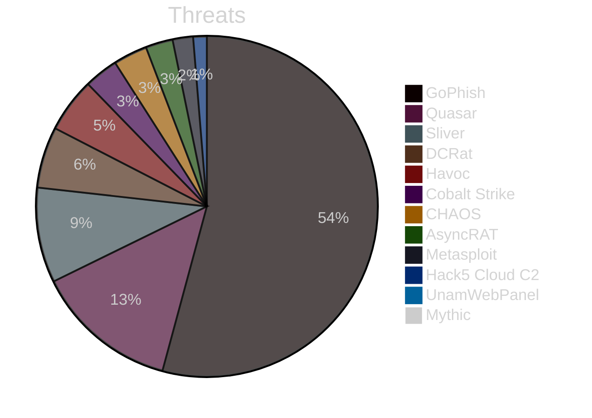
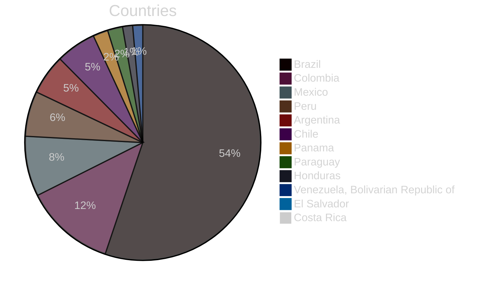
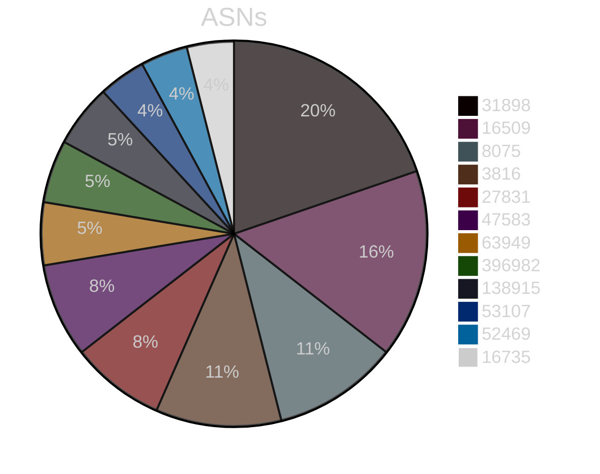
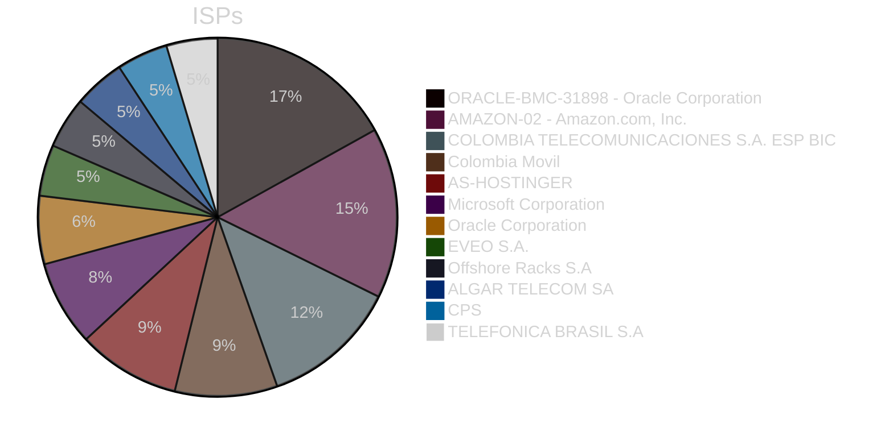
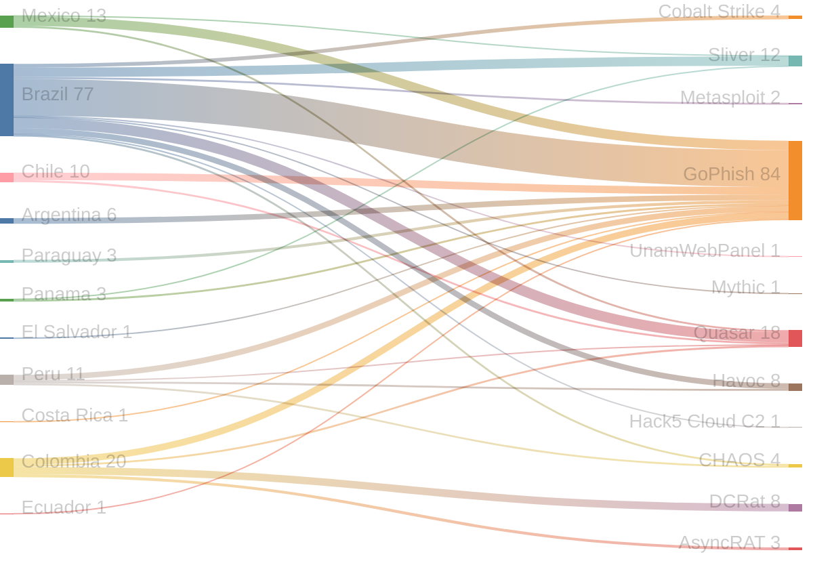
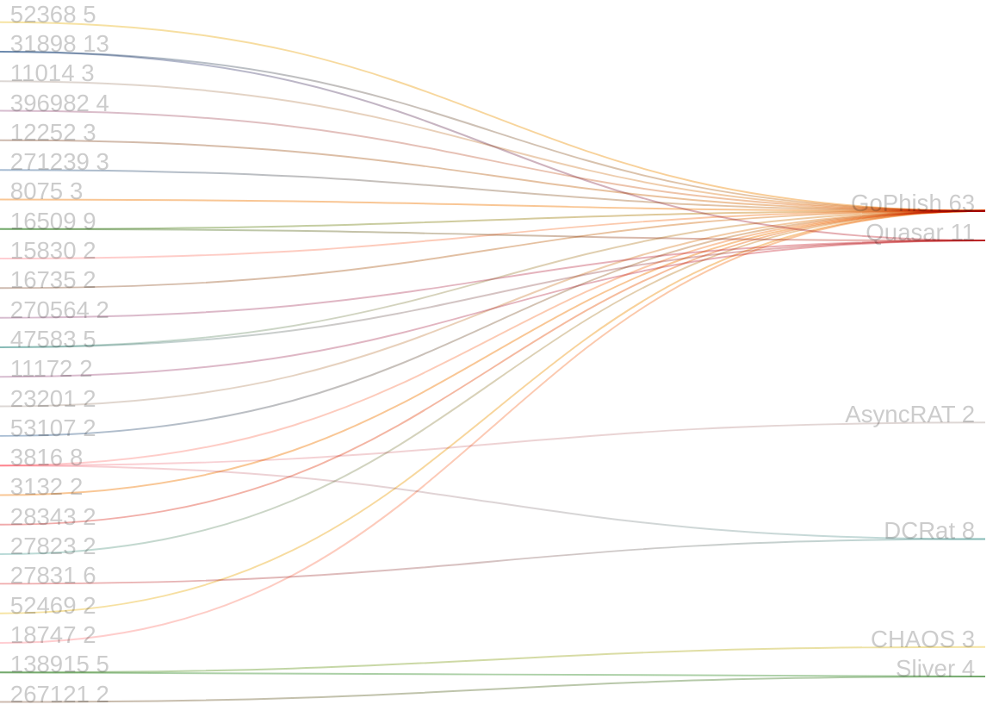
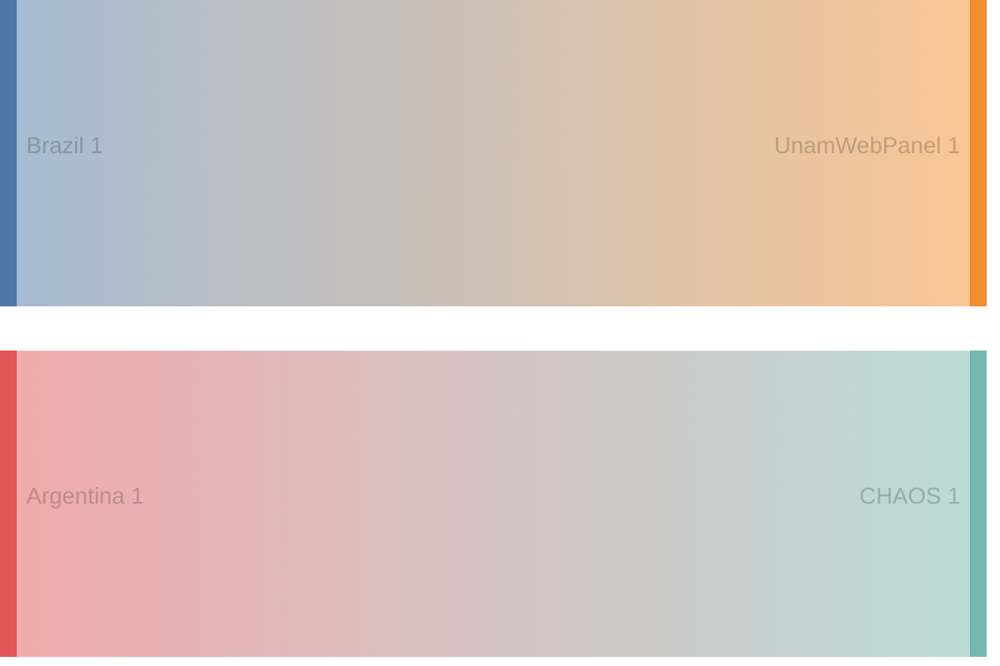
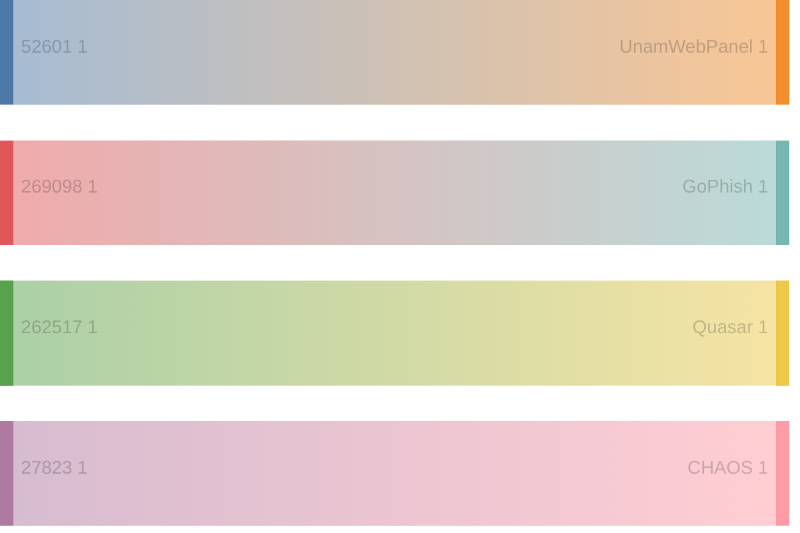

# ZOLIM - Zoque-Observatorio Latinoamericano de Infraestructura Maliciosa

> **ZOLIM (Observatorio Latinoamericano de Infraestructura Maliciosa de Zoque)** es una iniciativa de investigación de ZoqueLabs orientada a documentar, analizar y publicar **snapshots periódicos de infraestructura maliciosa en América Latina**, con énfasis en sistemas de comando y control (C2) y tooling asociado.

- Generated: `2026-05-01T17:47:21Z`
- Current snapshot: **[ZOLIM dataset: 2026-05-01_12-47-21](https://github.com/ZoqueLabs/olim_datasets/tree/main/reports/2026-05-01_12-47-21)**
- About ZOLIM: [Español](/zolim/2026/02/05/acerca-de-zolim.html) - [English](/zolim/2026/02/05/about-zolim.html)

## Metrics (current)

> **IPs:** `149` | **Unique ports:** `38` | **Threat frameworks:** `14` | **Countries:** `14` | **Cities:** `47` | **ASNs:** `67`

## Tops (current)

- Threats: `GoPhish(84)` `Quasar(21)` `Sliver(14)` `DCRat(9)` `Havoc(8)` `Cobalt Strike(5)` `CHAOS(5)` `AsyncRAT(4)` `Metasploit(3)` `Hack5 Cloud C2(2)` `UnamWebPanel(1)` `Mythic(1)`
- Countries: `Brazil(80)` `Colombia(18)` `Mexico(12)` `Peru(9)` `Argentina(8)` `Chile(8)` `Panama(3)` `Paraguay(3)` `Honduras(2)` `Venezuela, Bolivarian Republic of(2)` `El Salvador(1)` `Costa Rica(1)`
- Cities: `São Paulo(56)` `Lima(9)` `Barranquilla(6)` `Buenos Aires(5)` `Santiago(5)` `Valledupar(5)` `Belo Horizonte(4)` `Radica(4)` `Campinas(4)` `Panamá(3)` `Rosario(3)` `Bucaramanga(3)`
- ASNs: `31898(15)` `16509(12)` `8075(8)` `3816(8)` `27831(6)` `47583(6)` `63949(4)` `396982(4)` `138915(4)` `53107(3)` `52469(3)` `16735(3)`
- ISPs: `ORACLE-BMC-31898 - Oracle Corporation(11)` `AMAZON-02 - Amazon.com, Inc.(10)` `COLOMBIA TELECOMUNICACIONES S.A. ESP BIC(8)` `Colombia Movil(6)` `AS-HOSTINGER(6)` `Microsoft Corporation(5)` `Oracle Corporation(4)` `EVEO S.A.(3)` `Offshore Racks S.A(3)` `ALGAR TELECOM SA(3)` `CPS(3)` `TELEFONICA BRASIL S.A(3)`
- Orgs: `unknown(102)` `Microsoft Corporation(5)` `Oracle Corporation(3)` `Offshore Racks S.A(2)` `Google LLC(2)` `ATPlus Telecom(2)` `TELEFÔNICA BRASIL S.A(2)` `Amazon Data Services Brazil(2)` `Linode(2)` `ZAM LTDA.(2)` `Kaopu Cloud HK Limited(2)` `FAXT TELECOMUNICACOES LTDA(1)`
- Ports (frequency across IPs): `3333(39)` `443(29)` `31337(13)` `8080(13)` `80(12)` `8848(5)` `8443(4)` `9000(3)` `43333(3)` `8081(3)` `9090(3)` `3790(3)`

## Graphs (current)

```mermaid
---
config:
  theme: dark
---
pie title Threats
  "GoPhish" : 84
  "Quasar" : 21
  "Sliver" : 14
  "DCRat" : 9
  "Havoc" : 8
  "Cobalt Strike" : 5
  "CHAOS" : 5
  "AsyncRAT" : 4
  "Metasploit" : 3
  "Hack5 Cloud C2" : 2
  "UnamWebPanel" : 1
  "Mythic" : 1
```

```mermaid
---
config:
  theme: dark
---
pie title Countries
  "Brazil" : 80
  "Colombia" : 18
  "Mexico" : 12
  "Peru" : 9
  "Argentina" : 8
  "Chile" : 8
  "Panama" : 3
  "Paraguay" : 3
  "Honduras" : 2
  "Venezuela, Bolivarian Republic of" : 2
  "El Salvador" : 1
  "Costa Rica" : 1
```

```mermaid
---
config:
  theme: dark
---
pie title ASNs
  "31898" : 15
  "16509" : 12
  "8075" : 8
  "3816" : 8
  "27831" : 6
  "47583" : 6
  "63949" : 4
  "396982" : 4
  "138915" : 4
  "53107" : 3
  "52469" : 3
  "16735" : 3
```

```mermaid
---
config:
  theme: dark
---
pie title ISPs
  "ORACLE-BMC-31898 - Oracle Corporation" : 11
  "AMAZON-02 - Amazon.com, Inc." : 10
  "COLOMBIA TELECOMUNICACIONES S.A. ESP BIC" : 8
  "Colombia Movil" : 6
  "AS-HOSTINGER" : 6
  "Microsoft Corporation" : 5
  "Oracle Corporation" : 4
  "EVEO S.A." : 3
  "Offshore Racks S.A" : 3
  "ALGAR TELECOM SA" : 3
  "CPS" : 3
  "TELEFONICA BRASIL S.A" : 3
```

### Country → Threat (top)

```mermaid
---
config:
  theme: dark
---
%% Country → Threat (top)
sankey-beta
  Brazil,GoPhish,39
  Brazil,Quasar,11
  Brazil,Sliver,10
  Mexico,GoPhish,10
  Colombia,DCRat,8
  Chile,GoPhish,8
  Colombia,GoPhish,7
  Brazil,Havoc,6
  Peru,GoPhish,6
  Argentina,GoPhish,6
  Brazil,Cobalt Strike,4
  Colombia,AsyncRAT,3
  Paraguay,GoPhish,3
  Chile,Quasar,2
  Panama,GoPhish,2
  Mexico,Quasar,2
  Colombia,Quasar,2
  Peru,Havoc,2
  Peru,CHAOS,2
  Brazil,CHAOS,2
  Brazil,Metasploit,2
  Brazil,UnamWebPanel,1
  Brazil,Mythic,1
  Brazil,Hack5 Cloud C2,1
  Mexico,Sliver,1
  Panama,Sliver,1
  Peru,Quasar,1
  El Salvador,GoPhish,1
  Costa Rica,GoPhish,1
  Ecuador,GoPhish,1
```

### ASN → Threat (top)

```mermaid
---
config:
  theme: dark
---
%% ASN → Threat (top)
sankey-beta
  31898,GoPhish,11
  27831,DCRat,6
  16509,GoPhish,6
  52368,GoPhish,5
  396982,GoPhish,4
  3816,GoPhish,4
  12252,GoPhish,3
  11014,GoPhish,3
  271239,GoPhish,3
  8075,GoPhish,3
  16509,Quasar,3
  47583,GoPhish,3
  138915,CHAOS,3
  270564,Quasar,2
  15830,GoPhish,2
  16735,GoPhish,2
  23201,GoPhish,2
  53107,GoPhish,2
  3132,GoPhish,2
  28343,GoPhish,2
  27823,GoPhish,2
  138915,Sliver,2
  52469,GoPhish,2
  47583,Quasar,2
  11172,Quasar,2
  31898,Quasar,2
  3816,DCRat,2
  18747,GoPhish,2
  267121,Sliver,2
  3816,AsyncRAT,2
```

## Delta vs previous snapshot

- IPs: **+5** / **-0** (persistent: `144`)
- Threat frameworks: **+1** / **-0**
- Countries: **+0** / **-0**
- ASNs: **+2** / **-0**
- ISPs: **+3** / **-1**
- Orgs: **+2** / **-1**
- Ports: **+3** / **-1**
- Cities: **+1** / **-1**

### Delta lists (compact)

- New IPs: `177.67.105.14`, `181.32.33.172`, `190.232.52.93`, `45.178.183.89`, `66.97.39.94`
- Removed IPs: _none_
- New threats: `UnamWebPanel`
- Removed threats: _none_
- New countries: _none_
- New ASNs: `262517`, `269098`
- New ISPs: `AbsamHost Internet Data Center`, `FAXT TELECOMUNICACOES LTDA`, `NIQTURBO PIMENTEL E MOREIRA LTDA`
- New ports: `11180`, `30443`, `8090`

### IP reuse / threat drift

- IPs with threat changes: `1`
  - `177.124.72.24`: ['Sliver'] → ['Sliver', 'UnamWebPanel'] (+['UnamWebPanel'], -[])

### Delta graph: NEW Country → Threat edges

```mermaid
---
config:
  theme: dark
---
%% Δ Country → Threat (new edges)
sankey-beta
  Brazil,UnamWebPanel,1
  Argentina,CHAOS,1
```

### Delta graph: NEW ASN → Threat edges

```mermaid
---
config:
  theme: dark
---
%% Δ ASN → Threat (new edges)
sankey-beta
  52601,UnamWebPanel,1
  269098,GoPhish,1
  262517,Quasar,1
  27823,CHAOS,1
```

## All IPs (current snapshot)
 

| IP | Threats | Ports | Country | City | ASN | ISP | Org | Source | Last scan |
|---|---|---|---|---|---|---|---|---|---|
| 136.248.245.36 | GoPhish | 3333 | Chile | Colina | AS31898 | ORACLE-BMC-31898 - Oracle Corporation | unknown | censys | 2026-05-01_07-39-25 |
| 138.185.109.230 | GoPhish | 9443 | Brazil | Araguaína | AS52721 | TOLEDO FIBRA TELECOMUNICACAO LTDA | unknown | censys | 2026-05-01_07-25-19 |
| 144.22.192.165 | GoPhish | 8443 | Brazil | São Paulo | AS31898 | Oracle Corporation | Oracle Corporation | shodan | 2026-05-01_08-03-46 |
| 144.22.207.61 | GoPhish | 8443 | Brazil | São Paulo | AS31898 | Oracle Corporation | Oracle Corporation | shodan | 2026-02-18_07-41-20 |
| 146.235.38.234 | DCRat | 5038 | Brazil | São Paulo | AS31898 | ORACLE-BMC-31898 - Oracle Corporation | unknown | censys | 2026-03-05_11-10-21 |
| 147.28.223.190 | Sliver | 31337 | Mexico | La Cañada | AS54825 | Packet Host, Inc. | Equinix Services, Inc. | shodan | 2026-01-04_18-32-22 |
| 147.45.116.18 | Sliver | 31337 | Brazil | São Paulo | AS215540 | GLOBAL CONNECTIVITY SOLUTIONS LLP | GLOBAL CONNECTIVITY SOLUTIONS LLP | shodan | 2026-01-22_09-40-58 |
| 147.93.9.173 | Havoc | 443 | Brazil | São Paulo | AS47583 | AS-HOSTINGER | unknown | censys | 2026-03-05_08-16-01 |
| 148.230.153.56 | GoPhish | 3333 | Mexico | Torreón | AS22884 | TOTAL PLAY TELECOMUNICACIONES SA DE CV | unknown | censys | 2026-02-04_23-22-09 |
| 149.130.165.200 | Quasar | 9000 | Colombia | Cota | AS31898 | ORACLE-BMC-31898 - Oracle Corporation | unknown | censys | 2026-03-04_18-58-45 |
| 149.50.137.180 | GoPhish | 2087 | Argentina | Rosario | AS27823 | Dattatec.com | DATTATEC.COM S.R.L. | shodan | 2026-02-19_17-24-34 |
| 15.228.3.86 | Cobalt Strike | 80 | Brazil | São Paulo | AS16509 | Amazon.com, Inc. | Amazon Data Services Brazil | shodan | 2026-04-28_08-28-21 |
| 150.187.25.242 | Cobalt Strike | 9999 | Venezuela, Bolivarian Republic of | Barquisimeto | AS20312 | Fundación Centro Nacional de Innovación Tecnológica (CENIT) | Fundación Centro Nacional de Innovación Tecnológica (CENIT) | shodan | 2026-05-01_04-55-29 |
| 150.230.93.32 | GoPhish | 3333 | Brazil | São Paulo | AS31898 | ORACLE-BMC-31898 - Oracle Corporation | unknown | censys | 2026-05-01_14-10-52 |
| 152.203.25.225 | GoPhish | 8080 | Colombia | Bucaramanga | AS3816 | COLOMBIA TELECOMUNICACIONES S.A. ESP BIC | unknown | censys | 2026-01-27_11-49-19 |
| 152.67.58.223 | Hack5 Cloud C2 | 8080 | Brazil | São Paulo | AS31898 | Oracle Corporation | Oracle Public Cloud | shodan | 2026-05-01_14-38-54 |
| 156.244.39.44 | CHAOS;CHAOS | 1604;11434 | Peru | Lima | AS138915 | Kaopu Cloud HK Limited | Lightnode Limited | shodan | 2026-01-09_17-34-42 |
| 157.151.4.17 | GoPhish | 3333 | Brazil | Vinhedo | AS31898 | ORACLE-BMC-31898 - Oracle Corporation | unknown | censys | 2026-05-01_13-19-36 |
| 161.132.220.65 | Quasar | 8080 | Peru | Lima | AS27843 | WIN EMPRESAS S.A.C. | unknown | censys | 2026-04-17_13-11-01 |
| 161.132.51.222 | GoPhish | 3333 | Peru | Lima | AS3132 | Red Cientifica Peruana | unknown | censys | 2026-05-01_10-17-21 |
| 161.132.54.23 | GoPhish | 8081 | Peru | Lima | AS3132 | Red Cientifica Peruana | unknown | censys | 2026-01-07_01-42-12 |
| 167.234.226.89 | GoPhish | 443 | Brazil | São Paulo | AS31898 | Oracle Corporation | Oracle Corporation | shodan | 2026-04-20_08-48-39 |
| 168.138.128.79 | GoPhish | 3333 | Brazil | São Paulo | AS31898 | ORACLE-BMC-31898 - Oracle Corporation | unknown | censys | 2026-05-01_07-10-59 |
| 168.138.131.15 | Quasar | 80 | Brazil | São Paulo | AS31898 | ORACLE-BMC-31898 - Oracle Corporation | unknown | censys | 2026-03-05_04-55-17 |
| 170.231.155.101 | Metasploit | 3790 | Brazil | Varginha | AS263424 | Fonelight Telecomunicações S/A | Fonelight Telecomunicações S/A | shodan | 2025-12-26_00-53-40 |
| 170.239.86.183 | GoPhish;GoPhish | 3333;3333 | Chile | Santiago | AS52368 | ZAM LTDA. | ZAM LTDA. | shodan | 2025-12-15_03-08-50 |
| 170.239.86.232 | GoPhish;GoPhish | 3333;3333 | Chile | Santiago | AS52368 | ZAM LTDA. | ZAM LTDA. | shodan | 2025-12-30_12-46-13 |
| 172.233.1.83 | Havoc | 443 | Brazil | São Paulo | AS63949 | AKAMAI-LINODE-AP Akamai Connected Cloud | unknown | censys | 2026-01-09_16-14-23 |
| 172.233.15.195 | Supershell | 8888 | Brazil | São Paulo | AS63949 | Akamai Connected Cloud | Linode | shodan | 2026-02-03_23-45-25 |
| 172.233.25.95 | GoPhish | 3333 | Brazil | São Paulo | AS63949 | AKAMAI-LINODE-AP Akamai Connected Cloud | unknown | censys | 2026-05-01_13-12-02 |
| 172.233.27.101 | CHAOS | 12136 | Brazil | São Paulo | AS63949 | Akamai Connected Cloud | Linode | shodan | 2026-03-18_16-24-00 |
| 177.104.176.211 | GoPhish | 8080 | Brazil | São Paulo | AS53107 | EVEO S.A. | unknown | censys | 2026-02-27_18-10-23 |
| 177.104.188.108 | GoPhish | 3333 | Brazil | São Paulo | AS53107 | EVEO S.A. | unknown | censys | 2026-02-23_08-09-19 |
| 177.124.72.24 | Sliver;UnamWebPanel | 31337;11180 | Brazil | Belo Horizonte | AS52601 | FAXT TELECOMUNICACOES LTDA | FAXT TELECOMUNICACOES LTDA | shodan | 2026-05-01_13-50-34 |
| 177.126.168.209 | GoPhish | 3333 | Brazil | São Paulo | AS15830 | EQUINIX | unknown | censys | 2026-05-01_02-10-47 |
| 177.136.225.181 | Cobalt Strike | 10035 | Brazil | São Paulo | AS53107 | EVEO S.A. | unknown | censys | 2026-05-01_09-22-20 |
| 177.54.147.216 | Sliver | 31337 | Brazil | São Paulo | AS262287 | Latitude.sh LTDA | Latitude.sh LTDA | shodan | 2026-04-21_02-03-25 |
| 177.67.105.14 | Quasar | 8090 | Brazil | Campinorte | AS262517 | NIQTURBO PIMENTEL E MOREIRA LTDA | unknown | censys | 2026-05-01_12-47-58 |
| 177.74.252.105 | GoPhish | 3333 | Brazil | Itapema | AS28343 | UNIFIQUE TELECOMUNICACOES SA | unknown | censys | 2026-04-17_13-12-17 |
| 177.89.234.43 | njRat | 1177 | Brazil | Natal | AS28220 | Alares Cabo Servicos de Telecomunicacoes S.A. | CABO SERVICOS DE TELECOMUNICACOES LTDA | shodan | 2026-01-31_13-46-48 |
| 179.0.178.198 | Quasar | 1080 | Brazil | Belo Horizonte | AS270564 | MASTER DA WEB DATACENTER LTDA | unknown | censys | 2026-01-13_03-18-32 |
| 179.0.178.79 | Quasar | 1080 | Brazil | Belo Horizonte | AS270564 | MASTER DA WEB DATACENTER LTDA | unknown | censys | 2026-01-02_19-13-48 |
| 179.151.242.232 | GoPhish | 9090 | Brazil | São Paulo | AS26599 | TELEFONICA BRASIL S.A | unknown | censys | 2026-02-25_07-59-13 |
| 18.230.61.7 | GoPhish | 8080 | Brazil | São Paulo | AS16509 | AMAZON-02 - Amazon.com, Inc. | unknown | censys | 2026-03-31_13-54-40 |
| 18.231.69.245 | GoPhish | 8080 | Brazil | São Paulo | AS16509 | AMAZON-02 - Amazon.com, Inc. | unknown | censys | 2026-02-09_12-59-27 |
| 18.231.78.171 | Quasar | 443 | Brazil | São Paulo | AS16509 | AMAZON-02 - Amazon.com, Inc. | unknown | censys | 2026-03-05_05-59-35 |
| 181.162.184.56 | Quasar | 8080 | Chile | Rancagua | AS7418 | TELEFONICA CHILE S.A. | unknown | censys | 2026-02-17_01-35-32 |
| 181.174.164.116 | Sliver | 31337 | Panama | Panamá | AS52469 | Offshore Racks S.A | Offshore Racks S.A | shodan | 2026-01-20_20-44-09 |
| 181.174.165.127 | GoPhish | 3333 | Panama | Panamá | AS52469 | Offshore Racks S.A | unknown | censys | 2026-03-09_06-59-37 |
| 181.174.165.128 | GoPhish | 3333 | Panama | Panamá | AS52469 | Offshore Racks S.A | Offshore Racks S.A | shodan | 2026-03-05_12-01-02 |
| 181.176.215.140 | GoPhish | 80 | Peru | Lima | AS262210 | VIETTEL PERU S.A.C. | unknown | censys | 2026-01-27_18-23-44 |
| 181.206.158.190 | DCRat | 1000 | Colombia | Barranquilla | AS27831 | Colombia Movil | unknown | censys | 2026-04-02_09-10-35 |
| 181.235.1.253 | AsyncRAT | 6000 | Colombia | Valledupar | AS3816 | COLOMBIA TELECOMUNICACIONES S.A. ESP BIC | unknown | censys | 2026-04-17_13-11-53 |
| 181.32.33.172 | GoPhish;GoPhish | 8080;9090 | Colombia | Bucaramanga | AS3816 | COLOMBIA TELECOMUNICACIONES S.A. ESP BIC | unknown | censys | 2026-05-01_15-44-04 |
| 181.79.36.228 | GoPhish;GoPhish | 3333;80 | Colombia | Bogotá | AS18747 | IFX18747 - IFX Corporation | unknown | censys | 2026-03-18_08-11-03 |
| 186.155.213.134 | Metasploit | 3790 | Colombia | Bogotá | AS19429 | ETB - Colombia | ETB - Colombia | shodan | 2026-05-01_17-37-27 |
| 186.169.36.103 | AsyncRAT | 6000 | Colombia | Valledupar | AS3816 | COLOMBIA TELECOMUNICACIONES S.A. ESP BIC | unknown | censys | 2026-04-02_06-11-10 |
| 186.169.55.212 | DCRat | 9002 | Colombia | Valledupar | AS3816 | COLOMBIA TELECOMUNICACIONES S.A. ESP BIC | COLOMBIA TELECOMUNICACIONES S.A. ESP | shodan | 2026-02-09_05-37-35 |
| 186.169.63.171 | DCRat | 9090 | Colombia | Valledupar | AS3816 | COLOMBIA TELECOMUNICACIONES S.A. ESP BIC | unknown | censys | 2026-03-17_20-04-31 |
| 186.169.83.89 | Quasar | 2096 | Colombia | Valledupar | AS3816 | COLOMBIA TELECOMUNICACIONES S.A. ESP BIC | unknown | censys | 2026-04-17_12-37-48 |
| 186.177.71.142 | GoPhish | 443 | Costa Rica | San José | AS262197 | MILLICOM CABLE COSTA RICA S.A. | unknown | censys | 2026-02-11_10-12-51 |
| 186.212.30.231 | Havoc | 8081 | Brazil | São Paulo | AS18881 | TELEFÔNICA BRASIL S.A | TELEFÔNICA BRASIL S.A | shodan | 2026-05-01_17-08-31 |
| 186.64.122.196 | GoPhish | 8443 | Chile | Curicó | AS52368 | ZAM LTDA. | unknown | censys | 2026-03-22_09-27-01 |
| 187.127.4.73 | GoPhish | 443 | Brazil | Campinas | AS47583 | AS-HOSTINGER | unknown | censys | 2026-04-20_03-11-35 |
| 187.168.236.220 | GoPhish | 3334 | Mexico | Mexico City | AS8151 | UNINET | unknown | censys | 2026-01-22_23-11-26 |
| 187.45.170.66 | GoPhish | 3333 | Brazil | Rio de Janeiro | AS28137 | Vialink Solucoes de Tecnologia Ltda | unknown | censys | 2026-05-01_08-19-57 |
| 187.45.79.131 | GoPhish | 3333 | Brazil | Triunfo | AS28343 | UNIFIQUE TELECOMUNICACOES SA | unknown | censys | 2026-02-04_19-06-08 |
| 187.49.187.233 | Metasploit | 3790 | Brazil | São Paulo | AS270512 | Nw3 telecomunicações Ltda | Nw3 telecomunicações Ltda | shodan | 2026-04-15_00-57-22 |
| 187.84.150.111 | Sliver | 31337 | Brazil | Blumenau | AS267121 | ATPlus Telecom | ATPlus Telecom | shodan | 2026-03-31_08-19-55 |
| 187.84.150.127 | Sliver | 31337 | Brazil | Blumenau | AS267121 | ATPlus Telecom | ATPlus Telecom | shodan | 2026-04-19_02-00-47 |
| 189.45.141.173 | GoPhish | 443 | Brazil | Rio de Janeiro | AS17222 | MUNDIVOX DO BRASIL LTDA | MUNDIVOX DO BRASIL LTDA | shodan | 2026-05-01_11-17-04 |
| 190.104.242.91 | GoPhish | 43333 | Argentina | Buenos Aires | AS11014 | CPS | unknown | censys | 2026-05-01_09-18-10 |
| 190.104.242.92 | GoPhish | 43333 | Argentina | Buenos Aires | AS11014 | CPS | unknown | censys | 2026-05-01_14-07-34 |
| 190.110.41.114 | GoPhish | 3333 | Ecuador | Quito | AS22724 | PUNTONET S.A. | unknown | censys | 2026-01-23_14-11-46 |
| 190.111.234.234 | GoPhish | 43333 | Argentina | Buenos Aires | AS11014 | CPS | unknown | censys | 2026-05-01_14-35-40 |
| 190.119.16.140 | GoPhish | 443 | Peru | Lima | AS12252 | America Movil Peru S.A.C. | unknown | censys | 2026-05-01_11-10-34 |
| 190.119.63.144 | GoPhish;GoPhish | 443;443 | Peru | Lima | AS12252 | America Movil Peru S.A.C. | America Movil Peru S.A.C. | shodan | 2025-12-30_07-56-58 |
| 190.14.57.229 | Quasar | 443 | Chile | Santiago | AS27659 | Ingenieria e Informatica Asociada Ltda IIA Ltda | unknown | censys | 2026-03-04_22-14-38 |
| 190.232.52.100 | Havoc | 80 | Peru | Lima | AS6147 | INTEGRATEL PERU S.A.A. | unknown | censys | 2026-04-17_12-04-38 |
| 190.232.52.93 | Havoc | 80 | Peru | Lima | AS6147 | INTEGRATEL PERU S.A.A. | unknown | censys | 2026-05-01_11-43-13 |
| 190.55.127.139 | Quasar | 4782 | Argentina | Buenos Aires | AS27747 | Telecentro S.A. | unknown | censys | 2026-05-01_03-42-29 |
| 190.66.83.233 | GoPhish | 8080 | Colombia | Bucaramanga | AS3816 | COLOMBIA TELECOMUNICACIONES S.A. ESP BIC | unknown | censys | 2026-03-18_07-10-49 |
| 191.209.58.15 | GoPhish | 3333 | Brazil | São Paulo | AS27699 | TELEFONICA BRASIL S.A | unknown | censys | 2026-03-20_06-09-33 |
| 191.252.60.140 | Havoc | 80 | Brazil | São Paulo | AS27715 | Locaweb Servicos de Internet SA | unknown | censys | 2026-04-02_01-11-24 |
| 191.8.232.11 | Quasar | 6653 | Brazil | São Paulo | AS26599 | TELEFONICA BRASIL S.A | unknown | censys | 2026-02-17_09-08-19 |
| 191.93.113.160 | DCRat | 8848 | Colombia | Barranquilla | AS27831 | Colombia Movil | unknown | censys | 2026-01-05_18-30-31 |
| 191.93.113.86 | DCRat | 8848 | Colombia | Barranquilla | AS27831 | Colombia Movil | unknown | censys | 2026-03-18_07-06-32 |
| 191.93.117.34 | DCRat | 8848 | Colombia | Barranquilla | AS27831 | Colombia Movil | unknown | censys | 2026-02-17_09-10-22 |
| 191.93.118.190 | DCRat | 8848 | Colombia | Barranquilla | AS27831 | Colombia Movil | unknown | censys | 2026-03-05_07-58-20 |
| 191.93.118.254 | AsyncRAT;DCRat | 9000;8848 | Colombia | Barranquilla | AS27831 | Colombia Movil | unknown | censys | 2026-05-01_13-10-36 |
| 20.226.47.239 | Cobalt Strike | 80 | Brazil | São Paulo | AS8075 | Microsoft Corporation | Microsoft Corporation | shodan | 2026-04-11_14-50-29 |
| 200.10.229.166 | GoPhish | 3333 | Paraguay | San Lorenzo | AS27733 | Centro Nacional de Computacion | unknown | censys | 2026-02-17_09-23-08 |
| 200.109.21.86 | Quasar | 443 | Venezuela, Bolivarian Republic of | Valencia | AS8048 | CANTV Servicios, Venezuela | CANTV Servicios, Venezuela | shodan | 2026-01-27_16-50-57 |
| 200.219.214.190 | GoPhish | 3333 | Brazil | São Paulo | AS15830 | EQUINIX | unknown | censys | 2026-05-01_15-44-51 |
| 200.225.247.79 | Quasar | 8080 | Brazil | São Paulo | AS16735 | ALGAR TELECOM SA | unknown | censys | 2026-03-05_02-32-50 |
| 200.38.160.49 | GoPhish | 3333 | Mexico | Mexico City | AS13579 | INFOTEC CENTRO DE INVESTIGACION E INNOVACION EN TECNOLOGIAS DE LA INFORMACION Y COMUNICACION | unknown | censys | 2026-05-01_12-43-51 |
| 200.40.131.89 | Sliver | 31337 | Uruguay | Montevideo | AS6057 | Administracion Nacional de Telecomunicaciones | Administracion Nacional de Telecomunicaciones | shodan | 2026-01-21_19-23-04 |
| 200.58.100.246 | GoPhish | 3333 | Argentina | Rosario | AS27823 | Dattatec.com | unknown | censys | 2026-02-11_08-11-32 |
| 200.85.49.125 | GoPhish | 3333 | Paraguay | Asunción | AS23201 | Telecel S.A. | unknown | censys | 2026-01-02_00-18-19 |
| 200.9.4.41 | GoPhish | 443 | Paraguay | Asunción | AS23201 | Telecel S.A. | unknown | censys | 2026-05-01_03-12-56 |
| 201.16.156.113 | GoPhish | 3333 | Brazil | São Paulo | AS16735 | ALGAR TELECOM SA | unknown | censys | 2026-01-26_08-39-48 |
| 201.234.38.193 | GoPhish | 443 | Argentina | Buenos Aires | AS21756 | SIDERCA S.A.I.C. | unknown | censys | 2026-05-01_13-10-51 |
| 201.46.86.34 | GoPhish | 3333 | Mexico | Los Mochis | AS265621 | COMUNICACION DIGITAL DE SINALOA SA DE CV | unknown | censys | 2026-05-01_14-46-14 |
| 201.48.97.53 | GoPhish | 3333 | Brazil | Belo Horizonte | AS16735 | ALGAR TELECOM SA | unknown | censys | 2026-05-01_15-40-09 |
| 201.72.113.30 | GoPhish | 9443 | Brazil | Anápolis | AS4230 | CLARO S.A. | unknown | censys | 2026-05-01_11-10-59 |
| 201.92.133.149 | Havoc | 8081 | Brazil | São Paulo | AS27699 | TELEFÔNICA BRASIL S.A | TELEFÔNICA BRASIL S.A | shodan | 2025-12-22_01-54-38 |
| 207.248.247.66 | Quasar;Quasar | 8003;8002 | Mexico | Guadalupe | AS11172 | Alestra, S. de R.L. de C.V. | unknown | censys | 2026-03-05_09-54-36 |
| 34.176.142.248 | GoPhish;GoPhish | 80;443 | Chile | Santiago | AS396982 | Google LLC | Google LLC | shodan | 2026-05-01_17-38-30 |
| 34.51.42.9 | GoPhish | 443 | Mexico | Santiago de Querétaro | AS396982 | GOOGLE-CLOUD-PLATFORM - Google LLC | unknown | censys | 2026-02-09_17-10-57 |
| 34.51.56.27 | GoPhish | 80 | Mexico | Santiago de Querétaro | AS396982 | GOOGLE-CLOUD-PLATFORM - Google LLC | unknown | censys | 2026-02-02_04-30-21 |
| 34.95.222.105 | Sliver | 31337 | Brazil | São Paulo | AS396982 | Google LLC | Google LLC | shodan | 2026-04-12_15-45-15 |
| 38.56.209.142 | GoPhish | 7443 | El Salvador | Antiguo Cuscatlán | AS174 | Cogent Communications | DIGICEL S.A. DE C.V. | shodan | 2026-02-18_21-49-49 |
| 38.60.209.110 | CHAOS | 30443 | Brazil | São Paulo | AS138915 | Kaopu Cloud HK Limited | Kaopu Cloud HK Limited | shodan | 2026-05-01_16-20-20 |
| 38.60.209.204 | Sliver | 1337 | Brazil | São Paulo | AS138915 | Kaopu Cloud HK Limited | Kaopu Cloud HK Limited | shodan | 2026-03-04_07-55-28 |
| 38.60.242.200 | Sliver | 31337 | Brazil | São Paulo | AS138915 | KAOPU-HK Kaopu Cloud HK Limited | unknown | censys | 2026-02-17_10-26-10 |
| 4.201.122.3 | GoPhish | 443 | Brazil | Campinas | AS8075 | MICROSOFT-CORP-MSN-AS-BLOCK - Microsoft Corporation | unknown | censys | 2026-05-01_09-51-25 |
| 4.201.140.200 | GoPhish | 3333 | Brazil | Campinas | AS8075 | MICROSOFT-CORP-MSN-AS-BLOCK - Microsoft Corporation | unknown | censys | 2026-02-09_22-01-37 |
| 4.201.155.137 | Sliver | 31337 | Brazil | São Paulo | AS8075 | Microsoft Corporation | Microsoft Corporation | shodan | 2026-01-12_10-42-51 |
| 4.201.185.160 | Sliver | 31337 | Brazil | São Paulo | AS8075 | Microsoft Corporation | Microsoft Corporation | shodan | 2025-12-16_11-49-04 |
| 4.201.220.7 | Cobalt Strike | 50050 | Brazil | São Paulo | AS8075 | Microsoft Corporation | Microsoft Corporation | shodan | 2026-02-18_00-42-30 |
| 40.233.1.176 | GoPhish | 443 | Mexico | Radica | AS31898 | ORACLE-BMC-31898 - Oracle Corporation | unknown | censys | 2026-03-25_16-28-10 |
| 40.233.14.119 | GoPhish | 443 | Mexico | Radica | AS31898 | ORACLE-BMC-31898 - Oracle Corporation | unknown | censys | 2026-03-27_19-27-55 |
| 40.233.19.225 | GoPhish | 443 | Mexico | Radica | AS31898 | ORACLE-BMC-31898 - Oracle Corporation | unknown | censys | 2026-03-17_21-20-43 |
| 40.233.26.200 | GoPhish | 3333 | Mexico | Radica | AS31898 | ORACLE-BMC-31898 - Oracle Corporation | unknown | censys | 2026-02-28_10-24-52 |
| 45.178.183.89 | GoPhish | 3333 | Brazil | São Paulo | AS269098 | AbsamHost Internet Data Center | unknown | censys | 2026-05-01_13-22-45 |
| 45.225.129.11 | GoPhish | 3333 | Brazil | Rolândia | AS271239 | Altatech Solucoes em Tecnologia EIRELI | unknown | censys | 2026-01-13_08-12-57 |
| 45.225.129.210 | GoPhish | 3333 | Brazil | Apucarana | AS271239 | Altatech Solucoes em Tecnologia EIRELI | unknown | censys | 2026-02-25_11-00-19 |
| 45.225.129.50 | GoPhish | 3333 | Brazil | Rolândia | AS271239 | Altatech Solucoes em Tecnologia EIRELI | unknown | censys | 2026-01-06_12-42-16 |
| 45.226.189.70 | GoPhish | 3333 | Brazil | Curitiba | AS266997 | MPTEC INFORMATICA LTDA - ME | MPTEC INFORMATICA LTDA - ME | shodan | 2026-03-11_15-36-20 |
| 45.227.61.113 | GoPhish | 443 | Brazil | São Paulo | AS271366 | SMART TECNOLOGIAS E SOLUÇÕES APLICADAS LTDA | SMART TECNOLOGIAS E SOLUÇÕES APLICADAS LTDA | shodan | 2026-05-01_11-30-04 |
| 45.236.130.44 | Sliver | 31337 | Chile | Santiago | AS64111 | INFORMATICA BLUEHOSTING LIMITADA | INFORMATICA BLUEHOSTING LIMITADA | shodan | 2025-12-15_14-32-17 |
| 45.238.142.234 | Hack5 Cloud C2 | 443 | Honduras | San Pedro Sula | AS263686 | INET Communication | unknown | censys | 2026-05-01_15-10-37 |
| 45.67.247.185 | Quasar | 80 | Honduras | Tegucigalpa | AS273189 | CA NETWORK S.A. DE C.V. | unknown | censys | 2026-03-04_20-46-13 |
| 46.202.146.65 | GoPhish | 443 | Brazil | São Paulo | AS47583 | AS-HOSTINGER | unknown | censys | 2026-04-20_03-28-58 |
| 52.67.113.111 | Havoc | 443 | Brazil | São Paulo | AS16509 | Amazon.com, Inc. | Amazon Data Services Brazil | shodan | 2026-03-17_01-04-42 |
| 54.232.144.183 | Mythic | 443 | Brazil | São Paulo | AS16509 | AMAZON-02 - Amazon.com, Inc. | unknown | censys | 2026-02-17_13-10-46 |
| 54.232.234.226 | GoPhish | 443 | Brazil | São Paulo | AS16509 | AMAZON-02 - Amazon.com, Inc. | unknown | censys | 2026-05-01_05-10-41 |
| 54.233.43.28 | GoPhish | 8080 | Brazil | São Paulo | AS16509 | AMAZON-02 - Amazon.com, Inc. | unknown | censys | 2026-02-08_22-22-03 |
| 54.94.39.204 | Quasar | 443 | Brazil | São Paulo | AS16509 | AMAZON-02 - Amazon.com, Inc. | unknown | censys | 2026-03-04_23-51-33 |
| 56.125.168.86 | Quasar | 80 | Brazil | São Paulo | AS16509 | AMAZON-02 - Amazon.com, Inc. | unknown | censys | 2026-03-05_02-30-07 |
| 56.125.42.70 | GoPhish | 3333 | Brazil | São Paulo | AS16509 | AMAZON-02 - Amazon.com, Inc. | unknown | censys | 2026-03-30_10-12-17 |
| 56.125.59.57 | GoPhish | 8443 | Brazil | São Paulo | AS16509 | AMAZON-02 - Amazon.com, Inc. | unknown | censys | 2026-04-04_23-14-17 |
| 64.76.214.54 | GoPhish | 443 | Colombia | Barrio San Luis | AS3549 | Level 3 Parent, LLC | CTL Colombia | shodan | 2026-05-01_17-38-11 |
| 66.97.39.94 | CHAOS | 8080 | Argentina | Rosario | AS27823 | Dattatec.com | Dattatec Corp | shodan | 2026-04-29_14-16-50 |
| 74.163.80.224 | GoPhish | 3333 | Brazil | Campinas | AS8075 | MICROSOFT-CORP-MSN-AS-BLOCK - Microsoft Corporation | unknown | censys | 2026-05-01_09-01-05 |
| 74.163.81.142 | AsyncRAT | 443 | Brazil | São Paulo | AS8075 | Microsoft Corporation | Microsoft Corporation | shodan | 2026-04-01_18-27-04 |
| 82.25.65.119 | GoPhish | 3333 | Brazil | São Paulo | AS47583 | AS-HOSTINGER | unknown | censys | 2026-04-17_09-21-38 |
| 89.116.186.136 | Quasar | 9000 | Brazil | São Paulo | AS47583 | AS-HOSTINGER | unknown | censys | 2026-03-05_12-48-41 |
| 89.116.186.72 | Quasar | 8080 | Brazil | São Paulo | AS47583 | AS-HOSTINGER | unknown | censys | 2026-03-05_03-00-55 |

---

**Current snapshot link:** https://github.com/ZoqueLabs/olim_datasets/tree/main/reports/2026-05-01_12-47-21
