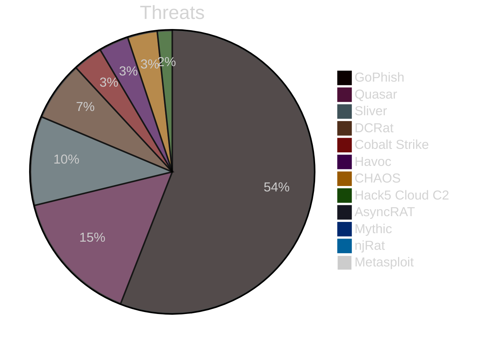
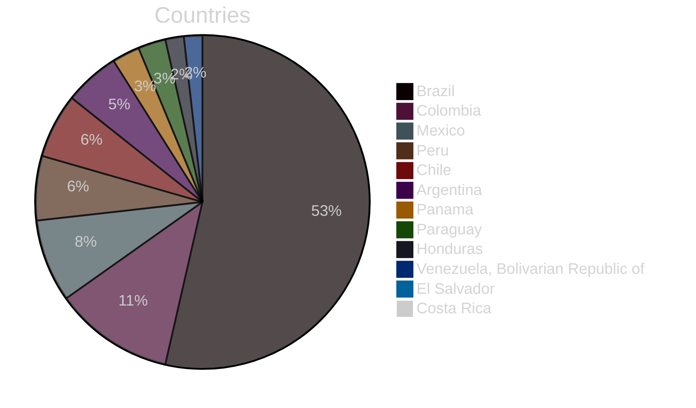
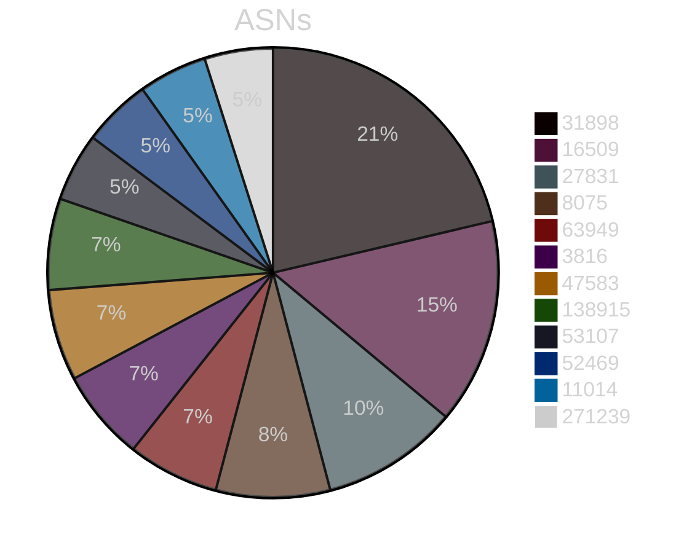
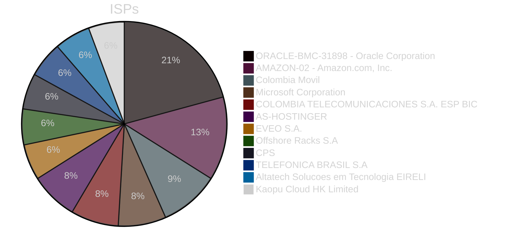
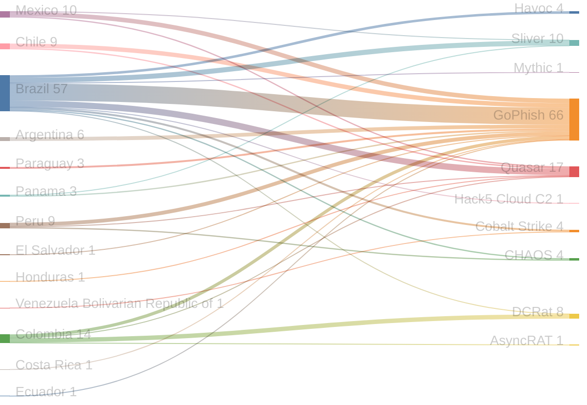
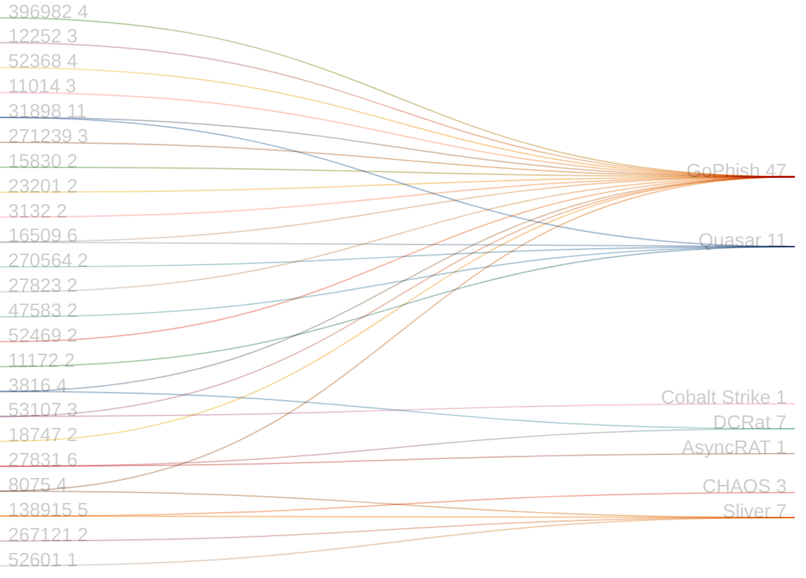
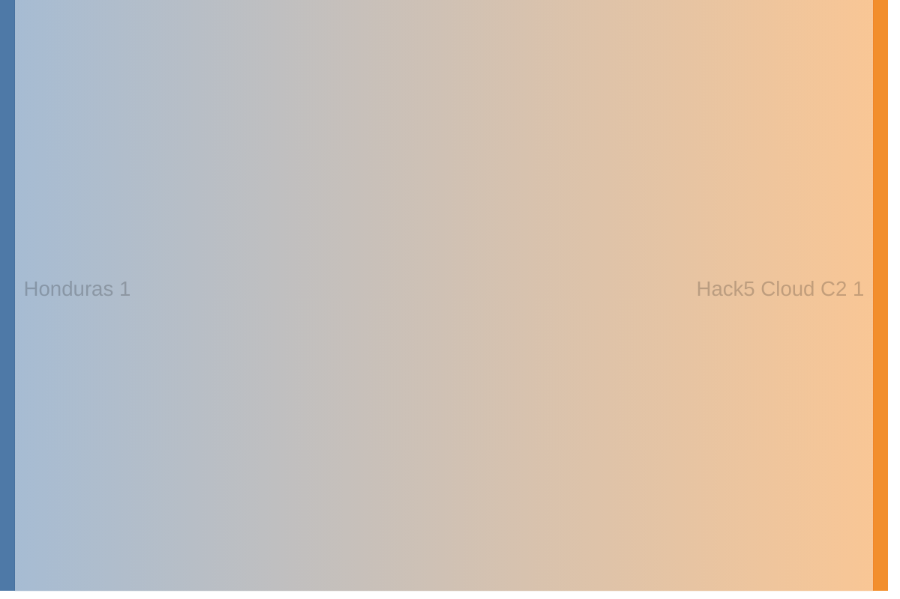
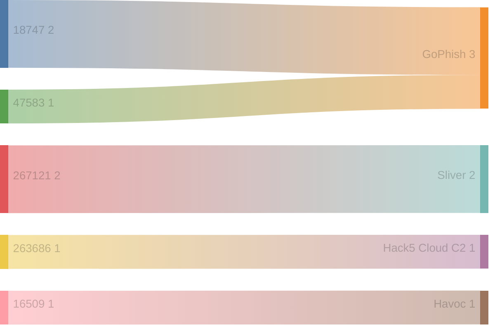

# ZOLIM - Zoque-Observatorio Latinoamericano de Infraestructura Maliciosa

> **ZOLIM (Observatorio Latinoamericano de Infraestructura Maliciosa de Zoque)** es una iniciativa de investigación de ZoqueLabs orientada a documentar, analizar y publicar **snapshots periódicos de infraestructura maliciosa en América Latina**, con énfasis en sistemas de comando y control (C2) y tooling asociado.

- Generated: `2026-03-18T16:50:06Z`
- About ZOLIM: [Español](/zolim/2026/02/05/acerca-de-zolim.html) - [English](/zolim/2026/02/05/about-zolim.html)
- Current snapshot: **https://github.com/ZoqueLabs/olim_datasets/tree/main/reports/2026-03-18_11-50-06**

## Metrics (current)

> **IPs:** `116` | **Unique ports:** `32` | **Threat frameworks:** `13` | **Countries:** `14` | **Cities:** `42` | **ASNs:** `54`

## Tops (current)

- Threats: `GoPhish(66)` `Quasar(18)` `Sliver(12)` `DCRat(8)` `Cobalt Strike(4)` `Havoc(4)` `CHAOS(4)` `Hack5 Cloud C2(2)` `AsyncRAT(1)` `Mythic(1)` `njRat(1)` `Metasploit(1)`
- Countries: `Brazil(60)` `Colombia(13)` `Mexico(9)` `Peru(7)` `Chile(7)` `Argentina(6)` `Panama(3)` `Paraguay(3)` `Honduras(2)` `Venezuela, Bolivarian Republic of(2)` `El Salvador(1)` `Costa Rica(1)`
- Cities: `São Paulo(45)` `Lima(7)` `Barranquilla(6)` `Santiago(5)` `Buenos Aires(4)` `Panamá(3)` `Belo Horizonte(2)` `Radica(2)` `Asunción(2)` `Rolândia(2)` `Mexico City(2)` `Santiago de Querétaro(2)`
- ASNs: `31898(13)` `16509(9)` `27831(6)` `8075(5)` `63949(4)` `3816(4)` `47583(4)` `138915(4)` `53107(3)` `52469(3)` `11014(3)` `271239(3)`
- ISPs: `ORACLE-BMC-31898 - Oracle Corporation(11)` `AMAZON-02 - Amazon.com, Inc.(7)` `Colombia Movil(5)` `Microsoft Corporation(4)` `COLOMBIA TELECOMUNICACIONES S.A. ESP BIC(4)` `AS-HOSTINGER(4)` `EVEO S.A.(3)` `Offshore Racks S.A(3)` `CPS(3)` `TELEFONICA BRASIL S.A(3)` `Altatech Solucoes em Tecnologia EIRELI(3)` `Kaopu Cloud HK Limited(3)`
- Orgs: `unknown(81)` `Microsoft Corporation(4)` `Offshore Racks S.A(2)` `Oracle Corporation(2)` `Amazon Data Services Brazil(2)` `Linode(2)` `ZAM LTDA.(2)` `Kaopu Cloud HK Limited(2)` `Colombia Móvil(1)` `Equinix Services, Inc.(1)` `GLOBAL CONNECTIVITY SOLUTIONS LLP(1)` `Univ. Catolica Nuestra Senora de la Asuncion(1)`
- Ports (frequency across IPs): `3333(34)` `443(22)` `31337(11)` `8080(10)` `80(8)` `8848(4)` `9000(3)` `43333(3)` `1080(2)` `8443(2)` `8081(2)` `9090(2)`

## Graphs (current)

```mermaid
---
config:
  theme: dark
---
pie title Threats
  "GoPhish" : 66
  "Quasar" : 18
  "Sliver" : 12
  "DCRat" : 8
  "Cobalt Strike" : 4
  "Havoc" : 4
  "CHAOS" : 4
  "Hack5 Cloud C2" : 2
  "AsyncRAT" : 1
  "Mythic" : 1
  "njRat" : 1
  "Metasploit" : 1
```

```mermaid
---
config:
  theme: dark
---
pie title Countries
  "Brazil" : 60
  "Colombia" : 13
  "Mexico" : 9
  "Peru" : 7
  "Chile" : 7
  "Argentina" : 6
  "Panama" : 3
  "Paraguay" : 3
  "Honduras" : 2
  "Venezuela, Bolivarian Republic of" : 2
  "El Salvador" : 1
  "Costa Rica" : 1
```

```mermaid
---
config:
  theme: dark
---
pie title ASNs
  "31898" : 13
  "16509" : 9
  "27831" : 6
  "8075" : 5
  "63949" : 4
  "3816" : 4
  "47583" : 4
  "138915" : 4
  "53107" : 3
  "52469" : 3
  "11014" : 3
  "271239" : 3
```

```mermaid
---
config:
  theme: dark
---
pie title ISPs
  "ORACLE-BMC-31898 - Oracle Corporation" : 11
  "AMAZON-02 - Amazon.com, Inc." : 7
  "Colombia Movil" : 5
  "Microsoft Corporation" : 4
  "COLOMBIA TELECOMUNICACIONES S.A. ESP BIC" : 4
  "AS-HOSTINGER" : 4
  "EVEO S.A." : 3
  "Offshore Racks S.A" : 3
  "CPS" : 3
  "TELEFONICA BRASIL S.A" : 3
  "Altatech Solucoes em Tecnologia EIRELI" : 3
  "Kaopu Cloud HK Limited" : 3
```

### Country → Threat (top)

```mermaid
---
config:
  theme: dark
---
%% Country → Threat (top)
sankey-beta
  Brazil,GoPhish,27
  Brazil,Quasar,10
  Brazil,Sliver,8
  Colombia,DCRat,7
  Mexico,GoPhish,7
  Chile,GoPhish,7
  Peru,GoPhish,6
  Argentina,GoPhish,6
  Colombia,GoPhish,5
  Brazil,Havoc,4
  Brazil,Cobalt Strike,3
  Paraguay,GoPhish,3
  Chile,Quasar,2
  Panama,GoPhish,2
  Mexico,Quasar,2
  Peru,CHAOS,2
  Brazil,CHAOS,2
  Colombia,AsyncRAT,1
  Brazil,Mythic,1
  Brazil,Hack5 Cloud C2,1
  Mexico,Sliver,1
  Panama,Sliver,1
  Peru,Quasar,1
  El Salvador,GoPhish,1
  Costa Rica,GoPhish,1
  Ecuador,GoPhish,1
  Brazil,DCRat,1
  Honduras,Quasar,1
  Colombia,Quasar,1
  Venezuela  Bolivarian Republic of,Cobalt Strike,1
```

### ASN → Threat (top)

```mermaid
---
config:
  theme: dark
---
%% ASN → Threat (top)
sankey-beta
  31898,GoPhish,9
  27831,DCRat,5
  396982,GoPhish,4
  52368,GoPhish,4
  12252,GoPhish,3
  11014,GoPhish,3
  271239,GoPhish,3
  16509,GoPhish,3
  16509,Quasar,3
  138915,CHAOS,3
  270564,Quasar,2
  15830,GoPhish,2
  23201,GoPhish,2
  53107,GoPhish,2
  3132,GoPhish,2
  8075,GoPhish,2
  27823,GoPhish,2
  3816,GoPhish,2
  138915,Sliver,2
  52469,GoPhish,2
  47583,Quasar,2
  11172,Quasar,2
  31898,Quasar,2
  3816,DCRat,2
  18747,GoPhish,2
  267121,Sliver,2
  8075,Sliver,2
  53107,Cobalt Strike,1
  27831,AsyncRAT,1
  52601,Sliver,1
```

## Delta vs previous snapshot

- IPs: **+12** / **-0** (persistent: `104`)
- Threat frameworks: **+0** / **-1**
- Countries: **+0** / **-0**
- ASNs: **+3** / **-0**
- ISPs: **+5** / **-1**
- Orgs: **+2** / **-1**
- Ports: **+2** / **-3**
- Cities: **+4** / **-0**

### Delta lists (compact)

- New IPs: `150.230.93.32`, `181.79.36.228`, `186.169.63.171`, `187.84.150.111`, `187.84.150.127`, `190.66.83.233`, `191.93.113.86`, `40.233.19.225`, `45.238.142.234`, `46.202.146.65`, `52.67.113.111`, `56.125.42.70`
- Removed IPs: _none_
- New threats: _none_
- Removed threats: `UnamWebPanel`
- New countries: _none_
- New ASNs: `18747`, `263686`, `267121`
- New ISPs: `ATPlus Telecom`, `BIZZ INTERNET LTDA`, `Colombia Móvil`, `IFX18747 - IFX Corporation`, `INET Communication`
- New ports: `12136`, `3057`

### IP reuse / threat drift

- IPs with threat changes: `2`
  - `177.124.72.24`: ['Sliver', 'UnamWebPanel'] → ['Sliver'] (+[], -['UnamWebPanel'])
  - `191.93.118.254`: ['AsyncRAT', 'DCRat'] → ['AsyncRAT'] (+[], -['DCRat'])

### Delta graph: NEW Country → Threat edges

```mermaid
---
config:
  theme: dark
---
%% Δ Country → Threat (new edges)
sankey-beta
  Honduras,Hack5 Cloud C2,1
```

### Delta graph: NEW ASN → Threat edges

```mermaid
---
config:
  theme: dark
---
%% Δ ASN → Threat (new edges)
sankey-beta
  18747,GoPhish,2
  267121,Sliver,2
  47583,GoPhish,1
  263686,Hack5 Cloud C2,1
  16509,Havoc,1
```

## All IPs (current snapshot)

 

| IP | Threats | Ports | Country | City | ASN | ISP | Org | Source | Last scan |
|---|---|---|---|---|---|---|---|---|---|
| 136.248.245.36 | GoPhish | 3333 | Chile | Colina | AS31898 | ORACLE-BMC-31898 - Oracle Corporation | unknown | censys | 2026-03-18_05-29-46 |
| 144.22.192.165 | GoPhish | 8443 | Brazil | São Paulo | AS31898 | ORACLE-BMC-31898 - Oracle Corporation | unknown | censys | 2026-03-18_12-10-59 |
| 144.22.207.61 | GoPhish | 8443 | Brazil | São Paulo | AS31898 | Oracle Corporation | Oracle Corporation | shodan | 2026-02-18_07-41-20 |
| 146.235.38.234 | DCRat | 5038 | Brazil | São Paulo | AS31898 | ORACLE-BMC-31898 - Oracle Corporation | unknown | censys | 2026-03-05_11-10-21 |
| 147.28.223.190 | Sliver | 31337 | Mexico | La Cañada | AS54825 | Packet Host, Inc. | Equinix Services, Inc. | shodan | 2026-01-04_18-32-22 |
| 147.45.116.18 | Sliver | 31337 | Brazil | São Paulo | AS215540 | GLOBAL CONNECTIVITY SOLUTIONS LLP | GLOBAL CONNECTIVITY SOLUTIONS LLP | shodan | 2026-01-22_09-40-58 |
| 147.93.9.173 | Havoc | 443 | Brazil | São Paulo | AS47583 | AS-HOSTINGER | unknown | censys | 2026-03-05_08-16-01 |
| 148.230.153.56 | GoPhish | 3333 | Mexico | Torreón | AS22884 | TOTAL PLAY TELECOMUNICACIONES SA DE CV | unknown | censys | 2026-02-04_23-22-09 |
| 149.130.165.200 | Quasar | 9000 | Colombia | Cota | AS31898 | ORACLE-BMC-31898 - Oracle Corporation | unknown | censys | 2026-03-04_18-58-45 |
| 149.50.137.180 | GoPhish | 2087 | Argentina | Rosario | AS27823 | Dattatec.com | DATTATEC.COM S.R.L. | shodan | 2026-02-19_17-24-34 |
| 15.228.3.86 | Cobalt Strike | 80 | Brazil | São Paulo | AS16509 | Amazon.com, Inc. | Amazon Data Services Brazil | shodan | 2026-03-18_09-53-16 |
| 150.187.25.242 | Cobalt Strike | 9999 | Venezuela, Bolivarian Republic of | Barquisimeto | AS20312 | Fundación Centro Nacional de Innovación Tecnológica (CENIT) | Fundación Centro Nacional de Innovación Tecnológica (CENIT) | shodan | 2026-03-18_02-30-38 |
| 150.230.93.32 | GoPhish | 3333 | Brazil | São Paulo | AS31898 | ORACLE-BMC-31898 - Oracle Corporation | unknown | censys | 2026-03-18_10-10-34 |
| 152.203.25.225 | GoPhish | 8080 | Colombia | Bucaramanga | AS3816 | COLOMBIA TELECOMUNICACIONES S.A. ESP BIC | unknown | censys | 2026-01-27_11-49-19 |
| 152.67.58.223 | Hack5 Cloud C2 | 8080 | Brazil | São Paulo | AS31898 | ORACLE-BMC-31898 - Oracle Corporation | unknown | censys | 2026-03-18_06-10-53 |
| 156.244.39.44 | CHAOS;CHAOS | 1604;11434 | Peru | Lima | AS138915 | Kaopu Cloud HK Limited | Lightnode Limited | shodan | 2026-01-09_17-34-42 |
| 157.151.4.17 | GoPhish | 3333 | Brazil | Vinhedo | AS31898 | ORACLE-BMC-31898 - Oracle Corporation | unknown | censys | 2026-03-18_06-19-42 |
| 161.132.220.65 | Quasar | 8080 | Peru | Lima | AS27843 | WIN EMPRESAS S.A.C. | unknown | censys | 2026-03-18_14-10-25 |
| 161.132.51.222 | GoPhish | 3333 | Peru | Lima | AS3132 | Red Cientifica Peruana | unknown | censys | 2026-03-18_03-10-45 |
| 161.132.54.23 | GoPhish | 8081 | Peru | Lima | AS3132 | Red Cientifica Peruana | unknown | censys | 2026-01-07_01-42-12 |
| 167.234.226.89 | GoPhish | 443 | Brazil | São Paulo | AS31898 | Oracle Corporation | Oracle Corporation | shodan | 2026-03-18_12-02-59 |
| 168.138.128.79 | GoPhish | 3333 | Brazil | São Paulo | AS31898 | ORACLE-BMC-31898 - Oracle Corporation | unknown | censys | 2026-03-18_10-10-43 |
| 168.138.131.15 | Quasar | 80 | Brazil | São Paulo | AS31898 | ORACLE-BMC-31898 - Oracle Corporation | unknown | censys | 2026-03-05_04-55-17 |
| 170.231.155.101 | Metasploit | 3790 | Brazil | Varginha | AS263424 | Fonelight Telecomunicações S/A | Fonelight Telecomunicações S/A | shodan | 2025-12-26_00-53-40 |
| 170.239.86.183 | GoPhish;GoPhish | 3333;3333 | Chile | Santiago | AS52368 | ZAM LTDA. | ZAM LTDA. | shodan | 2025-12-15_03-08-50 |
| 170.239.86.232 | GoPhish;GoPhish | 3333;3333 | Chile | Santiago | AS52368 | ZAM LTDA. | ZAM LTDA. | shodan | 2025-12-30_12-46-13 |
| 172.233.1.83 | Havoc | 443 | Brazil | São Paulo | AS63949 | AKAMAI-LINODE-AP Akamai Connected Cloud | unknown | censys | 2026-01-09_16-14-23 |
| 172.233.15.195 | Supershell | 8888 | Brazil | São Paulo | AS63949 | Akamai Connected Cloud | Linode | shodan | 2026-02-03_23-45-25 |
| 172.233.25.95 | GoPhish | 3333 | Brazil | São Paulo | AS63949 | AKAMAI-LINODE-AP Akamai Connected Cloud | unknown | censys | 2026-03-18_05-10-54 |
| 172.233.27.101 | CHAOS | 12136 | Brazil | São Paulo | AS63949 | Akamai Connected Cloud | Linode | shodan | 2026-03-18_16-24-00 |
| 177.104.176.211 | GoPhish | 8080 | Brazil | São Paulo | AS53107 | EVEO S.A. | unknown | censys | 2026-02-27_18-10-23 |
| 177.104.188.108 | GoPhish | 3333 | Brazil | São Paulo | AS53107 | EVEO S.A. | unknown | censys | 2026-02-23_08-09-19 |
| 177.124.72.24 | Sliver | 31337 | Brazil | Diamantina | AS52601 | BIZZ INTERNET LTDA | unknown | censys | 2026-03-18_06-29-40 |
| 177.126.168.209 | GoPhish | 3333 | Brazil | São Paulo | AS15830 | EQUINIX | unknown | censys | 2026-03-18_06-31-47 |
| 177.136.225.181 | Cobalt Strike | 10035 | Brazil | São Paulo | AS53107 | EVEO S.A. | unknown | censys | 2026-03-18_16-21-09 |
| 177.89.234.43 | njRat | 1177 | Brazil | Natal | AS28220 | Alares Cabo Servicos de Telecomunicacoes S.A. | CABO SERVICOS DE TELECOMUNICACOES LTDA | shodan | 2026-01-31_13-46-48 |
| 179.0.178.198 | Quasar | 1080 | Brazil | Belo Horizonte | AS270564 | MASTER DA WEB DATACENTER LTDA | unknown | censys | 2026-01-13_03-18-32 |
| 179.0.178.79 | Quasar | 1080 | Brazil | Belo Horizonte | AS270564 | MASTER DA WEB DATACENTER LTDA | unknown | censys | 2026-01-02_19-13-48 |
| 179.151.242.232 | GoPhish | 9090 | Brazil | São Paulo | AS26599 | TELEFONICA BRASIL S.A | unknown | censys | 2026-02-25_07-59-13 |
| 18.231.69.245 | GoPhish | 8080 | Brazil | São Paulo | AS16509 | AMAZON-02 - Amazon.com, Inc. | unknown | censys | 2026-02-09_12-59-27 |
| 18.231.78.171 | Quasar | 443 | Brazil | São Paulo | AS16509 | AMAZON-02 - Amazon.com, Inc. | unknown | censys | 2026-03-05_05-59-35 |
| 181.162.184.56 | Quasar | 8080 | Chile | Rancagua | AS7418 | TELEFONICA CHILE S.A. | unknown | censys | 2026-02-17_01-35-32 |
| 181.174.164.116 | Sliver | 31337 | Panama | Panamá | AS52469 | Offshore Racks S.A | Offshore Racks S.A | shodan | 2026-01-20_20-44-09 |
| 181.174.165.127 | GoPhish | 3333 | Panama | Panamá | AS52469 | Offshore Racks S.A | unknown | censys | 2026-03-09_06-59-37 |
| 181.174.165.128 | GoPhish | 3333 | Panama | Panamá | AS52469 | Offshore Racks S.A | Offshore Racks S.A | shodan | 2026-03-05_12-01-02 |
| 181.176.215.140 | GoPhish | 80 | Peru | Lima | AS262210 | VIETTEL PERU S.A.C. | unknown | censys | 2026-01-27_18-23-44 |
| 181.206.158.190 | DCRat | 1000 | Colombia | Barranquilla | AS27831 | Colombia Movil | unknown | censys | 2026-03-18_12-28-01 |
| 181.79.36.228 | GoPhish;GoPhish | 3333;80 | Colombia | Bogotá | AS18747 | IFX18747 - IFX Corporation | unknown | censys | 2026-03-18_08-11-03 |
| 186.169.55.212 | DCRat | 9002 | Colombia | Valledupar | AS3816 | COLOMBIA TELECOMUNICACIONES S.A. ESP BIC | COLOMBIA TELECOMUNICACIONES S.A. ESP | shodan | 2026-02-09_05-37-35 |
| 186.169.63.171 | DCRat | 9090 | Colombia | Valledupar | AS3816 | COLOMBIA TELECOMUNICACIONES S.A. ESP BIC | unknown | censys | 2026-03-17_20-04-31 |
| 186.177.71.142 | GoPhish | 443 | Costa Rica | San José | AS262197 | MILLICOM CABLE COSTA RICA S.A. | unknown | censys | 2026-02-11_10-12-51 |
| 187.168.236.220 | GoPhish | 3334 | Mexico | Mexico City | AS8151 | UNINET | unknown | censys | 2026-01-22_23-11-26 |
| 187.45.170.66 | GoPhish | 3333 | Brazil | Rio de Janeiro | AS28137 | Vialink Solucoes de Tecnologia Ltda | unknown | censys | 2026-03-18_07-29-08 |
| 187.45.79.131 | GoPhish | 3333 | Brazil | Triunfo | AS28343 | UNIFIQUE TELECOMUNICACOES SA | unknown | censys | 2026-02-04_19-06-08 |
| 187.84.150.111 | Sliver | 31337 | Brazil | Salvador | AS267121 | ATPlus Telecom | unknown | censys | 2026-03-18_08-10-42 |
| 187.84.150.127 | Sliver | 31337 | Brazil | Salvador | AS267121 | ATPlus Telecom | unknown | censys | 2026-03-18_08-10-42 |
| 190.104.242.91 | GoPhish | 43333 | Argentina | Buenos Aires | AS11014 | CPS | unknown | censys | 2026-03-18_07-15-02 |
| 190.104.242.92 | GoPhish | 43333 | Argentina | Buenos Aires | AS11014 | CPS | unknown | censys | 2026-03-18_07-08-47 |
| 190.110.41.114 | GoPhish | 3333 | Ecuador | Quito | AS22724 | PUNTONET S.A. | unknown | censys | 2026-01-23_14-11-46 |
| 190.111.234.234 | GoPhish | 43333 | Argentina | Buenos Aires | AS11014 | CPS | unknown | censys | 2026-03-18_07-19-45 |
| 190.119.16.140 | GoPhish | 443 | Peru | Lima | AS12252 | America Movil Peru S.A.C. | unknown | censys | 2026-03-18_12-49-28 |
| 190.119.63.144 | GoPhish;GoPhish | 443;443 | Peru | Lima | AS12252 | America Movil Peru S.A.C. | America Movil Peru S.A.C. | shodan | 2025-12-30_07-56-58 |
| 190.14.57.229 | Quasar | 443 | Chile | Santiago | AS27659 | Ingenieria e Informatica Asociada Ltda IIA Ltda | unknown | censys | 2026-03-04_22-14-38 |
| 190.66.83.233 | GoPhish | 8080 | Colombia | Bucaramanga | AS3816 | COLOMBIA TELECOMUNICACIONES S.A. ESP BIC | unknown | censys | 2026-03-18_07-10-49 |
| 191.209.58.15 | GoPhish | 3333 | Brazil | São Paulo | AS27699 | TELEFONICA BRASIL S.A | unknown | censys | 2026-03-05_10-10-24 |
| 191.8.232.11 | Quasar | 6653 | Brazil | São Paulo | AS26599 | TELEFONICA BRASIL S.A | unknown | censys | 2026-02-17_09-08-19 |
| 191.93.113.160 | DCRat | 8848 | Colombia | Barranquilla | AS27831 | Colombia Movil | unknown | censys | 2026-01-05_18-30-31 |
| 191.93.113.86 | DCRat | 8848 | Colombia | Barranquilla | AS27831 | Colombia Movil | unknown | censys | 2026-03-18_07-06-32 |
| 191.93.117.34 | DCRat | 8848 | Colombia | Barranquilla | AS27831 | Colombia Movil | unknown | censys | 2026-02-17_09-10-22 |
| 191.93.118.190 | DCRat | 8848 | Colombia | Barranquilla | AS27831 | Colombia Movil | unknown | censys | 2026-03-05_07-58-20 |
| 191.93.118.254 | AsyncRAT | 9000 | Colombia | Barranquilla | AS27831 | Colombia Móvil | Colombia Móvil | shodan | 2026-03-18_15-33-32 |
| 200.10.229.166 | GoPhish | 3333 | Paraguay | San Lorenzo | AS27733 | Centro Nacional de Computacion | unknown | censys | 2026-02-17_09-23-08 |
| 200.109.21.86 | Quasar | 443 | Venezuela, Bolivarian Republic of | Valencia | AS8048 | CANTV Servicios, Venezuela | CANTV Servicios, Venezuela | shodan | 2026-01-27_16-50-57 |
| 200.219.214.190 | GoPhish | 3333 | Brazil | São Paulo | AS15830 | EQUINIX | unknown | censys | 2026-03-18_07-42-01 |
| 200.225.247.79 | Quasar | 8080 | Brazil | São Paulo | AS16735 | ALGAR TELECOM SA | unknown | censys | 2026-03-05_02-32-50 |
| 200.38.160.49 | GoPhish | 3333 | Mexico | Mexico City | AS13579 | INFOTEC CENTRO DE INVESTIGACION E INNOVACION EN TECNOLOGIAS DE LA INFORMACION Y COMUNICACION | unknown | censys | 2026-03-18_07-52-52 |
| 200.40.131.89 | Sliver | 31337 | Uruguay | Montevideo | AS6057 | Administracion Nacional de Telecomunicaciones | Administracion Nacional de Telecomunicaciones | shodan | 2026-01-21_19-23-04 |
| 200.58.100.246 | GoPhish | 3333 | Argentina | Rosario | AS27823 | Dattatec.com | unknown | censys | 2026-02-11_08-11-32 |
| 200.85.49.125 | GoPhish | 3333 | Paraguay | Asunción | AS23201 | Telecel S.A. | unknown | censys | 2026-01-02_00-18-19 |
| 200.9.4.41 | GoPhish | 443 | Paraguay | Asunción | AS23201 | Telecel S.A. | Univ. Catolica Nuestra Senora de la Asuncion | shodan | 2026-01-26_05-31-56 |
| 201.16.156.113 | GoPhish | 3333 | Brazil | São Paulo | AS16735 | ALGAR TELECOM SA | unknown | censys | 2026-01-26_08-39-48 |
| 201.234.38.193 | GoPhish | 443 | Argentina | Buenos Aires | AS21756 | SIDERCA S.A.I.C. | unknown | censys | 2026-03-18_12-11-57 |
| 201.92.133.149 | Havoc | 8081 | Brazil | São Paulo | AS27699 | TELEFÔNICA BRASIL S.A | TELEFÔNICA BRASIL S.A | shodan | 2025-12-22_01-54-38 |
| 207.248.247.66 | Quasar;Quasar | 8003;8002 | Mexico | Guadalupe | AS11172 | Alestra, S. de R.L. de C.V. | unknown | censys | 2026-03-05_09-54-36 |
| 34.176.142.248 | GoPhish;GoPhish | 443;80 | Chile | Santiago | AS396982 | Google LLC | Google LLC | shodan | 2026-03-18_12-21-51 |
| 34.51.42.9 | GoPhish | 443 | Mexico | Santiago de Querétaro | AS396982 | GOOGLE-CLOUD-PLATFORM - Google LLC | unknown | censys | 2026-02-09_17-10-57 |
| 34.51.56.27 | GoPhish | 80 | Mexico | Santiago de Querétaro | AS396982 | GOOGLE-CLOUD-PLATFORM - Google LLC | unknown | censys | 2026-02-02_04-30-21 |
| 38.56.209.142 | GoPhish | 7443 | El Salvador | Antiguo Cuscatlán | AS174 | Cogent Communications | DIGICEL S.A. DE C.V. | shodan | 2026-02-18_21-49-49 |
| 38.60.209.110 | CHAOS | 3057 | Brazil | São Paulo | AS138915 | Kaopu Cloud HK Limited | Kaopu Cloud HK Limited | shodan | 2026-03-18_10-59-25 |
| 38.60.209.204 | Sliver | 1337 | Brazil | São Paulo | AS138915 | Kaopu Cloud HK Limited | Kaopu Cloud HK Limited | shodan | 2026-03-04_07-55-28 |
| 38.60.242.200 | Sliver | 31337 | Brazil | São Paulo | AS138915 | KAOPU-HK Kaopu Cloud HK Limited | unknown | censys | 2026-02-17_10-26-10 |
| 4.201.122.3 | GoPhish | 443 | Brazil | São Paulo | AS8075 | Microsoft Corporation | Microsoft Corporation | shodan | 2026-03-18_12-32-48 |
| 4.201.140.200 | GoPhish | 3333 | Brazil | Campinas | AS8075 | MICROSOFT-CORP-MSN-AS-BLOCK - Microsoft Corporation | unknown | censys | 2026-02-09_22-01-37 |
| 4.201.155.137 | Sliver | 31337 | Brazil | São Paulo | AS8075 | Microsoft Corporation | Microsoft Corporation | shodan | 2026-01-12_10-42-51 |
| 4.201.185.160 | Sliver | 31337 | Brazil | São Paulo | AS8075 | Microsoft Corporation | Microsoft Corporation | shodan | 2025-12-16_11-49-04 |
| 4.201.220.7 | Cobalt Strike | 50050 | Brazil | São Paulo | AS8075 | Microsoft Corporation | Microsoft Corporation | shodan | 2026-02-18_00-42-30 |
| 40.233.19.225 | GoPhish | 443 | Mexico | Radica | AS31898 | ORACLE-BMC-31898 - Oracle Corporation | unknown | censys | 2026-03-17_21-20-43 |
| 40.233.26.200 | GoPhish | 3333 | Mexico | Radica | AS31898 | ORACLE-BMC-31898 - Oracle Corporation | unknown | censys | 2026-02-28_10-24-52 |
| 45.225.129.11 | GoPhish | 3333 | Brazil | Rolândia | AS271239 | Altatech Solucoes em Tecnologia EIRELI | unknown | censys | 2026-01-13_08-12-57 |
| 45.225.129.210 | GoPhish | 3333 | Brazil | Apucarana | AS271239 | Altatech Solucoes em Tecnologia EIRELI | unknown | censys | 2026-02-25_11-00-19 |
| 45.225.129.50 | GoPhish | 3333 | Brazil | Rolândia | AS271239 | Altatech Solucoes em Tecnologia EIRELI | unknown | censys | 2026-01-06_12-42-16 |
| 45.226.189.70 | GoPhish | 3333 | Brazil | Curitiba | AS266997 | MPTEC INFORMATICA LTDA - ME | MPTEC INFORMATICA LTDA - ME | shodan | 2026-03-11_15-36-20 |
| 45.227.61.113 | GoPhish | 3333 | Brazil | São Paulo | AS271366 | ALTVIA TECNOLOGIA E SERVICOS DIGITAIS LTDA | unknown | censys | 2026-03-05_14-07-46 |
| 45.236.130.44 | Sliver | 31337 | Chile | Santiago | AS64111 | INFORMATICA BLUEHOSTING LIMITADA | INFORMATICA BLUEHOSTING LIMITADA | shodan | 2025-12-15_14-32-17 |
| 45.238.142.234 | Hack5 Cloud C2 | 443 | Honduras | San Pedro Sula | AS263686 | INET Communication | INET Communication | shodan | 2026-03-17_14-27-10 |
| 45.67.247.185 | Quasar | 80 | Honduras | Tegucigalpa | AS273189 | CA NETWORK S.A. DE C.V. | unknown | censys | 2026-03-04_20-46-13 |
| 46.202.146.65 | GoPhish | 443 | Brazil | São Paulo | AS47583 | AS-HOSTINGER | unknown | censys | 2026-03-18_04-59-11 |
| 52.67.113.111 | Havoc | 443 | Brazil | São Paulo | AS16509 | Amazon.com, Inc. | Amazon Data Services Brazil | shodan | 2026-03-17_01-04-42 |
| 54.232.144.183 | Mythic | 443 | Brazil | São Paulo | AS16509 | AMAZON-02 - Amazon.com, Inc. | unknown | censys | 2026-02-17_13-10-46 |
| 54.233.43.28 | GoPhish | 8080 | Brazil | São Paulo | AS16509 | AMAZON-02 - Amazon.com, Inc. | unknown | censys | 2026-02-08_22-22-03 |
| 54.94.39.204 | Quasar | 443 | Brazil | São Paulo | AS16509 | AMAZON-02 - Amazon.com, Inc. | unknown | censys | 2026-03-04_23-51-33 |
| 56.125.168.86 | Quasar | 80 | Brazil | São Paulo | AS16509 | AMAZON-02 - Amazon.com, Inc. | unknown | censys | 2026-03-05_02-30-07 |
| 56.125.42.70 | GoPhish | 3333 | Brazil | São Paulo | AS16509 | AMAZON-02 - Amazon.com, Inc. | unknown | censys | 2026-03-17_22-13-27 |
| 64.76.214.54 | GoPhish | 443 | Colombia | Barrio San Luis | AS3549 | LVLT-3549 - Level 3 Parent, LLC | unknown | censys | 2026-03-18_11-10-37 |
| 89.116.186.136 | Quasar | 9000 | Brazil | São Paulo | AS47583 | AS-HOSTINGER | unknown | censys | 2026-03-05_12-48-41 |
| 89.116.186.72 | Quasar | 8080 | Brazil | São Paulo | AS47583 | AS-HOSTINGER | unknown | censys | 2026-03-05_03-00-55 |

---

**Current snapshot link:** https://github.com/ZoqueLabs/olim_datasets/tree/main/reports/2026-03-18_11-50-06
